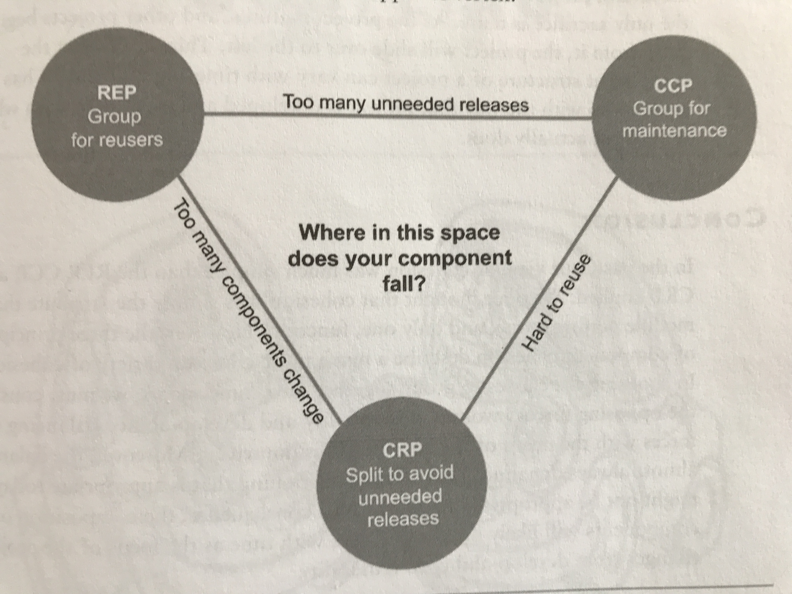
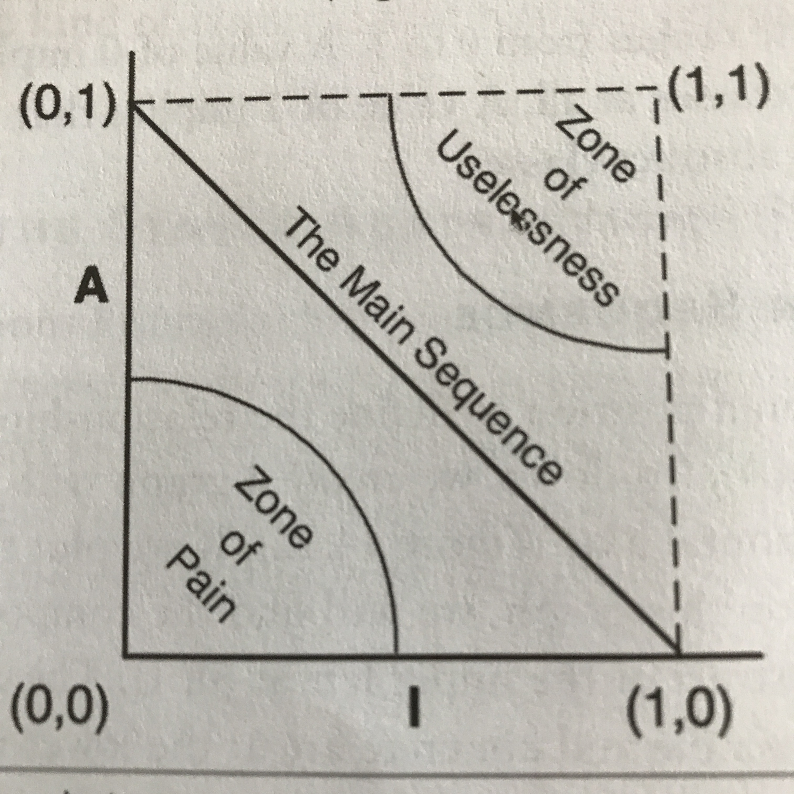

# Clean Architecture

## General Overview
Clean architecture was created by Robert C. Martin. The general idea is that any type of architecture should respect the rights direction of the dependecies, see the Dependency Rule.

The core, the entities is the purest part of the system with 0 impurity. The more we move to outer layers, the more impure the layers become, note that functional programming languages tend to encourage this idea.

For more on how functional programming encourages clean architecutes styles, watch the talk from [Mark Seemann "Functional Architecture - The Pits of Success"](https://youtu.be/US8QG9I1XW0) on YouTube.

Notice that most of the rules of the architecture emerge from the SOLID principles, translated in their module level equivalents. More on that later. 


### Dependency Rule
> Source code dependencies must point only inward, toward higher level policies.

Meaning, the inner modules must be be unaware and not depend on outer layers of the architecture. The outer layers must "plug in" into the inner layers. So think, plugin approach. By respecting these rules, any changes on the outer layers have 0 impact on inner layers.

Using the Dependency Inversion principle helps to achieve this. E.g. if a use cases must call an external service, it should use an interface. The outer layer that access the external service should then implement this interface. Notice that this enforces the outer layer to depend on the inner layer, not the other way around. The inner layers are more abstract, the more you move outwards, things become more concrete and "implementation details".

Moving data accross the layers should be only simple data structures, known as DTOs.

### Entities
This encapsulates enterprise wide business rules. This can be objects with methods, set of data structures and functions. Here we want all the high level rules set in stone so to say. Operational changes for example should have 0 impact on the entities.

### Use Cases
This layer contains application-specific business rules. Here we implement all the use cases of the system. Notice the location on the overview, that the Use Case layer orchestrates the flow from and to the entities layer, using the business rules to achieve the goals of use cases.

Changes to the UI/DB and any common frameworks should have also 0 impact on this layer.

Here we implement the actual use cases of the system., so what the application actually tries to do, achieve, automate, reach.

Use cases can have a sort of "business logic" but that's decided for the application, so the application is to expected to adhere to some rules, but the core business rules have nothing to do with this.

e.g. Show first screen x before continuing with step y. This has nothing to do with the core business logic and rules. Or you can not create the loan till all personal data is verified. This is what we mean with "application specific". This describes how a automated system is used.

### Interface Adapters
Set of adapters that converts data from the format most convenient for the use cases to the most convenient data format for some external part, like the DB and the web. The MVC architecture of a GUI would go here.

e.g. Presenters, views, controllers and Models.

The awareness of what database is uses should end in this layer and not go to any deeper circle.

When using other external services, again, here the transformation/mapping takes place.

### Frameworks and Drivers
This is more glue code, as we use here often external libraries or services. We convert data from some external form to the internal form used by the use cases and entities.

## What is architecture?

* The strategy behind the facilitation is to leave as many options open as possible, for as long as possible.
* Must support
  * Use cases and operation of the system
  * Maintenance of the system
  * Development of the system
  * Deployment of the system
* Art of drawing the right boundaries/lines
* Minimize the human resources required to build and maintain the system.

## Key notes

* Database is a detail -> Is a plugin
* Web is a detail -> Is a plugin
* Framework is a detail -> Is a plugin

## SOLID
Starting from the SOLID principles, we can deduct rules, slightly redefined to apply on module level instead of lower level code. Understand that the clean architecture is largely bases on the SOLID principles and their module level equivalents that grew out of them.

### SRP: Single Responsible Principle
This principle is often misunderstood, originally defined as:

> A module should have one, and only one, reason to change.

But more appropiate would be:

> A module should be responsible to one, and only one actor.

This makes more sense as software changes to a specific actor (a group of users that act), these actors are the reason to change.

A *module* in this definition can be a source file, but depending on the language this can be a loose definition, so let's call it rather a cohesive set of functions and data structures.

> Separate the code that different actors depend on.

#### Example
You have a `Employee` class with te functions `calculatePay()`, `reportHours()` and `save()`. This is a violation, why? The `calculatePay()` function would be used by the accountant department or the CFO. This is one actor. The `reportHours()` are relevant for HR department or the COO, this is **another** actor than the previous. So this class now serves different types of actors. 

Imagine that because of overtime, the CFO wants to change the algorithm on how to calculate the pay, but for the COO, they just want the same type of hours being reported. Here you might make changes that affect another actor's flow, who doesn't want that change. The code should be able to evolve orthogonal for the different actor types.

> Separate the code that different actors depend on.

Solution? Move the functions in separate classes and isolate the Employee data. So youend up with a `PayCalculator`, `HourReporter` and `EmployeeSaver` class alongside the `Employee` class.

With a simple facade you can still bring all these functions in a simple class that provides all the functionality, like a `EmployeeFacade`.

### OCP: Open Closed Principle

> A software artifact should be open for extension, but closed for modification.

Architects separate functionality based on how, why and when something changes, then organize that separated functionality in a hierarchy of components. Higher level components in that hierarchy are protected from the changes made to lower-level components.

This principle is mainly to protect changes in one component to another component. This is done by arranging components in a dependency hierarchy that protects higher-level components form changes in lower level components.

### LSP: Liskov Substitution Principle

> What is wanted here is something like the following substitution property: if for each object o1 of type S there is an object 02 of type T such that for all programs P defined in terms of T, the behaviour of P is unchanged when o1 is substituted for o2 then S is a subtype of T.
This rule is a good guide in asserting if the inheritance makes sense between two types. This principle easily translates to an architectural level.

Imagine calling 4 different API's that should follow a spec, but one doesn't. Now you have to create special code for the exceptions, clearly, there is not simple substition possible.

#### Example: Good
We have an interface `License` and we have then two classes `Personal License` and `Business License`. They both can implement the `calculateFee()` function without weird unexpected side effects.

#### Example: Bad
We have a class `Rectangle` with `setHeight` and `setWidth`, a `Square` should not inherit/sublcass the rectangle. Because there you should have a function `setSide()`. Now the user needs to be aware that:
```
Rectange r = ...
r.setWidth(5);
r.setHeight(2);
assert(r.area() == 10); // This will fail, and come as a suprise
```
the `Square` is not a suitable subtype of `Rectangle` in this solution. 

### ISP: Interface Segregation Principle

The ISP is a bit of a language depending principle, dynamic typed languages might not suffer as much of the violations of this principle.

The idea is not to polute an interface with too many responsibilities which are not cohesive or relevant to each other. You might force certain code and modules to be too much aware or create unnecessary dependencies because of a poluted interace. You might have to depend on more than you need, meaning, unnecessary dependencies.

This might cause unnecessary recompilations.

### DIP: Dependency Inversion Principle

> The most flexible systems are those in which source code dependencies refer only to abstractions, not to concretions.

In a statically typed language this means `use`, `import` and `include` statements should refer only to source modules containing `interaces`, `abstract classes` or other kind of abstract declaration.

In dynamic languages, same applies, only it is harder to define what is "abstract".

Note that `String` is a concrete dependency, but has a very low volatile charachteristic, so this should be a safe depenency, unlike other more volatile elements. Usually these are systems we are actively developing or external services.

As it is often the implementation that changes a lot and not the interface, the intefaces are less volatile than the concrete implementations.

* Don't refer to volatile concrete classess.
* Don't derive from volatile concrete classes.
* Don't override concrete functions.
* Never mention the namde of anything concrete and volatile.

Remember: Concrete implementations require more dependencies.

A good solution is `Abstract Factories`, factories that create instances of a service for example.

Usually DIP violations can not be entirely removed, but should be limited.

## Component Principles

### Component Cohesion
Principles for which classes belong in which components.

#### REP: The Reuse/Release Equivalence Principle

> The granule of reuse os the granule of release.

* Use a release process with release nunbers, else reuse is impossible.
* Classes and modules that are grouped together should be releaseable together.

Consider googling more on this principle.

#### CCP: The Common Closure Principle

> Gather into components those classes that change for the same reasons and at the same time. Separate into different components those classes that change at different times and for different reasons.

> Gather together those things that change at the same times and for the same reasons. Separate those things tjat change at different times or for different reasons.

This is **SRP (Single Responsibilty Principe) for components**.

* Most applications, maintainability is more important than reusability.
* Remember, don't overdo DRY.
* Place code together that can't move orthogonally from each other and always moves in parallel.
* Also associates with the **OCP (Open Closed Principle)**.

#### CRP: The Commong Reuse Principle

> Don't force users of a component to depend on things they don't need.

> Don't depend on things you don't need.

When one component uses another, a dependency is created between the components. Perhaps the using components uses only one class within the used component, but that still doesn't weaken the dependency. The using components still depends on the used component.

Because of the dependency, everytime the used component is changed, the using component will likely need corresponding channges. Even if no changes are necessary to the using component, you still might need to recompile, revalidate an redeploy.

**This principle tells us more about which classes shouldn't be together than which classes should be together**.

This is **ISP (Interface Segregation Principle) for components**.

#### Finding the balance

So we have the following principles for component cohesion:

* REP: The Reuse/Release Equivalence Principle (Tends to make components larger)
* CCP: The Common Closure Principle (Tends to make components larger)
* CRP: The Commong Reuse Principle (Tends to make componens smaller)

And they tend to find with each other. A good architect finds a position in that tension triangle that meets the *current* concerns of the development team, but is also aware that those concerns will change over time. For example, early in the development of a project, the CCP is much more important than the REP, because developability is more important than reuse.

Generally projects tend to start on the right hand side of the triangle. As it matures, and other projects begin to draw from it, it will slide over to the left.



### Component Coupling
Deals with relationships between components. Same as cohesion, there will be tension between developability and logical design.

#### ADP: Acyclic Dependencies Principle

> Allow no cycles in the component dependency graph.

Solution is often to partition the development environment in releasable components. Use semver to release these components, so other developers can that depend on them can choose when to upgrade.

> There can be no cycles.

Solutions
* Apply the DIP (Depeneency Inversion Principle)
* Create a new component that depends on the two components that have a cyclic dependency.

#### Top-Down Design

> The component structure cannot be designed from the top down.

#### Stable Dependencies Principle

> Depend in the direction of stability.

Some components are expected to be volatile, while others aren't. This is important to take in consideration to see which components will depend on other components.

*Stability has nothing directly to do with frequence of change. Rather to the amount of work required to make a change.*

How does that happen, by having many other components depend on it. If you have a component `x` that has 3 other components depend on it, it has three good reasons not to change. As `x` is *responsible* for those 3 components. But if component `x` depends on nothing, it's considered a `independent` component.

When we have a component `y` that depends on 3 separate components. So `y` is dependent, but also *iresponsible*, as it's not responsible for any other components that depend on it. This is also considered a unstable component.

> The metric I of a component should be larger than the I metrics of the components it depends on. That is, I metrics should decrease  in the direction of dependency.

Often, we can fix violations on the rule with the DIP. In Static languages you might end up with abstract components, where there are only abstractions.

**Stability Metrics**

How can we quantify the stability of a component?

One way way is to count the # of depeendencies that enter and leave the component. This will give us a **positional stability**.

* Fan-in: Incoming dependencies.
* Fan-out: Outgoing dependencies.
* I: `Instability = Fan-Out / Fan-In`. 
  * I = 1 : Max instability
  * I = 0 : Max stability 

Note that "dependencies" are counted by the amount of classes are dependend on. If a component `x` depends on `2` classes in component `y`, this means the fan-in is `2` between the two components, not `1`.

#### SAP: Stable Abstractions Principle

> A component should be as abstract as it is stable.

Some software should not change very often. This represents high-level architecture and policiy decisions. We don't want these business and architectural decisions to be volatile (notice Entities in the center). So these components should be `I = 0`, meaning stable. Unstable components `I = 1` should contain only software that is volatile (in outer layers).

This is **OCP (Open Closed Principle) for components**.

> On the one hand, a stable component should also be abstract so that its stability does not prevent it from being extended. On the other hand, an ubstable component should be concrete since its instabillity allows the code within to be easily changed.

If a component is to be stable, it should consist of interfaces and abstract classes so that it can be extended.

> The (SAP) Stable Abstraction Principle  and the (SDP) Stable Dependency Principe combined amount to the (DIP) Dependency Inversion Principe for components. Stable Dependency Principle (SDP) says that dependencies should run in the direction of stability, and the Stable Abstractions Principe (SAP) says that stability implies abstraction. Thus dependencies run in the direction of abstraction.

The combination of SAP and SDP allows a component to be partially abstract and partially stable.

**Measuring Abstraction**

`A` metric quantifies the abstractness of a component.

* Nc: The number or classes in the component (concrete code).
* Na: The number of abstract classes or Interfaces in the component.
* A: `Abstractness = Na / Nc`
  * `A = 1` : Max abstractness.
  * `A = 0` : Max concreteness.

**Relation Abstraction (A) and Instability (I)**



The zones of exclusion:

* **The Zone of Pain** : Highly stable and concrete. Cannot be extend because there is not abstraction, and hard to change because it is stable. So read, a lot of concrete code that is dependend on.
* **The Zone of Uselessness** : Means it's max abstract, but no one depends on it, making it useless.

> Some entities in fact faill in the Zone of Pain. Like database schema. They are volatile, extremely concrete and highly dependend on. This is why the interface between OO and databases is difficult to manage and why schem updates are generally painful. Another example is `String`, this is very stable, but no abstractions. But as it's so commonly used, we can consider it nonvolatile. Nonvolatile components in the zone of pain are harmless. One could consider the level of volotility to be a Z axis.

Ideally we try to have our components on the **Main Sequence** which have ideal balance. Most desirable tho is to be on a endpoint of the main sequence.

**Distance from the Main Sequence**

This helps us measure how far a component is from the ideal. We do this to calculate the distance `D` from the main sequence.

`D = |A + I - 1|`

* `D = 0` on the Main Sequence
* `D = 1` furthest away from the Main Sequence.
* Any `D > 0.1` is worth finding out why it's so far from the main sequence.

#### Conclusion
The metrics `A`, `I` and `D` are good guideliness to measure how well we comply with the Component coupling principles, but a metric is not a god. This is an arbitrary stand, they are imperfect, but they can be usefull. 
