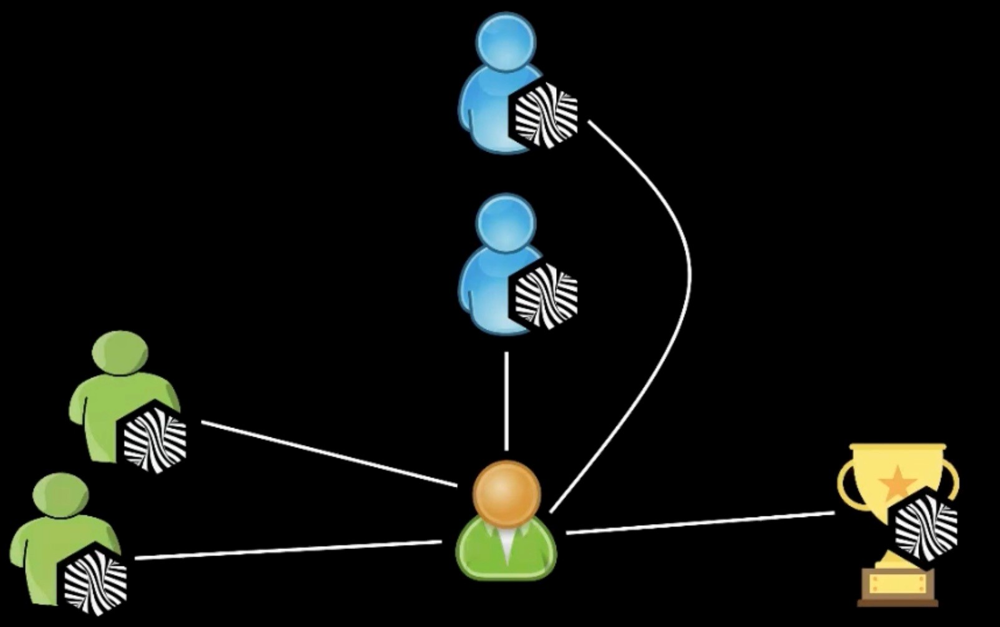

# Change Management

## How to do cultural change- 2-2-1 rule

*Science based, applied in Nike.*

* 2 points of reinforcement from management chain for given individual communicate they think its a good idea. They show support.
* 2 points of reinforcement from peers for given individual communicate they think its a good idea. They show support.
* 1 point of success story.

## [Patterns](patterns.md)

## Resources

* [More Fearless Change](https://www.goodreads.com/book/show/23287939-more-fearless-change)
* [Fearless Change - Patterns for Introducing New Ideas](https://www.goodreads.com/book/show/261666.Fearless_Change)
* [How Behavior Spreads](https://www.goodreads.com/book/show/36854820-how-behavior-spreads)