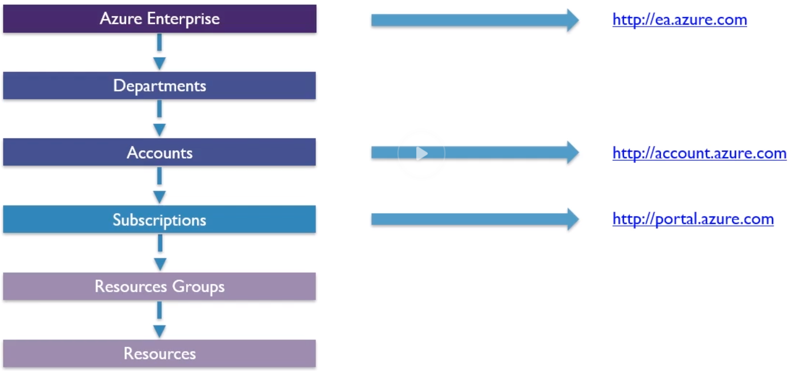
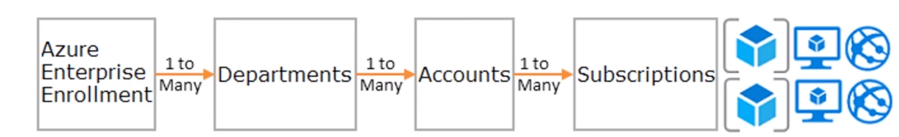
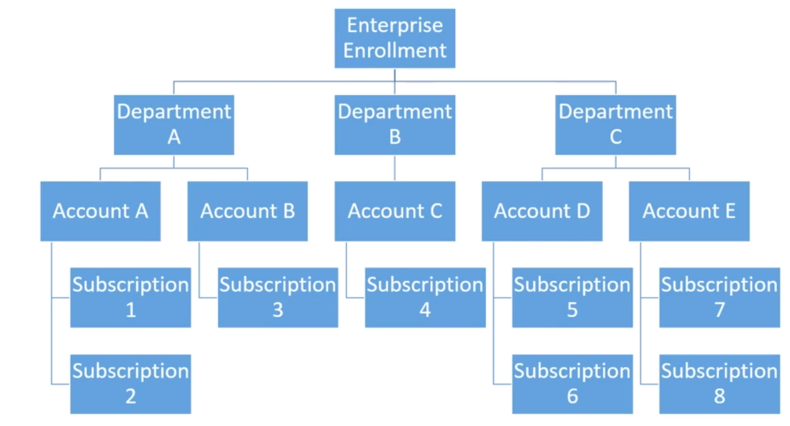
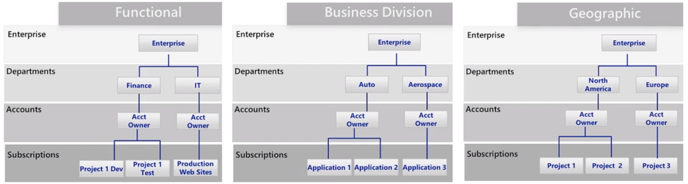
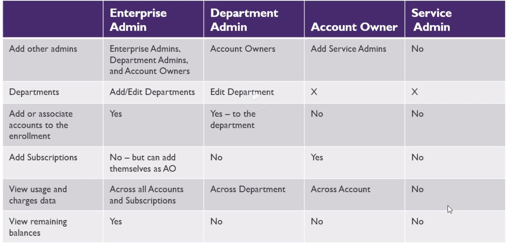

# AZ 300 Microsoft Azure Architect Technologies Notes

## Azure Fundamentals

### Accounts and Subscriptions Overview

* Recently added "management groups"

### Quotas Cost Analysis and Tagging Demonstration

* Like AWS, there is TAG concept, which helps you to tag resources for billing and other purposes. So a tagging strategy is very useful.
* You get a lot of soft limits for quotas, and with a ticket you can increase it, just like AWS. 
    * Limits for vCPU's, VM's ...

### Billing Alerts
