# AZ 300 Microsoft Azure Architect Technologies Notes

## Azure Fundamentals

* [AWS tp Azure Service Comparison](https://docs.microsoft.com/en-us/azure/architecture/aws-professional/services)
* [Azure Architecture Center](https://docs.microsoft.com/en-us/azure/architecture/)

### Some comparisons

* Blob storage does the same as AWS S3 and EBS
* Table storage - Key/value like DynamoDB
* Queue Storage - Messeging for workflow and communication between components of the cloud services
* File Storage - Similar to EFS
* Load balancer - Similar as AWS Classic Load Balancer (level 4)
* Application Gateway - AWS Application load balancer (application level, level 7)
* Traffic manager - DNS level traffic routing for load balancing and fail over cross geo.
* SES - In Azure use of 3th party solutions like sendgrid
* SQS - Queue Storage in Azure
* AWS Auto Scaling - VM Scale Sets
* Dynamo DB - Azure Cosmos
* ElastiCache - Azure Cache for Redis
* CloufFormation - Azure Resource Manager/VM extensions and Azure Automation + templates
* Trusted Advisor - Azure Advisor (analysis of cloud resource configuration and security for optimum config)
* AWS Management Console - Azure Portal
* SQS - Azure Queue Storage for between services, and Service Buss ofr Pub/Sub messaging self implemented
* SNS - Even Grid
* AWS Organizations - Management Groups + Azure Policy
* AWS SHield - Azure DDOS protection Service
* S3 - Azure Blob Storage
* EFS (Elastic File System) - Azure files
* S3 IA - Azure Storage Cool Tier
* S3 Glacier - Azure storage Archive Access Tier
* AWS Backup - Azure Backup
* Elastic Beanstalk - App Service (PAAS)
* API Gateway - API Management
* CloudFront - Azure Content Delivery Network

* Notice that many resources (like a User Define Route) can be stored in specific locations, research if you can
widely mix and match these regarding the subnets, VNets, Resource Groups...


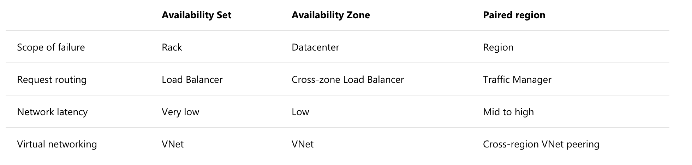
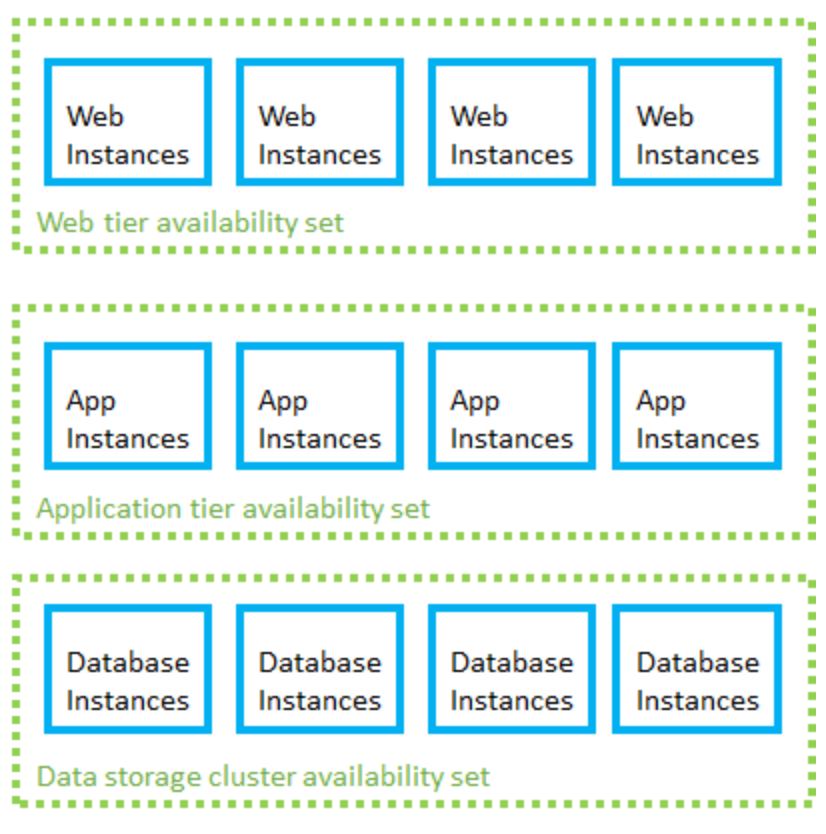

### Accounts and Subscriptions Overview


* Recently added "management groups"


### Quotas Cost Analysis and Tagging Demonstration

* Like AWS, there is TAG concept, which helps you to tag resources for billing and other purposes. So a tagging strategy is very useful.
* You get a lot of soft limits for quotas, and with a ticket you can increase it, just like AWS. 
    * Limits for vCPU's, VM's ...

### Billing Alerts

### Policies

You can assign policies, (also with JSON), so that any a suscription for example, can only
deploy certain type of virtual machines.

So we want maybe to set such "Allowed virtual Machine SKUs" for services.

Policies can be assigned to multiple subscriptions by using management groups.

### Resource Groups and Tagging

Resource groups are an arbitrary grouping of related resources. You can put resources from another
region (aside of the one defined in the resource group). But the meta data of the resource group will be stored 
in the defined region.

Tips for tagging
* Cost center (who Pays)
* Business Owner
* Maintenance window

We can also do IAM and policies on a resource group basis.

You can check all the deploys that happened in a Resource Group.

A resource group has its own view, you can do deployments, policies, iam, cost, automation scripts, metrics, ...

A resource group is always assigned to a subscription.

### Moving Resources Between Resource groups

You can move resources from one resource group to another.

Metrics from monitoring are stored in a "Diagnostics Storage Account".

Somre resources cannot be moved, like alerts and (at the moment) managed disks.

### Azure Monitoring Overview

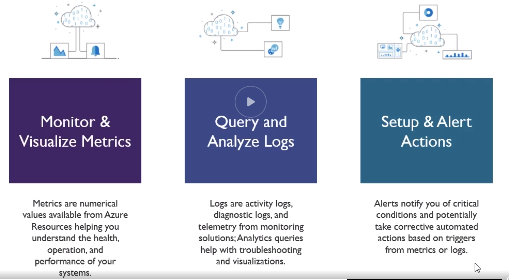

You can create metric filters and then pin them to your dashboard.

When creating an alert, you choose the target resource(s), then what condition to trigger it, then the action group
which is to notify a team via mail, text, trigger webhooks, runbooks, functions, or many others.

A runbook is basically certain actions you dfine (like scale up) or such. This can be triggered manually or automatically.

Azure by default monitors the host level metrics (from the hypervisor) like CPU usage and such,
this is different from the guest level metrics, being the usage of certain services or programs in your OS.
For this you need to install an agent on your guest OS which runs on your virtual machine.

You can enable guest level metrics collection in the VM > Monitoring > Diagnostic Settings > Enable guest level monitoring.

ITSM (IT Service Management)

### Log Analytics Key Features

Log Analytics is the layer that is used to gather all logs and then other services can query this layer.
The log analytics takes care of auto storing, creating tables and everything necessary to persist data.

Data Sources (for logs)
* source : Event Type : desc
* Custom Logs : <LogName>_CL : Text files from the gues level agents
* Windows Event Logs : Event : Collected form the event logon windows computers
* Windows Performance Counters : Perf : Perf from windows machines
* Linux Performance Counters : Perf : Per from linux machines
* IIS Logs : W3CIISLog : IIS logs in W3C format
* Syslog : Syslog : Syslog events on Windows or Linux machines

other ones are like Azure Activity Log and Storage account logs.

Search query fundamentals
* Start with the source table (e.g Event)
* Follow on with a series of operators (which VM)
* Separate out additonal operations by using pipe `|`
* Join other tables and workspaces using "union"

You are charged for the service "Log Analytics"

Seems that resource groups are often mandatory in many setups.

You pay for Log Anayltics per GB

So you create a Log Analytics workspace, here you pay per GB, you can then attach data sources, like VMs to it.

You can then query in the workspace, somehow you can also query accross multiple workspaces.

Log analytics stores in a region its data.

Again IAM is applicable to such a workspace.

With the query language, you start with a source, then you always do PIPING to the next thing, like:
```
    Perf 
    | where TimeGenerated > ago(1h) 
    | where CounterName == @"% Processor Time"
    | summarize avg(CounterValue) by Computer, (bin(TimeGenerated, 1m))
    | render timechart
```

Reminds a bit of F# syntax

From a query you can create an alert rule.

### Create and Configure Storage Accounts

Like S3, storage accounts are assigned some public URL, therefore it needs to be universily unique,

```
    https://<your-storage-account-name>.<type>.core.windows.net/<container>/filename.extension
```

Types
* General Purpose v1 (GPV1)
* General Purpose v2 (GPV2) - Main choice (merged GPV1 and Blob account)
* Blob account

* Block Blob
  * Ideal for storing text or binary files, a singlicke block blob can contain up to 50K blocks of up to 100MB each, max 4.75TB
  * Append blobs are optimized for append operations (e.g. logging)
* Page Blob
  * Efficient for read/write operations
  * used by Azure VM's
  * Up to 8 TB in size.
  
* Storage Tiers
  * Hot (high storage costs, low access costs)
  * Cold (lower storage costs, higher access cost, intended for data that will remain cool for 30 days or more)
  * Archive (Lowest storage, highest access cost, when a blob is in archive storage it is offline and cannot be read)
  
* Choosing between Blobs, Files and Disks
  * Blobs : Access app data from anywhere, large amount of objects to store images, video
  * Files : Access files across multiple machines, jumpbox scenarioas for shared development scenarios
  * Disks : Do not need to access data outside of the VM, Disk expansion for application installations
  
Storage accounts must have unique names across Azure (like a bucket on AWS).

* Replication
  * Locally redundant Storage (LRS) - 3 copies in the same zone
  * Zone redundant Storage (ZRS) - 3 copies across different zones but same region
  * Geo redundant Storage (GRS) (Cross zone) - 6 copies accross multiple regions 
  * Read Access Geo Rendundant Storage (RA-GRS) - replicate to another region for reading
  
A storage account can be allowed to a single VPC or to all of your VPCs.

The Secure transfer flag enforces access to be over HTTPS and other equivalents depending the type of access.

You can use **Azure Storage Explorer** for managing files, uploading, viewing, get urls, and such.
You also have azcopy CLI to copy from and to a storage account.

**Managing Access: Container permissions**

* Public Access level : By default disabled for obvious reasons
  * Levels:
    * Private
    * Blob (anonymous read access for blobs only)
    * Container (anonymous read access for containers and blobs), public access to the entire container

We can have more granular access management
* Shared Access Signature 
  * Is is a query string that we add on to the url of the storage resources
  * string informs Azure what access should be granted (basically signed urls)
  * Utilized a hash based message auth (again, typical signed url)
  * The SAS can be used as
    * Account SAS Tokens
      * Granted at the account level to grant permissions to services within the account. (Service to Service communication)
    * Service SAS Tokens 
      * Grants access to a specific service within a storage account
      
Breakdown

```
    https://<your-storage-account-name>.<type>.core.windows.net/<container>/filename.extension
    ?sv=2017-7-29  # Storage service version
    &ss=bfqt       # Signed services (Blob, File, queue, Table)
    &srt=sco       # Signed Resource Types (Service, Container, Object)
    &sp=rwdlacup   # Signed Permission (Read, Write, Delete, List, Add, Create, Update, Process) (process is queue messages)
    &se=UTCTIMESTR # Signed Expiry
    &st=UTCTIMESTR # Signed Expiry & Start
    &spr=https     # Signed Protocol
    &sig=...       # Signature hash
```

You can create a Access Policy that a SAS refers to. Since the SAS refers to an policy, you can change the policy itself
dynamically.

**Encryption Keys and Key Vault**

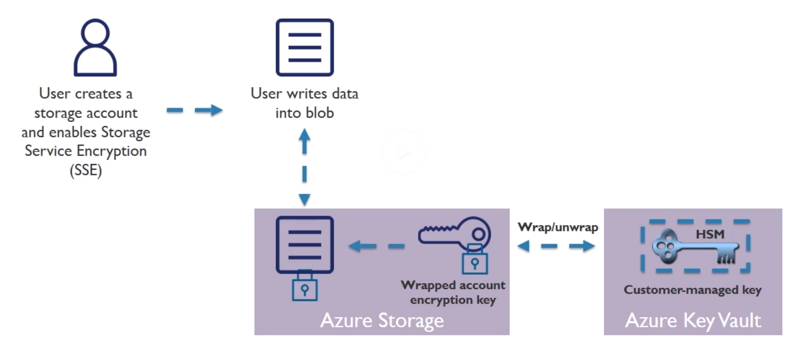

HSM : Hardware Security Modules

SSE : Service Encryption

**Custom Domains**

e.g. have http://acloud.guru instead of http://account.blob.core.windows.net *can also points directly a specific container)

It's all DNS anyway!

2 ways to do this

* Create a CNAME record with your DNS provider that points from
  * Your Domain (eg www.yourdomain.com to youraccount.blob.core.windows.net) - Simple but results in brief downtime as Azure verifies the registration of your domain
  * "asverify" subdomain (verify.yourdomain.com to asverify.youraccount.blob.core.windows.net)
    * When step complete, create CNAME record that points to youraccount.blob.core.windows.net
    * No downtime
    * This is the indirect CNAME validation
    
**Azure Import/export Use Cases**

* Data Migration to the cloud (large amounts of data to azure)
* Content Distribution (sending data to customer sites)
* Backup (backup on premise data)
* Data Recovery (send data from data center to on premise data centers)

* Import/export service
  * Access via Azure Portal
  * Used to track data import (upload) jobs
  * Used to track data export (download) jobs
* CLI for
  * Prep disk drives that are shipped
  * Copying data to your drive
  * Encrypts data with BitLocker
  * Generates drive journal files
  * Determine number of drives
* Use V1 for blob and V2 for files
* Disk Drives
  * HDD
  * SSD
  * Import jobs: You ship drives containing your data
  * Export Jobs: You ship empty drives
  
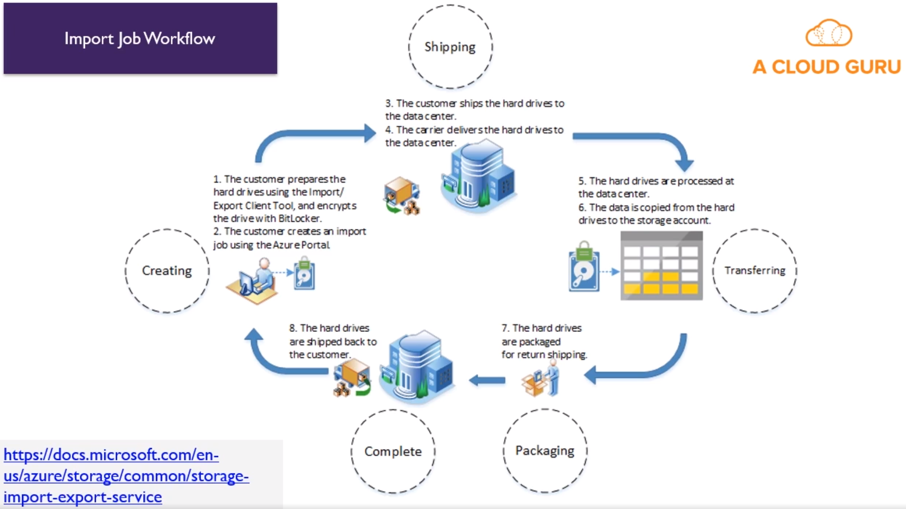

**Business Continuity Strategies**

* High Availability (Run another instance of apps in case of catastrophic failure) (proactive)
* Disaster Recovery (Run apps in secondary datacenter if a failure occurs) (reactive)
* Backup (Restore your data)

* Azure Backup
  * Backup solution purpose builft for Cloud
  * Unlimited Scaling
  * Unlimited Data Transfer
  * Multiple Storage Options (LRS/GRS)
  * Long Term Retention
  * Application-Consistent Backups
  * Data Encryption

* Azure Backup Components (read about them in the docs!)
  * Azure Backup (MARS) Agent
  * System Center DPM (Data Protection Manager)
  * Azure Backup Server
  * Azure IaaS VM Backup
  
* Other Recovery Options (more manual)
  * Snapshot recovery
    * Blob snapshots taken of VM page blob
    * Snapshots can be copied into the same or different regions
    * VMs get created from snapshot
    * Application consistent if VM was shutdown, otherwise crash-consistent
  * Geo Replication
    * Uses Azure storage GRS
    * Data is replicated to a paired region far away from the primary copy
    * Data recovery in the event of an outage or entire region unavailable
    * RA-GRS option available as well
    
## Virtual Machines

* Azure uses hypervisor for the VM
* Billed per second
* AWS EBS === Azure Storage for VM Disks

* Types
  * A - Basic : Basic version of the A series for testing and development.
  * A - Standard : General-purpose VMs
  * B - Burstable : Burstable instances that can burst to the full capacity of the CPU when needed. (typicall webservers, check sth with cpu credits)
  * D - General Purpose : Built for enterprise applications. DS instances offer **premium storage**.
  * E - Memory optimized : High memory-to-cpu core ratio. Es instances offer **premium storage**.
  * F - CPU Optimized : High CPU core-to-memory ratio. FS instances **offer premium storage**.
  * G - Godzilla : Very large instances ideal for large databases and big data use cases.
  * H - High performance compute : Aimed at very high-end computational needs such as molecular modelling and other scientific applications.
  * L - Storage optimized : Offer higher disk throughput and IO.
  * M - Large memory : Another large-scale memory option that allows for up to 3.5 TB of ram.
  * N - GPU Enabled : has GPU
  * SAP HANA : Specialized instances built and certificied for running SAP HANA.
  * Could be that a policy or subscription does not allow you to use certain types
  
* Specializations
  * S : Premium Storage options (eg. DSv2)
  * M : Larger memory (eg. A2m_v2)
  * R : Supports remote direct memory access (RDMA) (eg. H16mr)
  
* Azure Compute Inits (ACUs)
  * Way to compare CPU performance between different types/size of VM
  * Microsoft created performance benchmark.
  * Eg. A VM with ACU of 200 has twice the performance of a VM with an ACU of 100.
  
* Supported workloads
  * Windows Server Support
    * Pre-windows 2008 R2 
      * Supported
      * Must bring own image
      * No marketplace support
      * Need to have your own custom support agreement (CSA)
    * Windows Server 2008 R2
      * Supported
      * Specific support matrix for server roles.
    * Windows Server 2012 : Supported, datacenter version in marketplace
    * Windows Server 2016 : Supported, datacenter and nano versions in marketplace.
    * Desktop OS : PRo and Enterprise in marketplace
    * Read [Article](https://support.microsoft.com/en-us/help/2721672/microsoft-server-software-support-for-microsoft-azure-virtual-machines) !!
  * Linux Server Support
    * CentOS
    * CoreOS
    * Debian
    * Oracle Linux
    * Red Hat Enterprise Linux
    * SUSE Linux Enterprise
    * OpenSUSE
    * [More Info](https://docs.microsoft.com/en-us/azure/virtual-machines/linux/endorsed-distros)
  
* There are regional limitations on VM types based on region

* Region sets relate to deployment (eg EAST US and WEST US). They would always first patch the one region, once done, the other, never at the same time.
  * Important to take in account to avoid at all cost
  
* There is a list of restricted usernames for your VMs
  * Eg. Administrator, admin, user, user, test, david, gues, root, server, sql, john, backup, console, ... and more
  
* Setting up a VM
  * Windows OS always requires username/pass, while linux, you can also choose a SSH key
  * Availability Options
    * No redundancy
    * Availability set : Same data center, but 2 VMs in separate racks and power supply and separate networking
    * Availability zone : In separate data centers
    * Azyre Hybrid : Benefit to use on premise windows server license and run windows VM at reduced cost. (but need Software Assurance or sth)
  * Disks
    * By default a VM has a OS and temporary (ephemeral?) disk for short term storage.
    * Additional data disks can be added
    * When adding data disk, you can use a Snapshot or storage blob as source
    * By default disks are managed (see advance section)
  * Networking
    * PublicIP can be assigned but you can choose not too
    * Sugnet is mandatory and the VPC (or rather Virtual Network)
    * NIC : Network Interface Card
    * NIC Network security group (TODO read more !)
      * Ideally one Network Security Group assigned per Subnet (is the general advice)
    * Accelerator netorking is only on specific VM types and OS's (bypassed a certain virtualization layer)
    * YOu can always put immediatly a VM in a pool behind a load balancer
  * Management
    * System assigned managed identity : This is like a AWS Role, so other azure services can authenticate
    * You can enable built in backup
  * Tags obviously
  * At the end you can download the template for later automation
  * During deployment you can check the inputs/outputs and the template
  
* VM
  * Connect over RDP with Windows
  * SSH for linux
  * CLI with powershell WinRM
    * Create a key vault
    * Create a self-signed certificate
    * Upload certificate to the Key vault.
    * Get the url for your certificate from the key vault
    * Reference your self-signed certificate when you create the VM
    
* VM Storage
  * Disks can be encrypted (in-rest)
  * YOu can always attach disks once running (don't forget to mount it in the guest OS)
  * Types
    * Standard HDD
      * Traditional HDD
      * Most cost effective
      * Throughput based on VM
      * IOPS based on VM
    * Standard SSD
      * SSD
      * Recommended for most
      * Max throughput 500MB/S per disk
      * Max IOPS 2000 IOPS per disk
    * Premium SSD
      * SSD
      * Higher performance, lowest latency
      * Max 750 MB/s per disk
      * Max IOPS 7500 IOPS per disk
    * Ultra SSD - in preview
  * Managed Disk - Standard sizes
    * the size impacts the throughput and IOPS, therefore an estimated performance is shown when choosing size
    * S4 - 32 GB
    * S6 - 64 GB
    * S10 - 128 GB
    * S20 - 512GB
    * And many more...
    * ! IOPs and throughput are not provisioned and depend ong the performance of the VM.
  * VM LIMITS
    * Make sure that your VM can handle your bandwith, because the VM itself can be the weakest link in the chain of
      throughput and IOPS. (VM can be limited itself technically or by design)
  * Managed vs Unmanaged Disks
    * Unmanaged Disk (DIY)
      * DIY - Manage storage account
      * Managment overhead (20000 IOPS per storage account limit)
      * Supports all replication modes (LRS, ZRS, GRS RA-GRS)
    * Managed Disk
      * Simple (don't worry about the storage account)
      * Lower management overhead as Azure manages the storage accounts
      * Only LRS replication mode (currently) - but you can have backup to ZRS, GRS or RA-GRS.
  * Disk Caching
    * Method for improving performance of a Virtual HD (VHD)
    * Utilizes local RAM and SSD drives on underlying VM host (the actual barebone)
    * Available on standard and premium disk
    * Types
      * Read-Only Caching : Improve latency and potentially gain higher IOPS per disk
      * Read-Write Caching : Ensure you have a proper way to write data from cache to persistent disks
    * Default/allowed settings
      * OS - Default "Read-Write" - Allowed "Read-Only or Read-Write"
      * Data - Default "None" - Allowed "None, Read-Only, or Read-Write"
    * At this time you can change only the disk caching via Powershell, not via Portal

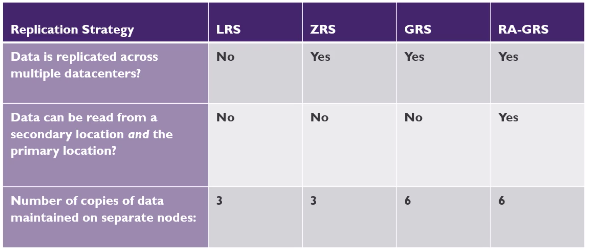

* Azure VM Networking
  * One NIC can be attached to a VPC and subnet, attached/detacched as needed
  * Network security groups can be attached to a NIC or to a subnet
  * You can customize the DNS for a NIC, but by default it inherits from the Virtual Network
  * I think the Network Security Group is equivalent to NACL
  
* Availability Sets
  * TODO : Compare the limitations of VPC/SUBNET limitations with the Virtual Network/SUBNET limitations regarding regions and zones.
  * TODO : Read more on this availability sets VS AWS
  * Availability sets can be directly mapped to a backend pool of a Load Balancer
  * Potential for VM Impact
    * Planned Maintenance
    * Unplanned Hardware maintenance
    * Unexpected Downtime
  * With Availability sets
    * Group two or more machines in a set
    * Separated based on fault Domains and Update Domains
  * An availability set can have up to 3 Fault domains. Each fault domain is a different rack with own power and networking connectivity.
    * This is for teach, downtime
  * Update domains is to make sure when they patch stuff, they never patch the same update domains at the same time.
  * One availability set per TIER ? (WEB/APP/DATA) - YES
  

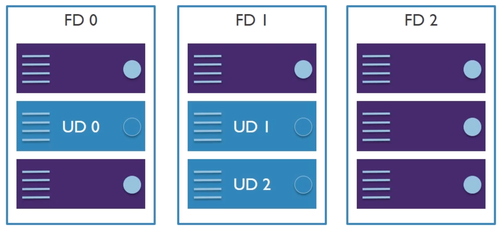
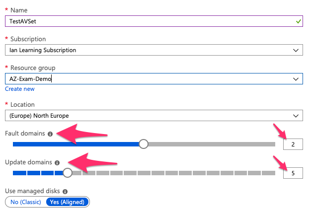

* Scale Sets
  * Horizontal scaling
  * Virtual Machine Scale Sets (VMSS)
  * This can be auto scaling or fixed scale or schedule
  * Auto scaling can be on simple metrics like CPU Usage, but also in application metrics
  
## Networking


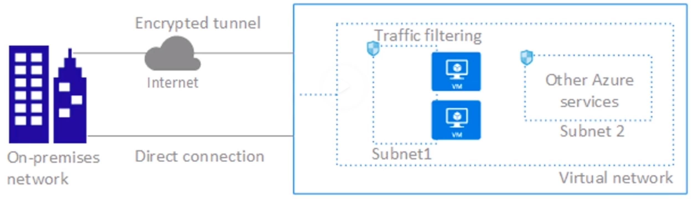
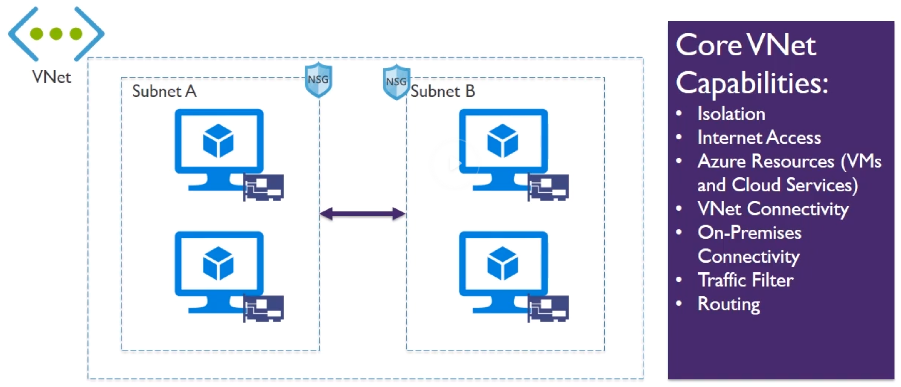

* Vnet : Virtual Network
* NSG : Network Security Group on a Subnet (similar to NACL)
* Revise subnetting/masking again (10.0.0.0/24) CIDR
* When creating a subnet, you don't assign a Zone, unlike in AWS, in AWS a subnet resides explicitly in a ZOne
* Some addresses in a subnet are always reserved by Azure
* You need to know Powershell commands for the exam 😞
* DHCP only allocates IP address to a resources until its created
* IP address only deallocated after deletion of resource
* Static addresses are the equivalent DHCP reservation
* Address prefix comes from Vnet/subnet definitions
* Azure reserves the first 3 and last IP from the pool, so the first Ip address is `.4`, because 1,2 and 3 are reserved. Meaning 5 reserved in total. as 0 is always your loopback interface
* All resources in a VNEt can communicate with the internet by default
* Private IP is SNAT (Source Network Address Translater) to a public IP selected by Azure.
* Outbound connectivity can be restricted via routes (Routing table) or **traffic filtering** (Network Security Groups).
* Inbound connectivty without SNAT requires public IP


* DNS
  * Azure provided DNS for basic networking (between services and such)
  * Customer DNS Server (self hosted DNS server)
  * Recommendations
    * Azure Provided DNS
      * Name resolution between role instances or VMs in the same VNET
    * Customer-managed DNS Server
      * Name resolution between role instances or VNs in different VNET
      * Resolution of on-premises computes and service names from role instances or VMs in Azure
      * Resolution of Azure hostnames from on-premises computers
  * All VMs in a Vnet must be restarted to utalize updated DNS server settings (configured on bootup)
    * You can also configure a DNS individually on a VM by editing the NIC settings
* Remember you can configure on the NIC to disabled/enabled/reassign public IP and set a fixed private IP address


* Routing
  * Every subnet has a route table, with min routes:
    * Local Vnet : Route for local addresses (no next-hop value)
    * On-Premises : Route for defined on-premises address space (VNet gateway is next-hop address)
    * Internet : Rotue for all traffic destined to the internet (Internet Gateway is the next-hop address)
    * Default routing in a subnet
      * 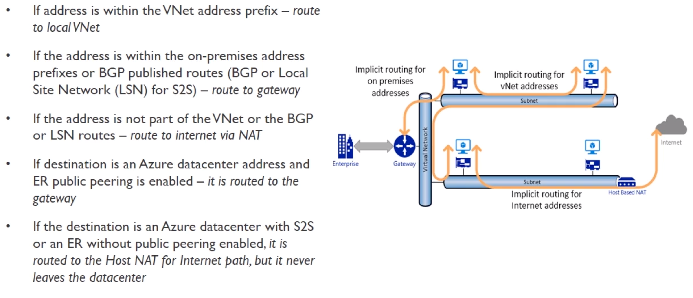
      * S2S : Site to Site
      * BGP : Border Gateway Protocol (exchange routing among autonomous sustems on the internet)
    * We can create User Defined Routes (UDR)
      * Find it under "Route Tables"
      * When creating one, you 
    * VNET peering to connect different VNETS with each others
    * Daisy chaining does not work. so if you peer A > B > C, A and C can't see each other.
  * Demo
    * TODO try those User Defined Routes, you define one, then you associate it to a subnet
    * You can't pair VNETS with overlapping CIDR
    * Allow forwarded traffic : Allow traffic that did not originate from within A to be forward to B (when A -> B peer)
      * You can configure this indivudally in each direction
    * Allow gateway transit : Vnet uses VPm gateway in peered Vnet, only one VNET can have a VPN gateway configured then
    
* Network Secruity Groups (NSGs)
  * Network filter
  * Allows or restricts traffic to resources in your VNET
  * Inbound en outbound rules
  * Stateless
  * Can be associated to Subnet or NIC (on Subnet level, this rule is applied to ALL resources in the subnet)
  * Properties
   * Name
   * Protocol
   * Destination and source port range
   * Destination and source address range
   * Direction (in or outbound)
   * Priority (range 100 - 4096) (the lower, the higher the priority)
   * Access (Allow/Deny)
  * Default (Service) tags
    * System provided to identity groups of IP addresses
    * Vnet
    * Azure Load Balancer
    * Internet
  * there are always default rules created
  * An NIC can only have one NSG
  
* Hybrid Connectivity 
  * Options
    * Site to Site (S2S) -> Via VPN 
      * Vnet > VPN Gateway > One ore more VPN Tunnel > One or more On premise (multi site for more than one)
      * S2S VPN is over **IPsec/IKE** (ikeEv1 or IKEv2)
      * Required VPN device in enterprise datacenter with public IP address
      * Must **not** be located behind NAT
      * Can be used for cross-premises and hybrid configs
    * Point-to-site -> P2S
      * Connect clients to the Vnet directly 
      * Vnet -> VPN Gateways -> One or more **P2S SSTP tunnels** to one or more clients
      * Secure connectiom from invididual computer
      * No need for a VPN device or public IP
      * OS support Windows 7, 8, 8.1, 10 and Wondows Server 2008 R2 and up
      * Throughput up to 100 Mbps
      * Doesn't scale easily, only usefull for a few workstations
    * 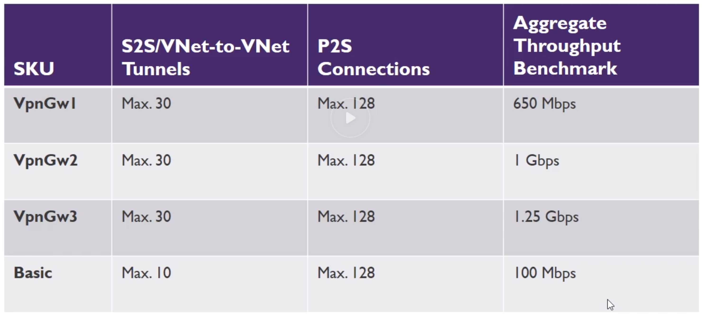
    * 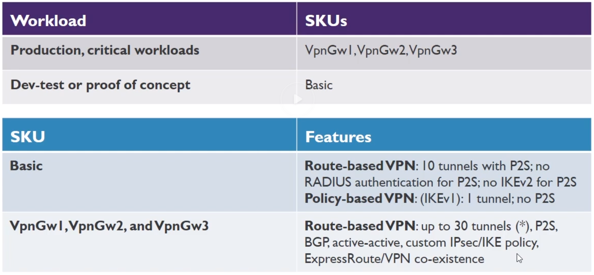
    * ExpressRoute -> Direct connection
      * Customers Network -> Partner Edge -> Express Route Circuit (primary and secondary connection) -> Microsoft Edge -> Internal forwarding to microsoft peerinf for Office 265 or Dynamics or else to Azure private peering to VNETS
      * 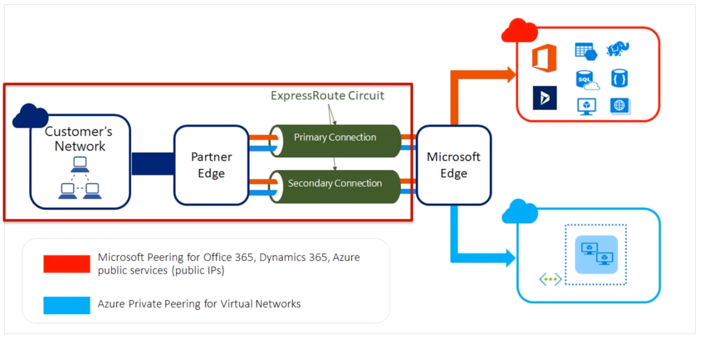
      * 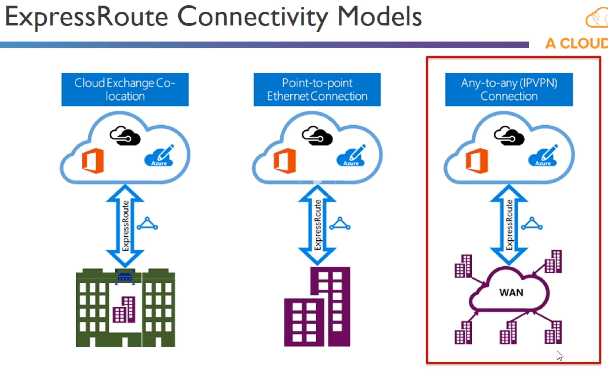
      * Requires /30 routes or sth
      * Benefits
        * Layer 3 Connectivity
        * Connectivity in all regions
        * Global connectivity
        * DYnamic Ruting
        * Built-In Redundancy
      * Unlimited vs Metered
       * Unlimited
         * Speed 50 Mbps - 10 Gbps
         * Unlimited inbound data 
         * Unlimited outbound data
         * Higher monthly fee
       * Metered
         * Speed 50 Mbps - 10 Gbps
         * Unlimited Inbound data transfer
         * Outbound data transfer charged at a predetermined rate per GB
         * Lower monthly fee 
       * Considerations
        * Understand the models
          * Unlimited vs Metered Data
          * Understand what model you are using today to accelerate adoption
          * Understand the differences in available port speeds, locations and approach
          * Understand the limits that drive additional circuits
        * Understand the providers
          * Each offer a different experience based on ecosystem and capabilities
          * Some provide complete solutions and management
        * Understand the costs
          * Connection costs can be broken out by the service connection costs (Azure) and the authorized carrier costs (telco partner)
          * Unlike other Azure services, look beyond the Azure pricing calculator

* Network Watcher
  * TODO : Play with it
  * Extension you have to install
  * Gues OS level agent that monitors the network of your VMs
  * You can then see the topology graphically of the entire network and all network related stuff
  * You can monitor the connection between two VMs (or other stuff?)
  * Network Performance monitor
  * Very detailed stuff
  * Network Diagnostics
  * IP Flow verify : Check if a package is allowed or denied from a VM (+ debug the Security Rules)
  * Security Group View : Choose a NIC and you can see all the rules for that NIC and break it down where the rules come from
  * Next Hop : You can check from a VM and target an IP address and see what the next hop would be (again debugging the routing tables)
  * Package capture...
  * VPN debug ...
  
* Load Balancing
  * Load Balancer (layer 4, transport layer)
    * Basic and Standard SKUs 
    * Service monitoring (probe instances which are unhealthy)
    * Automatic reconfiguration (for when scaling)
    * Hash Based Distribution + provides stickyness, so keep accessing same backend service
    * Internal and Public Options
    * Any application protocols
  * Application Gateway (layer 7, application layer), works also as reverse proxy
    * Cookie bases session affinity (user can remain same user session)
    * Stanard Tier (traditional) or WAF Tier
    * Can have multiple instances
    * SSL offload (ssl is broken)
    * End to End SSL (re encrypts)
    * Web Application Firewall (protects agains SQL injection and typical attacks), you can then add rules obviously
    * URL Based content routing
    * Requires its own subnet
    * HTTP, HTTPS and Websockets application protocols
    * What is this SKU related to the Application Gateway?
    * Connection draining - Don't stop in flight reqiests/connections before a backend servers is removed from a backend pool
    * Cookie based affinity - send requests with same cookie to same backend server
    * Can only assign a private IP address to it if its the only App Gateway in related Vnet
    * Sizes
      * Page Response 6K - Small (7.5 Mbps) - Medium (13 Mbps) - Large (50 Mbps)
      * Page Response 100K - Small (35 Mbps) - Medium (100 Mbps) - Large (200 Mbps)
  * Traffic Manager - Global, zo DNS level
  * 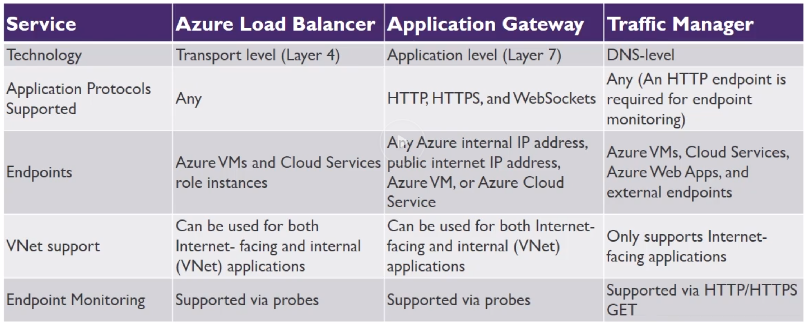

## Managing and Securing Identities

* Domain Services Overview
  * 3 Major Options for Auth in AD
    * **Azure AD (AAD)** -> Primary mechanism
      * Modern AD service directly build for the cloud
      * Often the same as 265 directory service 
      * Can sync with in premises directory service
      * A "tenant" in AD is like a brand new AD isolated from others
      * Features
        * Enterprise Identity Solution
        * Single Sign-On (you can reuse the same cookie sort to say, so you don't need to keep relogging in for each app)
        * MFA
        * Self Service (empower users to do complete password resets, request access, ....)
      * Creating a new directory (TODO: Does that equal creating a new tenant?)
        * Must be UUID name, as this gets a public subdomain for `*.onmicrosoft.com`
        * A subscription can only be owned within one "directory/tenant", so users from different directories cannot have access to the exact same subscription.
        * When creating a new user, a password is created you can check, but they will be prompter to change it after login
        * new users will get an email like `<freetochoose>@direcotryname.onmicrosoft.com`
        * Guest users are supported
        * Via the IAM of an object (like a subscription), you can assign a role so that a User, group or service principal can access that subscription/object.
      * Tiers
        * Free 
          * 500K Object Limit
          * 10 Apps/user
          * Basic Reports
          * No SLA/group based access/password self service/branding
          * Limited MFA
        * Basic
          * 10 Apps/User
          * Basic Reports
          * Limited MFA
        * Premium P1
        * Premium P2
          * Privileged Identity Management -> Temporary switch to higher access role when necessary and then degrade again, so like temp root access
        * Office 365 Apps (thats not one you choose)
    * **Active Directory Domain Services (ADDS)** -> On premise solution, prob self hosted
      * Windows server with Activey Directory Domain Services role installed on it
      * Legacy Active Directory since Windows 2000
      * Traditional Kerbos and LDAP functionality
      * Deployed on Windows OS usually on VMs
    * **Azure Active Directory Domain Services (AADDS)** -> Manager service
      * Provides managed Active Directory Domain Services (instead of self hosted)
      * Allows you to consume domain services without the need to patch and maintain domain controllers on IaaS
      * Domain Join, Group Policy, LDAP, Kerberos, NTLM; all supported
      * Perfect for unexperienced devs with AD
      * Need to create a dedicated subnet for this? - No, it is just recommended. To separate the IP space related to AADDS.
      * You will need to update DNS settings for your VNet that runs AADDS

* Azure AD Overview
  * TODO [Read Article](https://docs.microsoft.com/en-us/azure/active-directory/fundamentals/active-directory-whatis)
  * 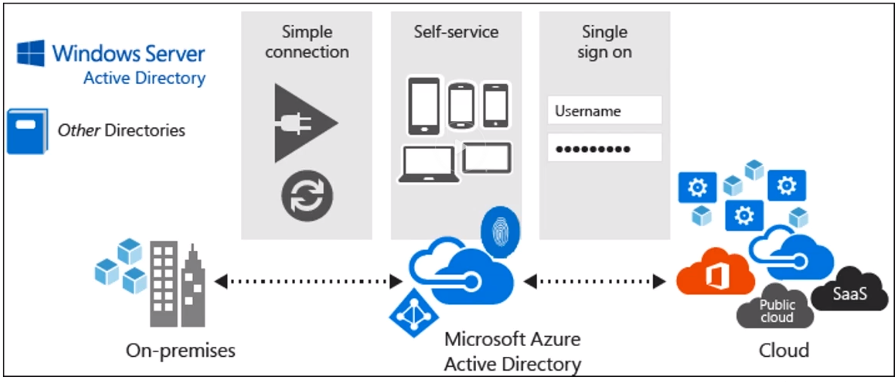

* Azure AD Connect (Connects a Azure AD (cloud) and ADDS (On Premise))
  * Components
    * Synchronization Services (create users and keep in sync and such)
      * Filtering : Limit which objects are synced to Azure AD
        * Default filtering : All users, contacts, groups and windows 10 users are synced
        * Password Hash Sync : Syncs password hash of your on premise AD to the Azure AD
        * Password writeback : Change/reset password in the cloud and write back to the on premise AD
        * Device writeback : Allow register devices back to on premise AD
        * Prevent accidental deletes : (by default on) 
        * Automatic upgrade : (default on for express) auto update/patch the version
      * Password Sync Options
        * Password Sync : Ensures user passwords ar the same in both directories (ADDS and Azure AD)
        * Passthrough authentication : When user logs in, request is forwarded to ADDS. So Azure AD just acts as a proxy. Single Source
        * AD FS - AD Federation services server to fully federate accross AD DS and Azure AD along with other services.
          * Identity Federation : Linking identity across different identity systems. (related to SSO)
            * Technologies used : SAML, OAuth, OpenID, JWT, Windows Identity Foundation
            * Examples : Being able to login with Google Account to other services, same with FB, Microsoft, Github, ...
    * Active Directory Federation Services (optional)
    * Health Monitoring
      * Agent that you have to install on your ADDS
  * Signel Sign On : Using password sync or passthrough authentication (not Federation)
    * Requires Company device with modern browser
    * User not required to authenticate with Azure AD if they are logged on with their AD DS credentials
  * MFA
    * Sth you know (password)
    * Sth you have (phone)
    * Sth you are (Biometrics)
    * Methods 
      * Phone call
      * Text Message
      * Mobile App notification
      * Mobile app verification code (code generator like Google Authenticator)
      * 3th party tokens
    
* Azure AD B2C
  * Allow people ot login with LinkedIn/Facebook/...
  * Cloud Identity Solutions for Web And Mobile Apps
  * Highly scalable to hundres of millions of identities
  * Enables authentication for:
    * Social Accounts
    * Enterprise Acccounts
* Azure AD B2B
  * Allowes you to collaborate with partners outside of your organization
  * Users receive an email with a confirmation link upon invitation
  * Imported users are "Azure AD External User Objects"
  * Access to shared apps, resources, documents, ...
  * Partners access with their own credentials
  * Enterprise-level security
  
* Privileged Identity Managment (PIM)
 * What ?
   * A user with some admin rights. 
   * Put some control around these privileged users
   * Visibility into users with privileged access
     * Azure Resources
     * Azure AD
   * On Demand administrative access
   * View administrator history
   * Setup alerts
   * Require approvals (via workflows)
 * PIM Process
   * User, with not too much access (but should sometimes)
   * When they need this elevated access
   * They go through activation process (customizable)
     * Additional Auth
     * Approval workflow (sent to a manager or sth)
     * Can put time restriction on it
   * Now you have an activated user, ready to work.
 * Requirements
   * Azure AD P2 License
 * PIM Roles
   * Privileged Role Admin : Can manage role assignments and all aspects of PIM
   * Security Administrator : Can read security information and reports, manage config in Azure Ad and Office 365
   * Need to be global admin to setup PIM, this user is assigned both of the above roles.
   * Only Privileged Role Admin can mange Azure AD directory role assignments of users.
 * Assigned roles
   * Directory
     * Azure AD roles
     * Can be "eligble" or "permanent"
     * E.g. Global Admin
   * Resource
     * Azure RBAC
     * Built or custom roles
     * E.g. Subscription admin

* RBAC : Role Based Access Control 
* TODO : Real difference between Azure AD and AADDS

## Governance and RBAC Controls

* Role Based Access Control (RBAC)
  * Azure RBAC Built in roles
    * Owner : Full access to all resources, including the right to delegate access to others.
    * Contributor : Can create and manage all types of Azure resources, but cannot grant access to others.
    * Reader : Can view existing Azure resources, but cannot performan any actions against them 
    * Other Roles (some examples)
      * API Management Service Contributor - Can manage API management service and the APIS
      * API Management Service Operator Role - Can manage API management service, not not the APIS themselves.
      * API Management Service Reader Role - Read-only access to API management service and the APIS.
      * Application Insights Component Contributor - Can manage Application Insights components
      * Automation Operator - Able to start, stop, suspend and resume hobs
      * Backup Contributor - Can manage backup in Recovery Serices vault
      * Backup Operator - Can manage backup except moving backup in Reovery services vault
      * Backup reader - Can view all the backup management services
    * Roles include various actions
    * Action defines what type of operations you can perform on a given resource type
      * Write enables POST, PUT, PATCH, DELETE
      * Read enables GET
      * Use PowerShell to get latest roles `Get-AzureRMRoleDefinition`
  * RBAC Custom Roles
    * Create if none of built in works for you
    * Each tenant can have 2000 roles
    * Use "Actions" and "NonActions"
    * Assignable scopes 
      * Subscriptions
      * Resource Groups
      * Individual Resources
    * Example
    ```
        {
          "name" : "my-role-name",
          "Description" : "My Description",
          "Actions": [
            "Microsoft.Storage./*/read",
            "Microsoft.Compute/VirtualMachines/start/action"
          ],
          "NotActions" : [],
          "AssignableScopes": ["my-subscription"]
        }
    ```
    
* User rights
  * Resulting rights are the union of a user and the roles.
    
* Azure Policies
  * Enforce governance
  * Built in or custom code
  * Assigned to subscriptions or resource groups (not specific resources)
  * Create a policy and then assign it
  * So this is an alternative approach from RBAC ?
    * Seems to be some logical/coded limitations, like don't allow regions to be deployed in, as you can't do that with a role
  * Example
  ```
    {
        "if": {
            "not": {
                "field" : "location",
                "in" : "[parameters('listOfAllowedLocations'')]"
            }
        },
        "then": {
            "effect" : "Deny"
        }
    }
    ```
    
* Azure Resource Locks
  * Mechanism for locking down resources you want to ensure to have an extra layer of protection before they can be deleted.
  * 2 options
    * CanNotDelete : Authorized users can read and modify but not delete the resource
    * ReadOnly : Authorized users can read the resource but cannot update or delete
  * can be done on Subscription, resource group or specific resource
    
## Create and Deploy Apps

### App Services Overview

* PaaS for apps
* Types
  * Web Apps
    * Build and host apps with various languages
    * Auto scale
    * HA
    * DevOps features
  * Mobile Apps
    * Build mobile device backend
    * HA
    * High Scalabale
    * Build native apps for iOs, Android, Windows, Cross platform
    * Shares same APp service deployment ro reduce run rates
  * Logic Apps
    * Automate business processes and workflows
    * Use the orchestration engine to build a solution
    * Examples
      * Every time your app calls an API do some task
      * Routinely ingest data from a storage blob or external Saas Service
      * Regulary check Tweets or #Slack messages from a specific account
  * API App
    * Allow us to easily create, consume and call APIS
    * Option to use APIs you create
    * Could also be from external API services   
* Security Features
  * Features run on isolated VN
  * ISO, SOC, and PCI Compliant
  * Fully integrated Azure AD
  * Managed Service Identity
  * Support custom domains, SSL/TLS, including custom certificates using wildcards or subject alternate name
  * Supports multiple auth protocols: OAuth, OpenId, and Microsoft AD
  * Integrates with WAF
* DevOps Features
  * CI/CD Support
  * IDE Tool integration
  * Deployment Slots - Stage environemnt for example and flip it to prod
* App Service Plans Overview
  * First define the following
    * Subscription the plan belongs to
    * Location (region)
    * Pricing Tier (Free, Shared, Basic, Standard Premium, Isolated)
    * Instance size (small, Medium, Large)
  * Then configure settings
    * Scale count
    * Scale rules - Allow auto sclae if plan allows it
    * Scale up - Increase resources associated with the App Service Plan (auto switch the plan that you defined at start)
      * So scale rules to scale the pricing plan
* App Service Plan Pricing Tiers
  * Free (shared compute resources - runs on same VM as some other apps, so even other customers)
  * Shared (shared compute resources - runs on same VM as some other apps, so even other customers)
  * Basic (dedicated compute resources)
  * Standard (dedicated compute resources)
  * Premium (dedicated compute resources)
  * Isolated (dedicated compute resources) - Dedicated VMs on Deciated network, max scale and isolation
  * Comes with SLA's
  * A plan might have a limited amount of 
    * Apps (free 10, Shared 100, after, unlimited)
    * Max Instances (0, from basic 3 to more)
    * SLA (free and shared have none, others 99.95%)
    * Functions only starting basic
    * Auto scale only starting with basic
  * Guideliness
    * Create a plan for a specific applications
    * Deploy app servies to support the application
    * Do not use a single plan for every web app
    * Combine app services vs mass VM creation
    * Combine other services in the same resource group
  * A plan is something you deploy first before deploying apps on it
* App Service Environments (ASEs)
  * Fully isolated environment
  * For high performing apps - high CPU and/or memory
  * Individual or multiple services plans
  * 2 ways to deploy: Internal (internal load balancer, so internal access) or External (internet facing)
  * Create in a subnet of a Vnet , which acieves isolation
  * May you take a few hours to spin up
* Management Tools
  * Management Portal
  * Kudu
  * Visual Studio
  * PowerShell
  * CLI
* App Service Plan Metrics
  * CPU % : Avg CPU used across all instances of the plan
  * Memory % : Avg memory used across all instances of the plan
  * Data In : Av income bandwith used across all instances of the plan
  * Data Out : Av outgoing bandwith used across all instances of the plan
  * Disk Queue Length : Avg of both read and write requests that were queued on storage.
    * High disk queue indicates of an app that might slow down due to excessive disk I/O
  * HTTP Queue Length : Avg of HTTP requests that sit in queue before being fulfilled. 
    * High queue is symptom of a plan under heavy load
* Free and Shared App Quotes
  * CPU (short) - CPU allowed for this app in a 5min interval. Resets every 5 min.
  * CPU (day) - CPU allowed for this app in a day. Resets at mignight UTC
  * Memory - Total memory allowed for this app
  * Bandwith - Total bandwith allowed for this app in a day. Resets at mignight UTC
  * Filesystem - Total amount of storage allowed
* Results of exceeding quote
  * CPU - App stopped until quote resets. During this time, all requests get a 403
  * Memory - App restarts
  * Bandwith - App stoped until quote rests. During this time, all requests get a 403
  * Filesystem - Write operations will faill (including logs)
* Azure Web App Diagnostic Logs
  * Web Server
    * Web Server logging (requests)
    * Detailed Error Message
    * Failed Request Tracing (detailed info regarding failed requests)
  * Application
    * levels Error, Warning, Information, Verbose
  * Logs and locations
    * Type : Application Logs - `Application/`
    * Failed Request Traces - `W3SVC###########/`
    * Detailed Error Logs - `DetailedErrors/`
    * Web Server Logs - `http/RawLogs`
    * Deployment Logs - `/Git`
  * Creating Alerts in Application Insights, metric types
    * Metric - A metric crosses a threshold for a period of time
    * Web Tests - A site is not available or responding slowly
    * Proactive diagnostics - Triggered when something out of the ordinary occurs
    
  * KUDU - Fast analytics on fast data
  
* Application Settings
  * Setting - summary - Default - other options
  * `.NET` - .NET version - v4.5 - v3.5
  * `PHP` - version - v5.5 - OFF, v5.6, v5.7, v7.0, v7.1
  * `JAVA` - version, web container option to choose Tomacat or Jetty - OFF - Java 7, 8
  * `PYTHON` - python version - OFF - v2.7, v3.4
  * Platform - 32 or 64bit mode (free and shared only have 32bit) - 32bit - 32bit
  * Web Sockets - enable websockets - OFF - ON
  * Always On - Unload on Idle (only basic and standard?) - OFF - ON
  * Auto-Swao - Swap slot into prod when code pushed to it - ON - OFF
  * Connection Strings
    * Configure db connectiong strings per slot
    * Variable instead of configuration file
    * Secure as it's not stored in a file
    * Prefixes
      * `SQLCONNSTR_`
      * `MYSQLCONNSTR_`
      * `SQLAZURECONNSTR_`
      * `CUSTOMCONNSTR_`
  * Handler Mappings
    * Define for a file extension, which script process to execute them.
  * Virtual Applications and Directories
    * Create subdirectories with specialized sub apps
    * Virtual Directory (URL path) > Physical Path > Application or not
  * Custom Domains obviously
  
* Deployment slots
  * Allow you to deploy in on production slots
  * Applies to WebApps, API and Mobile Apps (not logic apps of whatever!)
  * Reduces risk and increase speed
  * Are live running apps
  * Staging slot can be seamlessly be swapped to prod
  * Seamlessly reverse back to staging if needed
  * Swapped vs Not Swapped Settings
    * Swapped (what is being swapped)
      * General Settings (framework version ,32/64 bit, ...)
      * App settings (can be configured to stick to a slot)
      * Connection Strings (can be configured to stick to a slot)
      * Handler mappings
      * Monitoring and diagnostic settings
      * WebJobs content
    * What is not swapped
      * Publishing endpoints
      * Custom domain names
      * SSL certificates and bindings
      * Scale settings
      * Webjobs schedulers
  * When you swap
    * You basically staging and production, it swaps the apps (Prod becomes the staging one, and the staging one becomes the prod one)
    
## Serverless Computing

* What is Serverless ?
  * Only pay what you use, flexible to scale, stitch stuff together, fully managed
* Types
  * Azure Functions
    * Languages : C#, F#, Java and JavaScript
    * Pay per use pricing
      * Consumption Plan
      * App Service Plan (Run on the same plan as other services, not sure how that works)
    * Integrated Security with OAuth providers
    * Code in the portal or deploy via DevOps tools
    * Function App
      * Requires global unique name again
      * Choose OS (JUST WHY ? ITS SERVERLESS)
      * With Linux version you can publish code or docker image
      * needs a storage account where you will save it
      * A function app is a grouping of multiple functions
  * Logic Apps (if this then that, workflow/steps like in AWS)
    * Workflow engine
    * Used to orchestrate and stitch together functions and services (Just like regular orchestration tools)
    * Visualize, Design, Build, Automate
    * Triggers -> Actions
      * You have an event that happens, which fires of an action
  * Even Grid
    * First you create a "topic", so you can then tell which services subscribe to the topic, so pub/sub
    * This is where you assign subscribers
  * Event Hub
    * Push a LOT of events, high performance (can use Kafka), more for streaming for IoT ?
    * TODO Read a bit more about it ?
    * You can stream the audit log of AD to a Event Hub
    
## Design and Develop Apps that run in Containers

* Install Docker Demo : Whatevs
* Prepare App for AKS Demo
* Checkout the Azure examples github repo yml files and try to deploy one [Link](https://github.com/Azure-Samples/)

## Server Migrations

### Azure Migrate

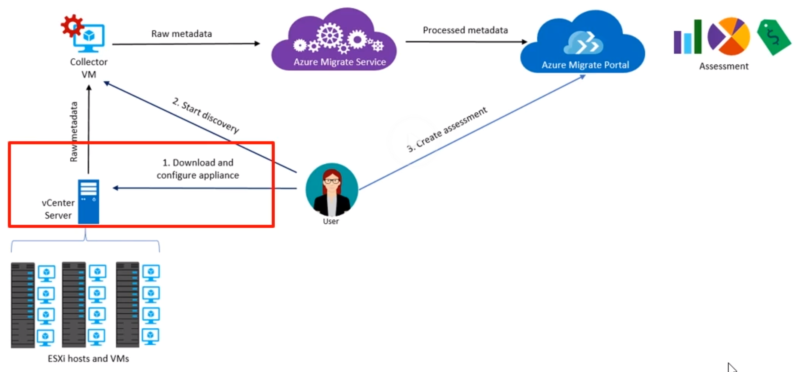

* Migrate On Premise to Azure Cloud
* Assesses Azure Readiness
  * Are my machines capable of running on Azure?
  * Are there specific compatibility issues that need to be addressed?
* Sizing
  * Get approximate sizing recommendation based on historic performance (So it would check if you 8core was over provisioned)
* Cost estimation
  * Based on the sizes selected
* Dependency Mapping
  * Visualize dependencies in order to plan **waves** of workloads for migration appropiately
    * Waves, because you won't deploy it all at once

* vCenter is your VM server managment from VMWare

* How it works
  * You download the appliance and install it on your on premise solution (vCenter)
    * For now "One-time discovery", in preview is "continious discovery"
    * This collector is downloaded as OVF template (.ova file), about 10-11Gb
    * The collector will run as a VM in your vCenter server
    * Go to VMWare sphere Web Client
    * Actions > Deploy OVF template
    * Select local file that you downloaded > next
    * Choose a folder where you wanna put it, give a name
    * Select a resource, so the VMWare host that will run it in your cluster, or just the cluster (auto assign)
    * Review
    * Where to place it on storage (thin - dynamic allocation, thick preallocate)
    * Choose Network and finish
    * RDP in that collector VM, on `localhost` you can do finalize the setup with a ProjectId and Project Key from the Migrate project
  * Start the discovery, all required raw metadata is sent to a "collector VM"
  * All that raw date is processed by Azure migrate Service
  * After processing, results are shown in Azure migrate Portal where you can create an assessment based on that

* Limitations : 
  * VMware assesment only (for Hyper-V use ASR deployment planner)
  * Up to 1500 VMs in a single discovery and project.
  * For larger environments, split the discovery into multiple assesments. You can execute up to 20 projects per subscription.
  * Project can only be created in the US regions. Metadata is stored in West Central or East US.
  
* What does into an Assessment?
  * Target Location : Target region
  * Storage Type : Determines whether to use Standard or Premium disks. 
    * For performance-based sizing, the disk sizing recommendation is done based on the performance data of the VMs.
  * Sizing Criterion : Based on performance history or as is on premises VMs
  * Azure Hybrid Benefit : Determine if you have licensing that you can utilize for Azure Hybrid Benefit
  * Reserved Instances : Whether to utilize reserved instances to further reduce costs.
  * VM Uptime : The duration for which VMs will run in Azure. (should run always or just specific times)
  * Pricing Tier : Pricing tier of VMs
  * Performance History : By default, evaluates the performance history for the last day with 95% precentile value of the on premise machines.
  * VM Series : Choose VM series types you want to include
  * Comfort Factor
    * Azure Migrate considers a buffer (comfort factor) during assessment. The buffer is applied on top of machine utilization data for VMs (CPU, memory, disk and network).
    The comfort factor accounts for issues such as seasonal usage, short performance history, and likely increases in the future usage.
    E.g. a 10core VM with 20% utilization normally results in a 2core VM. However, with a comfort factor of 2.0x the result is a 4core VM instead. **The default comfort setting is 1.3x**
    * It will always round up to the next VM type. For example if you have 2.3core or 3core, it rounds up to 4core.
  * Port requirements
    * Collector > Azure Migrate Service : 443
    * Collector > vCenter Server : 443 (can be changed)
    * On Premise VM > Log Analytics Workspace : 443 
  * You can create multiple assessments
  * **When creating an assessment, you can go to assesment properties, that's where you can set all afforementioned assessment details**
   
### Azure Site Recovery (ASR)

* Quick recap on Business Continuity Strategies
  * HA - Run instances on different places - Proactive
  * Disaster Reovery (run apps in secondary datacenter IF error occurs) - reactive
  * Backup - Restore data
  
* Overview
  * On-premises to Azure Recovery : On-Premise VMware and Hyper-V to Azure replication
  * Azure to Azure Recovery : Recover workloads from Primary region in a Secondary targer region (in case a region fails)
  * Automation and Orchestration : Setup recovery plans to customer which services are restored, as well any subsequent scripts
    * Rich integration into Azure automation for additional automation requirements
  * RTO and RPO Targets : Continious replication for Azure from VMWare and Hyper V
    * Replication frequency
      * 30 sec
      * 5 min
      * 15 min
  * VMware to Azure Recovery
  * ASR Process
    * Converts VM (vmd file) to VHD
    * Upload to Azure
    * Migration completed from recovery vault
  * VMWare migration
    * Prepare Azure
      * Verify Account Permissions
        * Can you create a VM in selected Resource Group
        * Can you create a VM in selected Network
        * Can you write to the selected Storage account
          * Recommended to use a Generap Purpose v1
      * Create Storage Account
      * Create Recovery Services Vault
      * Setup an azure network
    * Prepare VMWare
      * VMware permissions
      * Prepare an account for Mobility service installation
      * Verify compatibility
      * Prepare connectivity to Azure VMs (VPN ? Jumpbox ? ...)
    * Setup Recovery
      * You install like before with a ova file a VM that will run the on premise logic.
      * Once installed, RDP in it and follow the setup
        * Login to azure, choose subscription, reovery services vault, ...
    * RPO : Recovery Point Objective (max amount of time you might have lost)
    * TODO : Check out what the recovery options are

## Automation

### VM Custom Images

* Custom Images
  * DIY Image
  * Windows - Sysprep
  * Linux - sudo waagent / deprovision + user
  * Generalize in Azure
  * Create Image
* Marketplace Images
  * Provided for you in the Azure Marketplace
  * Properties
    * Publisher
    * Offer
    * SKU (Stock Keeping Unit)

* Create Custom Image (windows example)
  * Start `c:/Windows/System32/Sysprep.sysprep.exe`
  * "Enter System Out-of-Box Experience (OOBE)"
  * [] Generalize checkbox -> if not checked, any VM created of this image won't start
  * Shutdown options : Reboot
  
* When you "capture" and image of a VM (at least with linux), you're not able to use this VM anymore.
* From that Image you can build directly a VM

### DSC Overview

* Introduction to Configuration Management
  * Enterprise level configuration management for multiple nodes
    * Puppet
    * Chef
  * Smaller size
    * PowerShell (of f*cking bash?)
    
* PowerShell DSC : Desired State Configuration
  * Specify configuration of a machine decleratively (like a docker-compose.yml-ish)
  * Specific for Windows machines again
  * Key Components
    * Configurations -> Declaritive powershell scripts that define the instances of the resources
    * Resources -> The resource itself (contain the code to keep a resource in a specific state, so the adapter for the specific resource)
    * Logical Configuration Manager (The engine that tries to keep the state, like k8s engine)

* Example Command
  * `> Publish-AzureRmVNDscConfiguration -ConfigurationPath <your-declarative-powershellfile> -OutputArchivePath somefile.zip`
  * Here you publish the declartive part into some zip file with all desires files?? I guess ? (like IIS and.NET ?)
  * To use this now,
    * Go to a VM
    * Settings > Extensions
    * Add -> Powershell DSC
    * Select here the published archive from the first command

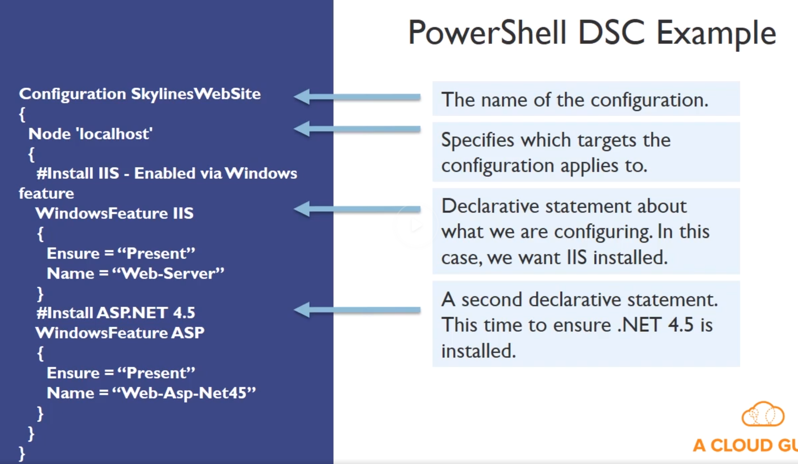

### Custom Script Extension

* Execute VM Tasks without logging into the VM
* Upload via Portal or download scripts from Azure Blob storage or GitHub
* These are scripts that run POST configiration. It can download the scripts from Blob Storage and then run them for further setup.
* Can be automated using PowerShell
* Benefits
  * No local or domain credentials needed to login to Azure VM
  * VM does not need an accessibly IP to internet
  * Simple to implement
* Drawbacks
  * Must be enabled for each VM you want to run your script on.
  * VMs will need internet access if using GitHib or Blob storage for scripts.
  * Relatively Slow
  
### PowerShell VM Commands

* New Resource Group : 

`NewAzureRmResourceGroup -Name <myResourceGroup> -Location <EastUS>`

* New Virtual Machine :

```
New-AzureRmVM \
    -ResourceGroupName "<...>"
    -Name "<...>"
    -Location "<...>"
    -VirtualNetworkName "<...>"
    -SubnetName "<...>"
    -SecurityGroupName "<...>"
    -PublicIpAddressName "<...>"
    -OpenPorts "<...>"
```

* Create VM Configuration : 

`NewAzureRmVMConfig -VMName <...>`

* Start and Stop VMs

```powershell
    Start-AzureRmVM
    Stop-AzureRmVM
```

[More... TRY THIS](https://docs.microsoft.com/en-us/azure-stack/user/azure-stack-quick-create-vm-windows-powershell)

### ARM Templates

* Apply infrastructure as code
* Declare Azure Resources in JSON (cloudformation in AWS)
* Download templates from Azure Portal
* AUthor new templates
* Use quickstart templates
  * Found on azure docs and githib

* File Types
  * ARM Template file (JSON)
  * ARM Template Parameter File (separate your parameters optional)
  * Deployment Scripts
  
* ARM Template Constructs
  * Parameters : Define the inputs to pass in ARM during deploying
  * Variables (for reusing) : 
  * Resources : Define the resources to deploy or updated
  * Outputs : Values tha are returned after the ARM deployment is complete (e.g. output public IP address)
  * Notice that you saw these things during the deploy of a VM
  
```
{
  "$schema": "...",
  "contentVersion": "1.0.0.0",
  "parameters" : {
    "skuName" : {
      "type" : "string"
    }
  },
  "variables" : {},
  "resources" : [],
  "outputs" : {}
}
```

### ARM Linking Templates

* You can link templates for reusability and flexibility.
* Main Template
  * Optional Resource Template
  * Shared Resource template
  * Member Resource temlate

* Methods 
  * Inline : Create entire ARM template in body of existing template
    * 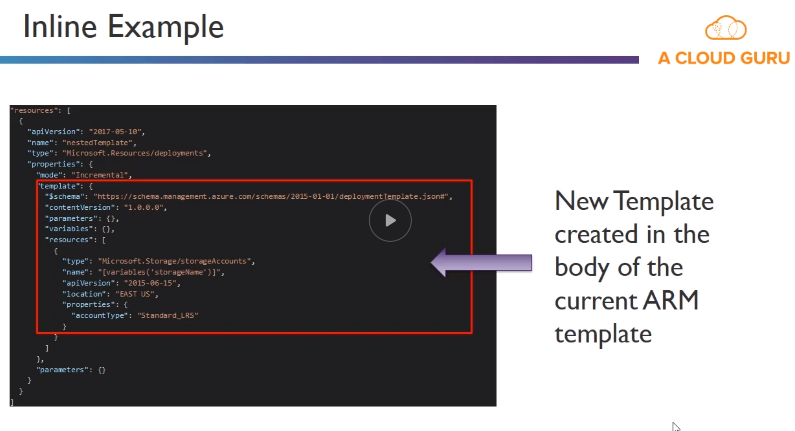
  * External : Link to an external template with an `INLINE` or `EXTERNAL` parameter set.
    * 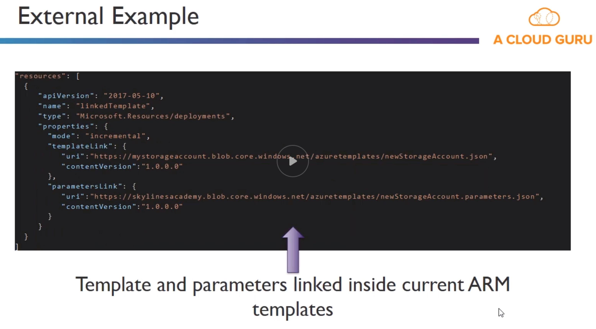

* Key ARM Functions
  * `Copy` - Declare resource and copy it
  * `copyIndex()` - Copy f
  * `dependsOn` - Variable depends on another
  * example `"name" : "[concact(copyIndex(), 'storage, uniqueString(resourceGroup(),id))]"`
  
#### TODO ! Learn some ARM code for templates
#### Think which part of the Azure automation makes sense to "start P9 on windows server"

### Azure Runbooks

* Automated workflows (various tasks) that you do often
  * Create a Automation account
  * Fill out

* Runbook can bound to webhook or schedule easily

### Azure Automation DSC

* You can define, then compile a DSC, then apply it to multiple VMs and immediatly see if all of those VMs are Compliant or not

## Azure Files

* Go to a storage account (or create)
* Click on "files" in file servcie
* Create a file share > Name and Quota

Remember, this is like EFS on AWS. So you can attach such file share to different VMs and any other

## Azure File Sync

* How to cache some files when using Azure files, which is a centralized file service.
* Service/app you install on a Windows Server VM on premise
* This turns your VM as a cache of Azure FIle share in your premise

> Use Azure File Sync to centralize your organization's file shares in Azure Files, while keeping the flexibility, performance, and compatibility of an on-premises file server. Azure File Sync transforms Windows Server into a quick cache of your Azure file share. You can use any protocol that's available on Windows Server to access your data locally, including SMB, NFS, and FTPS. You can have as many caches as you need across the world.

* Prereq :
  * Azure File Share in same region where to deploy Azure File Sync
  * Windows Server instance (on prem)
  * Powershell
  
## Self study notes

* Directory + global subscription : Set for the portal which directory/subscription to only show