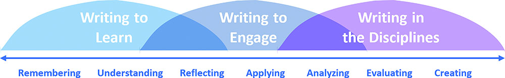

# Communication

## 1. Writing

These notes come from 2 different books by the same author, but the content feel so intertwined, it feels like one book.

Writing organizes and clarifies our thoughts. You might fear that "simple, clear thoughts" means a "simple mind", but that's not true. Someone who is able to formulate clear, simple thoughts put in the extra thinking, required after the first offloading of thoughts.

### 1.1. Quotes

* "If i had more time, i would have written a shorter letter" (Blaise Pascal, a French mathematician and philosopher)
* "great writing is all about the power of the deleted word" (richard bach, author)
* "Leave space and say less" (Peter Drucker)
* "Reading, writing and thinking are all integrated" (Kevin Byrne)
* "The hard part isn't the writing, the hard part is the thinking".
* "What are any of the disciplines but a way in which people try to make sense of the world or the universe? Mathematics is one of way of doing that, just as literature is, or philosophy, or history. Mat does it by looking for patterns and abstracting-that is, by examining a specific case and generalizing from that."
* "I believe that writing is an effective means of improving thinking skills because a person must mentally process ideas in order to write an explanation. Writing als improves self-esteem because mentally processed ideas then belong to the write and not just the teach or the textbook author" (Professor VanOrden)

### 1.2. Types Of Non-Fiction Writing

#### Types defined by William Zissner 

*From the books on learning to write and writing well.*

* **Explanatory** writing: Transmits existing information or ideas. **> On Writing Well**
* **Exploratory** Writing: Enables us to discover what we want to say. **> Writing To Learn**

The Explanatory writing is the one that has the most need for clarity and needs rigorous attention and iteration. The Exploratory writing is more about the "writing across the curriculum" or the "Writing To Learn".

Both writing skills are necessary, all can be thought and honed, none of it is a skill you must be born with.

#### Types defined by WAC Clearinghouse

* **[Writing To Learn (WTL)](https://wac.colostate.edu/repository/teaching/intro/wtl/)**: to help students learn foundational concepts to check students' understanding of material
* **[Writing To Engage (WTE)](https://wac.colostate.edu/repository/teaching/intro/wte/)**: to practice in critical thinking, reading and writing; to engage students in critical thinking
   * stands between the two most common approaches to writing across the curriculum: writing to learn (WTL) and writing in the disciplines (WID)
* **[Writing In The Disciplines (WID)](https://wac.colostate.edu/repository/teaching/intro/wid/)**: to practice writing conventions of the discipline; to gain familiarity with genres and design conventions
   * Also called writing to communicate

##### Kinds Of Thinking
*Based on [Blooms Taxonomy](https://tips.uark.edu/using-blooms-taxonomy/), but does not perse include all kinds of thinking, but its a great start. Also note, it does have a pyramid*

* Remembering
* Understanding
* Reflecting
* Applying
* Analyzing
* Evaluating
* Creating

[See imgage](assets/img1.jpg)

### 1.3. Type 1: Explanatory Writing

#### 1.3.1. General Tips

This are all soft rules.

* Mind your audience.
   * Is it clear to someone who doesn't know anything about the subject?
* The text must linearly and logically built up.
* Writing is a process, not a product,
* Simplicity: prune any excess words and use simple words.
   * Clutter is the disease of american writing
   * Clutter hides often painful truth
   * Clutter can be intentional vagueness
   * Political speech and writing are largely the defense of the indefensible
* The best "jargon" literature is even accessible to people from outside the field.
* Beware of the long word thats no better than the short word
* Be cautious of meta text «its interesting to note..», just note it.
* Don't inflate ("with the possible exception…" just say "exception")
* Don’t repeat recently mention information.
* Don't use adjectives that are implied (tall skyscraper)
* The more vague your ideas, the less confident or selling you sound.
* Write in first person, its more intimate, if your writing is good, your writing is worthy, people will care about your say. Don’t be shy or think you are egocentric. 
   * Some areas don’t allow this, like writing newspapers.
* Unity to the same pronoun (talking 1st, 2nd or 3th person) across your text. (formal, informal)
* Unity in tense (past, current, ...)
* Unity in mood/tone
   * E.g. Start of conversational, then switch to sound as a travel guide.
* Have more research material or detail than necessary, so you can pick what works well for you.
* Narrative is oldest and most compelling method of holding someones attention, everybody wants to be told a story. Always look fo says to convey information in narrative form.
* To conceal meaning is equally to conceal the lack of meaning 
* Sentences should have people in them
* Copy styles you like, as you mature, you will split of in your own style. There is no shame in copying a style you like and that works.

#### 1.3.2. The Process

* Iterative:
   * Write what you want to say
   * Then prune what does not add value or clutters.
   * Use a [thesaurus](https://www.thesaurus.com/) to find better wording.
   * Simplify where possible, rewrite, rethink.
   * Reread
   * Repeat
* Once you have the core of what you want to say, you can gently add some fluff to your liking.
* Warming up: It’s common to throw away first paragraphs once you found your style.
* This iterative process causes you to structure and clarify your thoughts, resulting into better understanding.
* Short: What do I want to say? Write ? Did I say what I wanted ? Review, Iterate.
* A new paragraph can explain something or expand on something that was introduce in preceding paragraph. That's a logical order, cause the reader might wonder "What is X that he just mentioned"?
* Another way to put it:
   * What do I want to say? 
   * Try to say it.
   * Have I said it?
   * Is this [sentence] clear to someone who knows nothing about the subject? No? Consider making it clear. Rewrite it.
   * What do I need to say next? Will it lead logically out of what I've just written ? Will it also lead logically towards where I want to go? If it will, write the sentence. 
   * Then ask "Did it do the hob I wanted it to do, with no ambiguity?" 
   * Keep thinking and writing and rewriting.

##### Tips

* As you write, you might discover other unities you want to adapt, thats fine and natural, whatever vibes well. Just update the whole piece to conform.
* Am i saying what i want to say?

#### 1.3.2. The Structure

##### 1.3.3. The Lead

* Show what's in it for the reader, so they know why to keep reading. Get them hooked, nudge curiosity.
   * Freshness, novelty, humor, surprise, unusual idea, paradox, interesting fact, question
* Continue to build. Every paragraph should amplify the preceding one. Give more thought to adding solid detail and less to entertaining the reader.
* Last sentence of paragraph must be springboard to next one. Give that sentence extra humor or surprise, so you have them for another paragraph. That sentence can also restore to an easy going tone, after some colder facts or details.

##### 1.3.4. The Ending

* Give almost as much thought to your last sentence, as your first.
* When you announce the beginning of a summary of things covered in the article, people loose focus
* Be weary of the sandwich technique
* The last paragraph must linger, take by surprise, a joy in itself
* When you are ready to stop, stop
* Once presented all facts, made your point, go for nearest exit

#### 1.3.5. Clutter and Verbosity Examples
* currently : now
* At the presence: now
* Even «now» can be often dropped «its raining», the tense says enough!
* Experiencing pain : Hurting
* Assistance : help
* Referred to as: called
* I might add: just add it, don’t go so meta (it’s interesting to note, just note)
* Smile happy: smile

### 1.4. Type 2: Exploratory Writing (Across The Curriculum)

This type of writing is more to explore, clarify and refine your thoughts. The focus is not on the end result or the answer. It's the journey towards the answer. Like a diary or journal, keeping track of observations and ideas and then share how you got to a result.

By giving a math problem in a context and have students write about it, they will naturally think more across the curriculum. Think of the world population growth issue, the question was all about how would you calculate or understand exponential growth. The writes would also think, do we have room? What is the impact? What are the solutions? So aside of thinking about the math, they also thought about all the other related and relevant parts in other fields (sociology, economics, ethics, sustainability, …)

If you write your thought process down, and not only a report, you will expand your thinking and reasoning. Making the thought process transparent, it allows a teacher, mentor, or coach to better evaluate the quality of your work. Has the student first gone to existing literature? How did they design the experiment? Why did they do certain things in order, this transparency helps to teacher, but also the student to reflect on "how" they got to the result, not just the result. In the the modern realistic world, the answer is not the most important, but ***HOW*** you got to the answer.

In Math, some teachers grade on "how" and "how far" you got to the answer, not only if you have the answer. Try to go from Explanatory to Exploratory writing.

A great quotation form the [WAC (Writing Across The Curriculum) site](https://wac.colostate.edu/repository/teaching/intro/include/):

> The purpose of writing to learn assignments—journals, discovery drafts, in-class writing—is to use writing as a tool for learning rather than a test of that learning, to have writers explain concepts or ideas to themselves, to ask questions, to make connections, to speculate, to engage in critical thinking and problem solving. The audience for this kind of writing is the student him- or herself.... The teacher serves as a facilitator rather than a judge, responding to the writing by asking questions, prodding for further thinking, or answering questions posed by the writer rather than "correcting" or grading the piece.... (McLeod & Maimon, 579)

> We cannot emphasize too strongly that it is an error to see writing to learn and writing to communicate as somehow in conflict with each other. Most of us who have been involved in WAC programs from the beginning see "writing to learn" and "writing to communicate" as two complementary, even synergistic, approaches to writing across the curriculum, approaches that can be integrated in individual classrooms as well as in entire programs.

>Writing, then, serves multiple purposes, and students gain as learners and thinkers as we integrate writing as frequently as possible across the curriculum

* You can find [here examples](https://wac.colostate.edu/repository/teaching/intro/wtl/wtlactivities) on different "Writing-To-Learn" (WTL) activities.

> Theoreticians and practitioners alike agree that writing promotes both critical thinking and learning 

> Writing to communicate—or what James Britton calls "transactional writing"—means writing to accomplish something, to inform, instruct, or persuade.... Writing to learn is different. We write to ourselves as well as talk with others to objectify our perceptions of reality; the primary function of this "expressive" language is not to communicate, but to order and represent experience to our own understanding. In this sense language provides us with a unique way of knowing and becomes a tool for discovering, for shaping meaning, and for reaching understanding. (p. x)

## 2. Presenting Ideas & Talks (TED)

* Many of the general tips, process and structure of Explanatory writing are applicable.
* As with many things, test your talks
* Talk styles to avoid:
   * The sales pitch
   * Ramble/Complain/Rant and being under prepared
   * The org bore: No one cares about your org unless you work there
   * Inspiration Performance: Only present because of ego and to "inspire", inspiration is a byproduct of a great presentation.
* Talk Tools
   * Connection
      * Make eye contact
      * Show vulnerability
      * Make em laugh - but not squirm
      * Park your ego
      * Tell a story
      * Avoid politics
   * Narration
      * Use story telling instead of just summarizing facts, we do this as a species for thousands of years, you love it. It helps you connect.
      * Tips
         * Built it on a character your audience can empathize with.
         * Built tension through curiosity, social intrigue or actual danger.
         * Offer right level of detail. Too little and it's not vivid, too much and it gets bogged down.
         * End with satisfying resolution, being funny, moving or revealing.
         * Execution matters
         * It has to be true
         * Don't overshare, if you share intimately, have worked through it
         * Parables are nice
   * Explanation 
      * Example of a good explanation
         * Step 1: Start right where you are, ground it... Make it relevant to us,...
         * Step 2: Create curiosity 
         * Step 3: Introduce concepts on by one
         * Step 4: Use metaphors
         * Step 5: Use examples
      * Explanations should be linear, built up, and if possible, use a structure that invites the receiver to become curious. 
      * Be weary of "curse of knowledge", make sure you don't over or under assume what the audience knows. Don't want to offend their intelligence, but neither intimidate them with expecting they know everything you talk about.
      * Consider making clear what your idea "isn't" which can manage expectations and clarify already things. (e.g. mindful eating does not require you to learn meditation.)
      * If you explain well, you can generate also **excitement** about your idea.
   * Persuasion
      * Short
         * Persuasion is the act of replacing someone's worldview with something better.
         * And at its hears is the power of reason, capable of long-term impact.
         * Reason is best accompanied by intuiting pumps, detective stories, or other plausibility-priming devices.
      * Means convincing the audience that they way they currently see the world isn't quite right.
         * First: Take down the parts that aren't working well
         * Second: Rebuild something better
         * Last: An upbeat statement or some conclusion of sorts?
         * Example: People on a social media diet assumes the world is full of constant violence. This is wrong, shows data on that violence only has been decreasing. Then remind how cruel history was and some of the ages. Then, show how modern media has incentive to lead with stories of drama, regardless if they're representative or not. Showing how we might overestimate the levels of violence. And create perceptive, the total number is not relevant, but the CHANCE you experience violence. And then ending with "Don't just ask what we do wrong? But also, what are we doing right?"
            * Based on "[The better angels of our nature](https://www.goodreads.com/book/show/13543093-the-better-angels-of-our-nature)" by Steven Pinker and his TED talk.
      * Priming is important. Don't start with the end conclusion, which can sound so unlikley and a far reach. Follow the above steps and prime the audience. On step at a time, go through the journey and prime the idea.
      * Use [Intuition Pumps](https://en.wikipedia.org/wiki/Intuition_pump)
         * Example through story the audience's intuition can "tell" where the story is going to (remember the TED talk about too much choice makes you unhappier, as he tels about the experience of buying a jeans)
         * Often instead of using (only) reasoned arguments, intuition pumps are more powerful, that's very common in philosophy. We nudge the audience in our direction.
         * Reasoned arguments in itself are also good tools
      * Reasoned Arguments
         * IF/THEN: If X is true, then clearly Y follows (Because X implies a Y)
            * Break down into small steps, thought steps, and then apply the IF/THEN approach to build buy in and agreement from the audience along the journey, with each small step.
               * See TED Talk [Dan Pallota](https://youtu.be/bfAzi6D5FpM?si=ZzSjRouYmUCh7u1y)
         * Reductio ad absurdum](https://iep.utm.edu/reductio/):
            *  a mode of argumentation that seeks to establish a contention by deriving an absurdity from its denial
            * Take the "counter position" to what you're arguing and showing that it leads to contradiction. If that counter position is "false" it strengthens your position.
            * Example on how we frown on high salaries for nonprofit leaders: "You want to make 50M selling violent video games to kids, got for it, we'll put you on *Wired*, but you want to make 0.5M trying to cure kids of malaria, you're considered a parasite yourself"
               * See TED Talk [Dan Pallota](https://youtu.be/bfAzi6D5FpM?si=ZzSjRouYmUCh7u1y)
            * Effective, but handle with care, use it on issues, not people or opponents. 
      * Detective Story: 
         * Structure: 
            * The big mystery
            * Travel the world for ideas in search of possible solutions
            * Rule then out one by one
            * Until one viable solution survives
      * More than logic: Logic is a big part, but make it more human, there are some tools:
         * Inject some humor early one
         * Add an anecdote
         * Offer vivid examples
         * Recruit 3th party validation
         * Use powerful visuals

   * Revelation
      * ... todo

### General Tips
* Throughline: same as a lead? At least the tips of a good throughline should be listed as good tips.
* Prune tip “plan your talk, cut 50%, once you’ve grieved the loss of half your talk, cut it another 50 percent” 
* Old formula used by sir ken robinson **“a good essay answers 3 questions: what? So what? Now what?”**.
* An idea based talk starts with curiosity, a issue based talk starts with morality, and that can cause morality fatigue
* Most speakers are used to talking for 30 or 40 minutes or longer. They find it literally hard to imagine giving a proper talk in such a short period of time. Hear we see the recurring team and need to write and think clear. Pruning clutter.

### Example of engaging writing

... instead of listing boring facts about yourself

> I want you to come with me to student's room at Oxford university in 1977. You open the door, and at first it seems like there's nobody there.
> But wait, Over in the corner, there's a boy lying on the floor, face up, staring at the ceiling. He's been like that for more than 90 minutes. That's me, 27 year old me. I'm thinking. Hard. I am trying... please don't laugh... I am trying to solve the problem of free will. That deep mystery that has stumped the world's philosophers for at least 2 millennia? Yp, I'm taking it on.
> Anyone looking objectively at the scene would have concluded that this biy was some weird combination of arrogant, deluded, or perhaps just socially awkward and lonely, proffering the company of ideas to people.
> But my own narrative? I'm a dreamer. I've always been obsessed by the power of ideas. And I'm pretty sure it's that inward focus that helped me survive growing up in a boarding schools in India and England, away from my missionary parents, and that gave me confidence to try build a media company. Certainly it was the dreamer in me that fell in love so deeply with TED.

## 3. Insights
* Exploratory teaches and helps you to think more critically and clearly, cause it improves your "way of thinking", how you get there. Teaching you often more and broader on a subject matter. You might naturally also take social implications into account when writing about a scientific invention.
* Writing code is the same mental process.
   * You make something work (e.g. Make a test pass)
   * You refactor towards cleaner code.
   * You run the tests again to make sure they pass.
   * You iterate
   * As you iterate, you get more clarity how it all fits together, you structure, you process.
* Programmers are non-fiction writes.
* Rubber Ducking: As you try to explain a problem, you need to clarify your thoughts about the problem, so you can express them clearly. Often, you will find the answer yourself through this process of clarifying your thoughts.
* Any thought process works better by writing.
   * Write your journey through the process, clarifying your thoughts.
   * You can reread your thoughts and improve them.
   * If you focus on clarification and simplification, you will get a better understanding.
   * Examples: RFC, Research, Design Document, Diary, Journal, Architecture Proposal, Presentation, Blogging
   * Writing an email in particular benefits from this: Any additional back-n-forth communication that is required due to unclarity, is exhausting.
   * People that blog often, do write clear ones, often have a good understanding of things, through the process of writing a good blog post.
* Those who do not try effort in improving and simplifying their writing, yet write a lot, will not grow.
* The more you embrace the process of writing well, the more clear your thoughts become.
* Shorter writing does not mean shorter time to work on it ("If i had more time, i would have written a shorter letter").
* President Woodrow Wilson on how long it takes to prepare a speech: It depends on the length of the speech
   * If it is a 10 minute speech, it takes me all of 2 weeks to prepare it
   * If it is half hour, it takes me a week
   * If I can take as long as I want to, no preparation at all. I'am ready now.
* Knowledge is stored in the human's mind is multidimensional, hierarchical and cross linking. When talking or speaking, we convert that knowledge into a one dimensional stream of words.
   * That's why, when talking/writing it is important to be linear and and cross link where necessary to avoid ambiguity, certain links are not obvious to the receiver.

## 4. The Iterative Thought Process
A self defined process based on my insights on becoming a more clear thinker.

* The **"The Iterative Thought Process"** is a more generic version of this. You guide your brain, you structure your thoughts through different mediums (writing, drawing, visualizing, ...). Writing happens to be one of them that works quite well.
   * Visual Methods: Miro board, mind map, Business Model Canvas, Value Proposition Canvas, KanBan Board, ...
   * Key is to have a way to "Annotate" or "Visualize" concepts and thoughts and their relations (just like a system) so you can offload it all. Then you can review it, restructure, simplify, prune, do all the usual iterative steps to improve your thoughts and understanding.
   * Steps:
      * Offload your thoughts (all of partially)
      * Structure (relations between them)
      * Prune
      * Review
      * Iterate
   * By offloading, it allows us to reflect on it, and work on it, however, most just offload and keep at that. 
   * By offloading, you create room for other thoughts and reflection, play with all elements.
   * By offloading, you can focus on subparts of the whole topic.
   * Did you know that your brain uses a constant amount of energy? Thinking harder, doesn't result in using more energy. That's why, when you focus, other things go to the background. Taking that fact in account, knowing the energy supply is constant, you can offload your thoughts, so the spotlight can then focus on the individual elements and parts, without keeping the big picture in your head.
* When writing as a part of the thought process: Write in a way that they don’t worry about beings criticized, it would damage/block their train of thoughts and ideas. That’s why a journal works so well.

### Related Concepts 

According to ChatGPT.

1. **Cognitive Load Theory**: This theory, developed by John Sweller, explores how human cognitive architecture handles information processing. It posits that learning is more effective when information is presented in a way that reduces unnecessary cognitive load, which aligns with the idea of refining and simplifying thoughts to enhance understanding and communication.

2. **Iterative Design**: In design fields, the iterative process involves repeated cycles of prototyping, testing, and refining a product or concept. This approach helps in gradually improving clarity and functionality, akin to refining thoughts or visualizations.

3. **Metacognition**: This is the awareness and understanding of one's own thought processes. Metacognition involves self-regulation of cognition through planning, monitoring, and evaluating, which can include refining and rephrasing thoughts for better clarity.

4. **Visual Thinking**: This is a way to organize your thoughts and improve your ability to think and communicate through visual means. Techniques such as mind mapping, sketching, and diagramming are used to clarify and simplify complex ideas.

5. **Information Design**: This field focuses on presenting information in a way that is most effective for understanding. It includes principles of clarity, simplicity, and the reduction of unnecessary complexity, often achieved through visual means.

6. **Clarity in Communication**: The process of rewriting or rephrasing thoughts to enhance clarity is a fundamental principle in communication studies. Techniques from this field are often employed to ensure messages are clear, concise, and effective.

## Rhetoric
By investigating the rhetoric the writer or the reader can better understand the other, which might help to write a better document or to interpret it better. Helps also to understand what influences how a reader receives a message, which might be differ over time.

* What is the Writer's Purpose ?
   * As a writer, understanding your purposes can help you in virtually every aspect of your writing process.
* What influences writers ?
   * As a writer, reflecting on your requirements and limitations can help you decide whether a particular decision-such as choice of topic or the inclusion of evidence from a particular type of source-will help or hurt your chances of accomplishing your purposes.
* What is the Reader's Purpose ?
   * As a writer, understanding the purposes of your readers can help you create a more effective document.
* What influences readers ?
   * Writers who do not take their readers' values and beliefs into account might miss an opportunity to create a more convincing, useful, or acceptable document.
   * Readers' knowledge of a particular topic will also affect their reading of a document. When writers assume that readers know more about a topic than they actually do, they can create a document that is difficult to understand.
   * When they assume their readers know less than they actually do, they risk creating documents that repeat information readers already know. In both cases, readers are likely to stop reading the document.
* What do Writers and Readers Know about Each Other?
* What is the Context?

* [WAC: Rethoric](https://wac.colostate.edu/repository/teaching/intro/rhetoric/)

## 5. Reasoning

... Pending as I'm reading [Reasoning](https://www.goodreads.com/book/show/1645567.Reasoning) by Michael Scriven.

## 6. Resources

* [On Writing Well: The Classic Guide to Writing Nonfiction](https://www.goodreads.com/book/show/53343.On_Writing_Well) by William Zinsser.
* [Reasoning](https://www.goodreads.com/book/show/1645567.Reasoning) by Michael Scriven.
* [Ted Talks: The Official TED Guide to Public Speaking](https://www.goodreads.com/book/show/41044212-ted-talks?) by Chris J. Anderson.
* [WAC: Writing Across The Curriculum](https://wac.colostate.edu/repository/teaching/intro/)
* [Writing To Learn](https://www.goodreads.com/book/show/53343.On_Writing_Well) by Willian Zinsser.
* [WAC: Rethoric](https://wac.colostate.edu/repository/teaching/intro/rhetoric/)
* [Level Of Disagreement](https://themindcollection.com/revisiting-grahams-hierarchy-of-disagreement/)