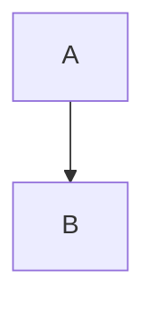

# Finetuning

## In Plain Words
When an LLM is done with the pre-training, then the model has passed its "general training", it has a lot of knowledge and it can then based on that, predict the best next token. But now you need to specialize it to your use case. So even the ability to ask it questions to get a "good" answer requires finetuning, cause you want to finetune it to answer questions well for example.

## Technical Intro

> The method wehre the parameters of a pre-trained model are tweaked by training it on acustom data set of interest to get a model with domain-specific knowledfe or expertise in following the instructions.

Let's say you have a model that's trained on car images, it knows and can recognize anyhting care-like based on features (like tires etc), but it might not be able to distinguish between a van, traktor, sports or family car. So you can use a pre-trained model for care images to then finetune it to specialize in a distinct skill.

You **freeze the initial layers such that the existing weights remain intact, and modify the final layers of the model by training them on tractor images.

> You take a pre-trained model, adjust some model-weights and you have a new model without too much pain.

**Transer Knowledfge** is what makes finetuning possible.

```mermaid
flowchart LR
    A[car<br>(pre-training data)] -->|pre-training| B[base model]
    B -->|fine tuning| C[fine tuned model]
    D[tractor<br>(fine-tuning data)] -->|fine tuning| B
```

### TEST


sequenceDiagram
  Alice->>Bob: Hello Bob



graph TD
  A --> B


orrr




