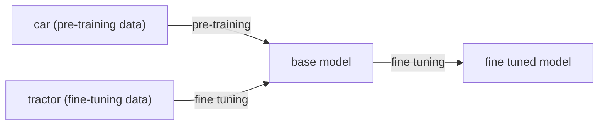

# Finetuning

## In Plain Words
When an LLM is done with the pre-training, then the model has passed its "general training", it has a lot of knowledge and it can then based on that, predict the best next token. But now you need to specialize it to your use case. So even the ability to ask it questions to get a "good" answer requires finetuning, cause you want to finetune it to answer questions well for example.

---

## Technical Intro

> The method wehre the parameters of a pre-trained model are tweaked by training it on acustom data set of interest to get a model with domain-specific knowledfe or expertise in following the instructions.

Let's say you have a model that's trained on car images, it knows and can recognize anyhting care-like based on features (like tires etc), but it might not be able to distinguish between a van, traktor, sports or family car. So you can use a pre-trained model for care images to then finetune it to specialize in a distinct skill.

You **freeze the initial layers such that the existing weights remain intact, and modify the final layers of the model by training them on tractor images.

> You take a pre-trained model, adjust some model-weights and you have a new model without too much pain.

**Transer Knowledge** is what makes finetuning possible.

---

## Finetuning Technique Categories

* **Instruction Tuning** - To make an LLM follow instructions given by you. This best uses labeled data (supervised learning) as fine-tuning data, to do the fine tuning.
* **Aligment Tuning** - Align it with certain values, like, human values, helpfulness, intent etc. Reinforcement training with a human feedback loop (the once who decides to give punishment or rewards) is the popular approach.
---

## Instruction Tuning or Supervised Fine-tuning (SFT)
> Train a pre-trained model on a relatively smaller dataset in a supervised manner.

* Fine-tuning dataset schema example
    * Record 1: 
        * Instruction: <some instruction>
        * Input: <some input text>
        * Output: <some expected output text>
    * Example Record
        * Instruction: `Solve the equation, explain step-by-step`
        * Input: `1+1`
        * Output: `The answer is 2, because ...`
* **Ways to construct the dataset**
    * **Manual Creation** - Basic manual approach.
    * **Use the existing NLP datasets** - There are a lof of existing NLP datasets for when supervised learning was/is used in NLP. 
        * Example: Fine-Tuned Language Net, FLAN
    * **Synthetic data** - Use LLMs to generate the data and maybe with some human help.
* Many public datasets exists - ShareGPT, Dolly, LIMA, ... 

### Instruction Fine-Tuned Models

### Understanding GPU for Fine-Tuning

---
## Alignment Tuning

---

## Parameter Efficent Model Tuning (PEFT)
...todo

### Adapter Tuning
...todo

### Soft Prompting
...todo

### Low-Rank Adaptation (LoRA)

...todo

### Quantized Low-Rank Adaptation (QLoRA)

...todo