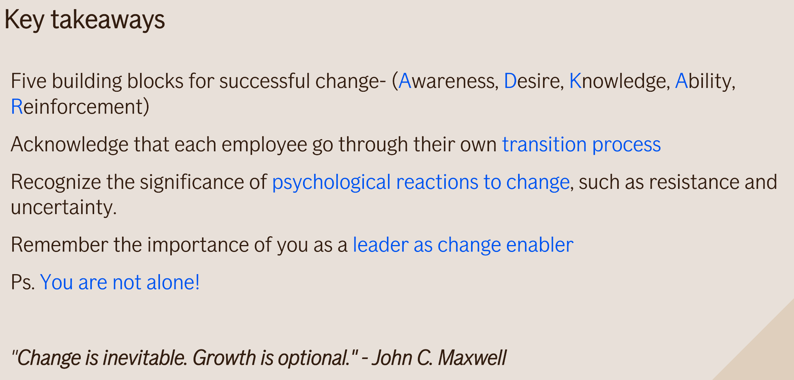

# Change Management

## How to do cultural change- 2-2-1 rule

*Science based, applied in Nike.*

* 2 points of reinforcement from management chain for given individual communicate they think its a good idea. They show support.
* 2 points of reinforcement from peers for given individual communicate they think its a good idea. They show support.
* 1 point of success story.

## [Patterns](patterns.md)

See the list of [Patterns](patterns.md)

## How Behavior Spreads

*How Behavior Spreads: The Science of Complex Contagions* by Damon Centola delves into how social behaviors, ideas, and practices spread through populations, contrasting traditional views of contagion (like infectious diseases) with the spread of behaviors and innovations. Centola, a sociologist, challenges the dominant model of "simple contagions" in favor of a more nuanced framework, termed "complex contagions." Here are the key findings and lessons from the book:

### 1. **Complex Contagions vs. Simple Contagions**
   - **Simple contagions** refer to things like viruses, where a single contact with an infected person may be enough to catch the infection. This follows a "contact-based" model, which is easy to understand and has been the dominant framework in epidemiology and social network theory.
   - **Complex contagions** involve behaviors or ideas that require reinforcement from multiple sources before they spread. Unlike a simple contagion, seeing a new behavior once may not be enough to adopt it. Examples include social movements, norms, and innovations. The spread requires social validation and exposure through multiple points of contact.

### 2. **Strong Ties vs. Weak Ties**
   - Traditional social network theory, drawing on Granovetter’s concept of "the strength of weak ties," emphasizes the importance of weak ties (acquaintances) in disseminating information. Weak ties were thought to be crucial for spreading new behaviors because they connect disparate social groups.
   - Centola argues that **strong ties** (close-knit social groups) are essential for spreading complex behaviors. This is because strong ties offer the social reinforcement and repeated exposure necessary to overcome the resistance to adopting new behaviors or ideas. It’s not enough for a person to be exposed to a behavior once—they need validation from multiple trusted sources before adopting it.

### 3. **The Role of Social Networks**
   - Centola highlights that the structure of a social network is a key determinant of whether a complex behavior will spread. Dense clusters of strong ties promote the adoption of new behaviors, while sparse networks with many weak ties are better suited for spreading information quickly but not necessarily changing behavior.
   - **Network clustering**—where groups of people are densely interconnected—can facilitate the spread of complex contagions, as repeated reinforcement within these clusters encourages adoption.

### 4. **Diffusion Dynamics**
   - In contrast to traditional diffusion models, which suggest that behaviors spread outward from a single innovator (like a ripple in water), complex behaviors spread more unevenly, with adoption often occurring within clusters of the social network first. The behavior then jumps between clusters once it has gained sufficient momentum within each group.
   - **Thresholds for adoption** are key. Individuals may not adopt a behavior unless they see a certain number of others in their social group doing the same. This leads to tipping points where behaviors suddenly spread rapidly after reaching critical mass.

### 5. **Real-World Applications**
   - Centola uses real-world examples, including online experiments and case studies, to show how complex contagions play out in various domains. For instance, health behaviors, like quitting smoking or adopting fitness routines, often require repeated social reinforcement.
   - Social movements and innovations—such as the Civil Rights Movement or the rise of solar energy adoption—also follow the complex contagion model, spreading through strong social networks and requiring multiple reinforcements before they catch on.

### 6. **Digital Networks and Online Behavior**
   - The book also explores how the dynamics of social contagions change in online networks, where the distinction between strong and weak ties can become blurred. Even in online spaces, Centola argues, **repeated exposure** and validation from multiple sources are crucial for spreading behaviors like activism or the adoption of new technologies.
   - Online platforms and algorithms that reinforce echo chambers may actually facilitate the spread of complex behaviors within clusters, but make it harder for behaviors to jump across different social groups.

### 7. **Implications for Policy and Innovation**
   - Understanding how complex contagions work can help policymakers, public health officials, and innovators design more effective strategies for promoting social change. For example, simply broadcasting a public health message may not be enough—targeting densely connected groups within communities for sustained engagement can be far more effective.
   - Marketers and social change advocates need to focus on building critical mass within clusters of adopters, rather than trying to target isolated individuals. This suggests a shift from mass advertising to strategies that prioritize social reinforcement within specific communities.

### 8. **Behavioral Norms and Collective Action**
   - Centola emphasizes that collective behaviors, like participation in protests or adopting environmental practices, often spread when individuals see enough others in their network taking action. A critical lesson is that **visibility and validation within a group** are essential for mobilizing large-scale collective action.

### Key Lessons:
   - **Reinforcement is crucial**: Unlike simple contagions, complex behaviors often require multiple exposures and social reinforcement before individuals adopt them.
   - **Strong ties matter**: For behaviors to spread, close relationships (strong ties) within a social network are more important than weak ties for promoting adoption.
   - **Network structure shapes diffusion**: The way people are connected—especially in clusters—greatly affects whether a behavior will spread.
   - **Tipping points exist**: Behaviors often spread slowly at first but can rapidly accelerate once they reach critical mass within key social clusters.
   - **Design for social networks**: Policymakers, marketers, and change agents need to design interventions that leverage the power of social networks and focus on clusters for effective diffusion of behaviors.

*How Behavior Spreads* challenges simplistic models of contagion, providing a more comprehensive framework for understanding how ideas, practices, and social movements spread in human societies.

## ADKAR Model

* **Awareness** of the need to change
* **Desire** to support and take part in the change
* **Knowledge** of how to change
* **Ability** to implement the change
* **Reinforcement** to sustain the change.

The ADKAR Model is prescriptive and goal-oriented, each milestone must be achieved to define success. It uses a 1–5 scale to determine how strongly an individual meets the requirements of each milestone. If a person scores a three or below, that specific step must be addressed before moving forward, Prosci defines this as a barrier point.

There are other models on [wikipedia](https://en.wikipedia.org/wiki/Change_management)

## Reactions in the change curve

> Kübler-Ross herself acknowledged that the stages were often misunderstood and oversimplified. She emphasized that they were not prescriptive or exhaustive but rather a way to normalize and validate the range of emotions people might feel when confronting profound loss or change.

As this change curve is based on Elisabeth Kübler-Ross's stages of grief model. Which is about the terminal ill accepting their status, instead the one loosing someone. It's also more of a range of types of emotions you can go through, not perse in that exact order.

## Others

## Resources

* [More Fearless Change](https://www.goodreads.com/book/show/23287939-more-fearless-change)
* [Fearless Change - Patterns for Introducing New Ideas](https://www.goodreads.com/book/show/261666.Fearless_Change)
* [How Behavior Spreads](https://www.goodreads.com/book/show/36854820-how-behavior-spreads)
* [Change Management - Wiki - More Models](https://en.wikipedia.org/wiki/Change_management)
