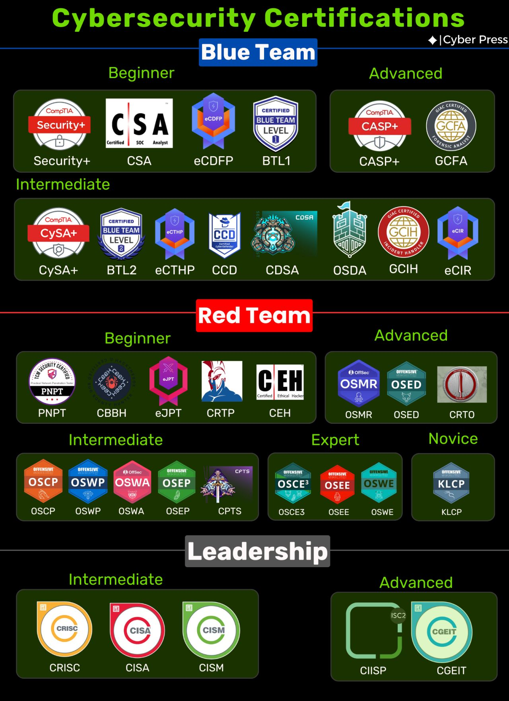
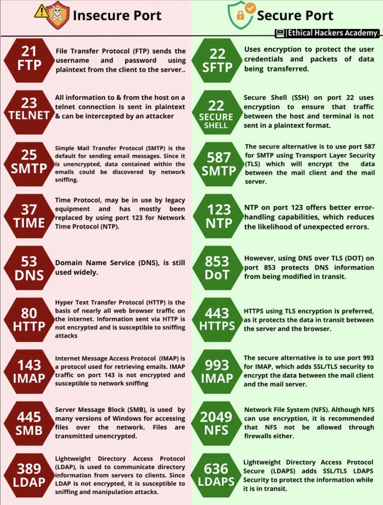
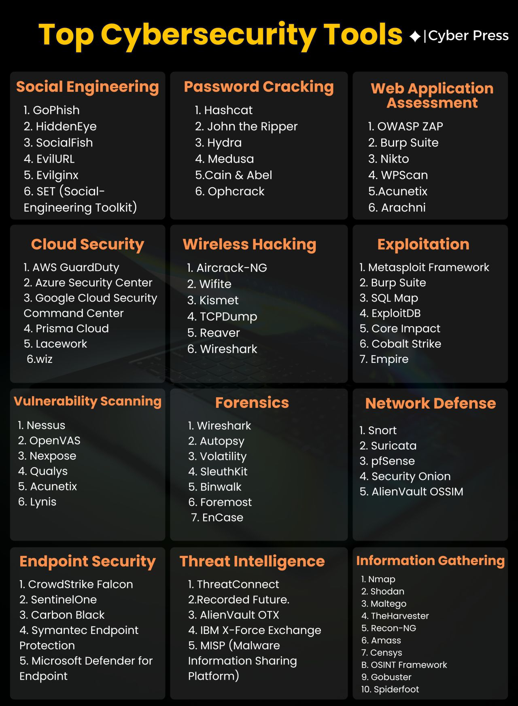

# Cybsersecurity

## Certifications

## Vulnerability Case Studies

* [XML Injection with SVG](https://www.cloudflare.com/en-gb/threat-intelligence/research/report/svgs-the-hackers-canvas/)
  * [More](https://cloudmersive.com/article/Understanding-SVG-Files-and-the-Dangers-of-XML-Exploits)
* NPM Malware
  * [NPM Malware Reportimg](https://docs.npmjs.com/reporting-malware-in-an-npm-package)
  * [Signapure reporting](https://www.csa.gov.sg/alerts-and-advisories/advisories/ad-2025-019)
  * [More](https://www.wiz.io/blog/shai-hulud-npm-supply-chain-attack)

## Links

* [Resources](resources.md)
* [Hack The Box Labs](https://www.hackthebox.com/hacker/hacking-labs)

## Info Graphs

## Books

* [network basics for hackers - occuptheweb](https://www.amazon.com/Network-Basics-Hackers-Networks-Break/dp/B0BS3GZ1R9)
* [Linux basic for hackers - occuptheweb](https://www.adlibris.com/nb/bok/linux-basics-for-hackers-2nd-edition-9781718503540)
* [Getting Started Becoming A master Hacker - occuptheweb](https://www.amazon.com/Getting-Started-Becoming-Master-Hacker/dp/1711729299)
