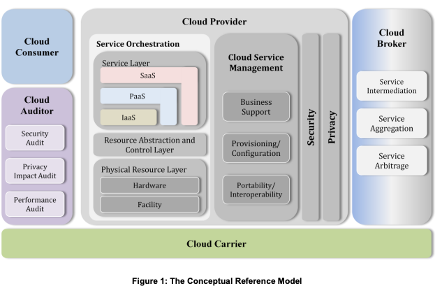

# Cloud and Virtualization Security

## Exploring the Cloud

* **oversubscription** - allocates more virtual resources than physical resources actually available, betting that not all customers will use their full allocation simultaneously.
* **multitenancy** - Different users share resources in the same cloud infrastructure.

### Benefits of the Cloud
* On-demand self-service computing
* Scalability (vertical & horizontal) - rapidly increasing capacity
* Elasticity - expand and contract capacity as needed
* Measure Service - You pay for waht you consume
* Agility & Flexibility

### Cloud Roles

* **Cloud Service Providers** - offer the cloud computing
* **Cloud Consumers** - ones that consume the cloud computing
* **Cloud Partners/brokers** - Resell supplementary products or services in regards of the cloud
* **Cloud Auditors** - independents that audit cloud services and operations
* **Cloud Carriers** - The network service provider that delivers connectivity between cloud consumers and providers.

Anyone can take multiple roles, like neptune was a Cloud consumer and service provider.

### Cloud Service Models (XaaS)

* **IaaS** - Customer does full config
* **PaaS** - Run apps that customer developed themselves, but without granualr network/infrastructure responbilities
  * Example **FaaS** upload just the code and it will execute on an event without further overhead.
* **SaaS** - Customer only does config in the "application", see ERP, CRM, ..
* **Managed Service Providers (MSPs)** - service organizations that are responsible for all tech infrastructure for a customer.
  * If they offer security, they are **Managed Security Service Providers (MSSPs)**

### Cloud Deployment Models

* **Public Cloud** - Default - Shared infrastructure for the general public/anyone
* **Private Cloud** - provisioned for a single customer
  * Build/deployed by either a 3th party or the organization itself.
  * More excess resources, so less cost efficient
* **Community Cloud** - Like Public multitenant, but all tenants are from the same community that share same needs or mission (e.g. regualrity needs, compliance, etc..)
* **Hybrid Cloud** - catch all of blending public, private and/or community
  * Requires technology to unify the different clouds into single coherent platform

Note: The intelligence community uses "Private Public" cloud. The infrastructure resides in a CIA facility, but provides (for example) decicated AWS services. Azure Arc allows to use Azure platform but on hardware/infrastructure you manage yourself. So it is a private cloud, but it uses the functinality/platform layer from a public cloud.

* **Public Cloud bursting**- You use only public cloud to expand capacity when necessary, but by default use private/on-prem

### Shared Responsibility Model
Your security responsibilities fall in the "customer responsibilites", the vendor area secuirty is for, the vendo

### Cloud Standards and Guidelines

* [NIST Cloud Computing Reference Architecture](https://nvlpubs.nist.gov/nistpubs/Legacy/SP/nistspecialpublication500-292.pdf)
  * This shared understanding helps to also talk about cybersecurity.
* **Cloud Security Alliance (CSA)** - industry organization focused on best practices in cloud security.
    * [CSA Site](https://exams.cloudsecurityalliance.org/en)
    * Designed the [Cloud Controls Matrix (CCM)](https://cloudsecurityalliance.org/research/cloud-controls-matrix) to help understand the right use of cloud security controls and map those to various regulatory standards.

## Virtualization
### Hypervisors

## Cloud Infrastructure Components
### Cloud Compute Resources
### Cloud Storage Resources
### Cloud Networking

## Cloud Security Issues
### Availability
### Data Sovereignty
### Virtualization Security
### Application Security
### Governance and Auditing of Third-Party Vendors

## Hardening Cloud Infrastructure
### Cloud Access Security Brokers
### Resource Policies
### Secrets Management
