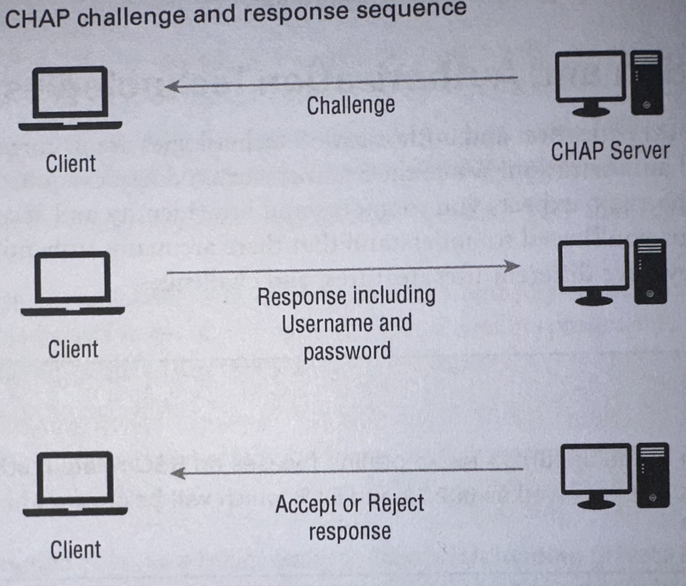
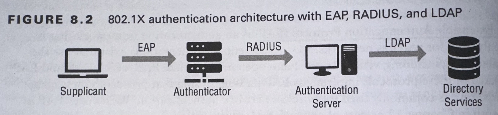
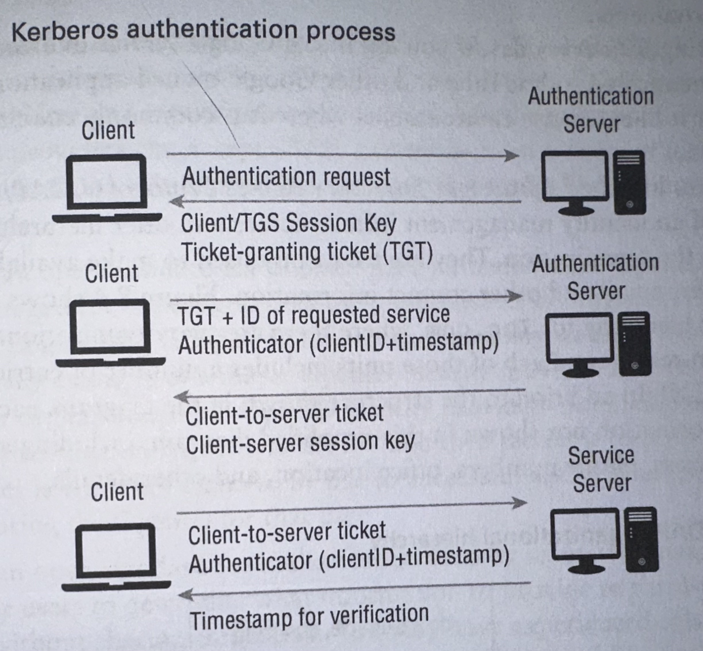
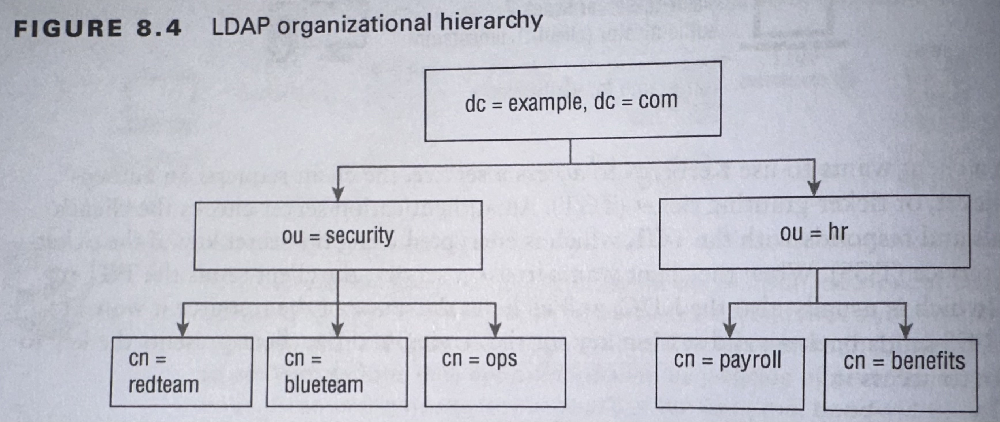

# Identity and Access Management
* **Subject** - People, applications, devices, systems, organization, entities basically
  * Most common "individual"

## Identity
* **Identity** A set of claims about such a `subject`.
    * Typically linked to information about the subject, important to the use of the identity.
    * Attribute Examples: Name, age, location, title, phyisical attributes, ...
* **Use of Identity** - If a `subject` wants to use their identity, it can claim so with:
  * `Usernames` - just identity, not an authentication in itself
  * `Certificates` - often used to identify systems and individuals.
  * `Tokens` - means to present a certificate
    * USually via a physical device
  * `SSH Keys` - Cryptographic representation replacing `username` and `password`.
  * `Smartcards` with embedded chip, often cary key pairs.
* **Lost Key Pairs**
  * Typical flaws: Uploaded private keys, no password on ssh certificates, poor passphrase mgmt.

## Authentication and Authorization
* Authentication - AuthN - Ensure the subject is who they claim to be
* Authorization - AuthZ - Verfies what you have access to.

### Authentication and Authorization Technologies
* **Extensible Authentication Protocol (EAP)**
  * Authentication framework for Wifi.
  * Implementations EAP-TLS, LEAP, EAP-TTLS...
* **Challenge Handshake Authentication Protocol (CHAP)**
  * Authentication framework
  * Encrypted challenge + 3-way handshake
  * 
* **802.1XX**
  * Authentication framework
  * IEEE standard for devices that want to connect to network
    * Network Access Control (NAC)
  * How It works
    * Device sent authentication request to authenticators/controllers (switches, AP,...)
    * Controllers connect to authentication server, typically via RADIUS
    * RADIUS might use LDAP or Active Directory as data source for Identity information.
  * 
* **Remote Authentication Dial-In User Service (RADIUS)**
  * Most common authentication, authorization and accounting (AAA) system for network devices.
    * Accounting refers to resource utilization like time, bandwith or CPU
  * Operates over UDP and TCP as client-server model.
  * How It Works
    * RADIUS sends passwords obfuscated by shared secret + MD5 hash.
    * Traffic between RADIUS Network Server and RADUI server encrypted in IPSec tunnels usaully.
* **Terminal Access Controller Acees Control Systgem Plus (TACACS+)**
  * Proviedes AAA services
  * By Cisco
  * Operates over TCP
* **Kerberos**
  * Authentication Protocol
  * Between trusted hosts across an untrusted network (e.g. the internet)
  * Uses authentication to shield its authentication traffiix
  * Kerberos users have
    * The primairy (e.g. username)
    * The instance (to help differentiate similar primaries)
    * The Realms (groups of users) seperated by trust boundries
  * 
#### Single Sign-On (SSO)
* Single identity to access multiple services/systems without reuathentication.
* Lightweight Directory Access Protocol (LDAP)
  * Offer hierarchical organized information about the organization.
    * `ou` organizational unit
    * `cn` common name
  * 
* Kerberos can be also used for SSO.
* **Core Technologies for authN & authZ to implement SSO**
  * **Security Assertion Markup Language (SAML)**
    * `xml` based to exchange AuthN/AuthZ infromation
    * So if all Identity providers follow SAML, then any service/application that wants to implement SSO, support SAML and you'll be able to integrate with various Idenity Providers.
  * **OpenID**
    * *Open standard for (decentralized) authentication.*
    * Example `Login with Google` or `Login with Facebook`
    * You login to a OpenId IDentity Provider (IdP) as external identity provider to your service/application.
    * The standard tells how this "dance" between Identity Provider and your service goes.
  * **OAuth**
    * *Open standard for authorization*
    * Method to specify "what information to provide a third-part application and sites without sharing credentials.
    * Concept of scopes, etc...
#### Federation
* The core problem Federation solves - You work at Company A, but need to access a partner application at Company B. Without federation, Company B would need to create and manage a separate account for you.
* Key Terms/topics
  * The `principal`, typically the user.
  * The `Identity Providers (IdO)` who provide identity and authentication services via `attestation` process.
  * The `Service Providers (SP) / Relying Party (RP)` who offer a service/application that the `principal` tries to access after their identity was `attested`
  * Trust relationship between `Identity Provider` and `Service Provider` must be pre established.
* Authorization is not in this process, authorization is configered on Service provider side.
  * Sometimes the SP would assign authorization rules/roles based on Identity related attibutes (like organizational unit).
  * But still, this is configured and set on the SP side.
* OpenID and SAML are often used to implement the entire Federation process.

## Authentication Methods
* First you `claim` an `identity` by username, certificate, ...
* Then you `prove` that the `identity` belongs to you via an `authentication method` as described next.x

### Passwords
* **Best practices**
  * Show password to prevent typos, password managers, store secrets with salts and secure hashing methods, locking after multiple attempts and MFA
* **Guideliness** - [NIST 800-63](https://pages.nist.gov/800-63-3/)
  * Reduce password complexity requirements and instead emphasize length.
  * Not require special characters
  * Allow ASCII and Unicode
  * Allow pasting into passwords fields (for password managers)
  * Monitor new passwords to ensure that easily compromised ones are not used
  * Eleminate Password Hints
* **Recomendations**
  * Length is the best defense against brute force
  * Complexity - prevent repeated characters and common words
  * Reuse limitations
  * Expiration dates to force renewal
  * Age limitations - Sometimes people keep resetting till the "reuse" limitation is circumvented.
* **Password Managers**
  * Good stuff
  * [Lastpass Breach Recommendation](https://blog.lastpass.com/posts/security-incident-update-recommended-actions)
* **Passwordless**
  * Instead depending on `what you know` primarily, it focuses on `what you have` (security tokens, certificates,...)
  * An option: `hardware security key` (like UbiKey)
    * Protocols: FIDO, Universal 2nd Factor (U2F), ..
    * FIDO: Open Authentication Standard supporting W3C Web Authentication and Client to Authenticator Protocol (CTAP)
  * Goal is to remove friction

### Multifactor Authentication (MFA)
* **4 different types of factors**, MFA uses at least 2
  * Something you *know* - password, PIN, questio
  * Something you *have* - hardware device
  * Something you *are* - physical characteristic of the individua;
  * Some**where** you *are* - location

### One-Time Passwords (OTP)
* A common implementation for MFA
* A password that can be only used once
* *Primary models*
  * **Time**-Based One-Time Passwords (TOTP) - Generates passwords that are x-seconds valid.
  * **HMAC**-Based One-Time Passwords (HOTP) - Uses a `seed value` and `moving factor` (the counter)
    * so there is a whole sequence that comes from it, everytime the "generate code" is pressed, so the backend can replay that untill give code is found.
* SMS is often also used, but (note by me), that's just an implementation of TOTP often.
* **Attacking**
  * Hard for now, but
  * Via SMS can be redirect using cloned SIM, or if phone is part of VoIP, compromise VOIP system and redirect the SMS factor, or real time acces to the OTP generator.
    * Some ovelhm user with reqeated requests so the user just provdes the latest code out of trustration. So you bully the user in providing it without they really understand it's an attack (at that point).

### Biometrics
* **Something you are**
* **Most Common**
  * Fingerprints via optical/ultrasonigc or capacitiv scanners
  * Retina scanning
  * Iris recognition - can be done fron bigger instance than retina
  * Facial recognition
  * Voice recognition
  * Vein recognition - no touch necessary
  * Gait analysis, measures how a person walks
* **Technologies assed on 4 measures**
  * Type I errors - False Rejection Rate (FRR) - False Negatives (the actual measure was presented but the system rejected)
    * FIDO suggests 3%
  * Type II errors - False Acceptance Rate (FAR) 0 False Positives (the wrong measure was presented bu the system accepted)
    * Fido suggest 0.01%
  * Receiver Operating Characteristic (ROC) - Plot FRR and FAR out on a graph and find the sweet spot to minimze both errors that's acceptble.
  * Imposter Presentation Match Rate (IAPMR) - how often an attack will succeed?
* **Backup Systems** - are necessary, cause there are often exceptions, like people who can't use fingeprints due to handling chemicals or such.

## Accounts
* **Contains the information, rights and permissions about a user.**

### Account Types
* **Basic Types**
  * **User Accounts** - for typical user
  * **Privileged or Adminstrative accounts** - root account (linux) or defaul admin account (windows)
  * **Shared and generic accounts or credentials** - often prohibited, but it happenbs
  * **Guest accounts** - Temporary users with limited priveleges and limited information about them
  * **Service accounts** - Service/Systems that don't require interactive authentication
### Provisioning and Deprovisioning Accounts
* **Provisioning**
  * Can do `identity proofing` to make sure who you are
  * Add account to groups with right permissions
  * Start with least privilege
  * Permission assignment and management is critical and hard.
  * *Permission Creep* as people grow and change roles they accumulate many permissions
* **Deprovisioning**
  * Avoid dormant or old accounts to be available to hackers or angry former employees.
  * Deletion is better than disabling accounts (in case that...) cause it is safer.
* **Privileged Access Managment (PAM)**
  * `Just-In-time (JIT) permissions` - Granted and revoked onloy when needed. Helps creeps but also oppertunity for one to impersonate and take advantage + audit.
  * `Password Vaulting` - Like JIT, but allow to accces privileged acces without needing t know the password.
  * `Ephemeral Accounts` - Temporary accounts with limited lifespan, set short lifespan and proper deprovisioning

## Access Control Schemes
Determine which users, services, and programs can access various files or other objects.

* **Mandatory Access Control (MAC)** - OS controls access rules, not users/admins
  * Rare
* **Discretionary Access Control (DAC)** - Assigns owners for objects like files and directories
  * Most common to PC file permissions
  * Owner can delegate permissions
* **Role-Based Access Control (RBAC)** - Roles that are matched with privileges
  * 3 primairy rules
    * Role Assignment - user can only use permissions that match the role
    * Role Authorization - user's role must be authorized for the user
    * Permission Authorization - user can use only permissions that their role is allowed
* **Rule-Based Access Control (RBAC/RuBAC)** - applies set of rules or Access Control Lists (ACLs)
  * Example: Firwall (the rule is accessed when the access is requested)
* **Attribute-Based Access Control (ABAC)** - replies on policies that take attribites of the user in consideration
  * Complex to handle but are also very flexible
* **Time-of-day restrictions** - limit when you can do stuff
* **Least privilege** - give only the minimum of permissions necessary

### Filesystem Permissions
* **Scopes**: `users`, `groups`
* **Actions**: `reading`, `writing`, and `executing`
* **Linux Filesystem** : `<file/directory> <user><group><others>`
  * `<file/directory>` either `d` for directory or `-` for file
  * `<user><group><others>` permissions for each group with `r` read, `w` write, and `x` for execute.
  * Examples:
    * Everyone has all permissions on folder `drwxrwxrwx`
    * Everyone has all permissions on file `-rwxrwxrwx`
    * Everyone has read permissions on file `.r--r--r--`
    * Everyone has read and execute permissions on file `.r-xr-xr-x`
    * Only my user can read and execute permissions on file `.r-x------`
  * Numeric expression
    * `0` > `---`
    * `1` > `--x`
    * `2` > `-w-`
    * `3` > `-wx`
    * `4` > `r--`
    * `5` > `r-x`
    * `6` > `rw-`
    * `7` > `rwx`
* **Windows Filesystem** :
  * Permissions:
    * `Full Control` (linux `rwx`)
    * `Modify` (linux `rw-`)
    * `Read & Execute` (linux `r-x`)
    * `Read` (linux `r--`)
    * `Write` (linux `-w-`)
