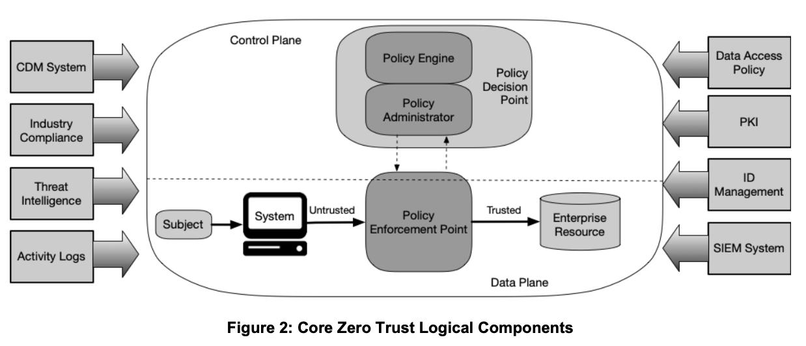

# Network Security

## Designing Secure Networks
* Different security controls usually operate on a distinct [ISO Model Layer](<../../computer-networks#the-7-layers>)
  * Most popular: Application Layer (7); Transport Layer (4) ; and Network Layer (3)

### Infrastructure Considerations
* **Attack Surface** - Points at which an unauthorized user could gain access.
* **Device Placement** - Physical placement are impact by needs, features and prefered topology and security design
  * Examplex: create VLANs, ...
* **Security Zones** - Network segments (physical/virtual)
  * For many reasons
  * Exampoles: Guest networks, internet facing networks (DMZ), management networks, higher clearance level, more sensitive data.
* **Connectivity Considerations** how connectivity is implemented (wifi, optics, cable, ...) and necessary throughput
  * Also multiple ISPs/failover connections are part of this
* **Failure Modes** - What if a security device fails ? Depends on business requirements
  * `fail-closed` - block any traffic during failure
  * `fail-open` - do't interfere with traffic during failure
* **Network Taps** to monitor traffic
  * `active` powered
  * `passive` not powered (removes los off power failure mode)

### Network Design Concepts
* **Physical Isolation** - requires physical presence to move data between air-gapped systems.
  * aka **Air-Gapped**`
  * Known hack: Malware that copied itself to USB sticks.
* **Logical Segmentation** - Virtual/software level isolation of networks
  * Often on Layer 2,3
  * aka VLANs, Subnets, ...
  * Packets move with VLAN tags.
  * Attacks focust on devices/systems that seperate/enforce this.
* **High Availability (HA)** to handle the `Availability` goal
* **Implementing Secure Protocols** - ensure that services/communication is secure
  * E.g. HTTPS over HTTP; SSH over Telnet
  * Mind the Protocol versions! (downgrade attacks)
  * Using an alternate port NOT a security control (Just obscurity)
* **Reputation Services** - feeds that track IP addresses, domains, and hosts known to engage in malicious activity.
  * Often combined with threat feeds.
* **Software-Defined Networking (SDN)** software-based network configuration.
  * Relies on controllers that managed network devices and configurations.
  * Flexibile, can be changed based on metrics/insights.
  * You can configure security zones and such (like security groups in AWS).
  * Often on Layer 2,3 and sometimes 4.
* **Software-Defined Wide Area Network (SD-WAN)**
  * Used more for availability, connecting various internet providers in a transparent way.
* **Scure Access Service Edge (SASE)**
  * Pronounced "Sassy"
  * Combines: **VLAN**, **SDN-WAN**, **firewalls**, **Cloud Access Security Brokers (CASB)**
  * USed to
    * make endpoints secure.
    * in-transit data is secure
    * policy-based security enforcement
  * **Cloud Access Security Brokers (CASB)** - policy enforcement point between service providers and service customers to allow organizations to enforce their policies for cloud resources.

### Network Segmentation
* **VLAN** is oneof the many technologies to implement segmentation.
  * Sets up a broadcast domain that is segmented at Data Link Layer (Layer 2).
  * Netowkrk devices enforce these packet forward based on the VLAN "tag".
  * The tag is assigned by the network devices as they receive traffic from an endpoint, the endpoint itself doesn't tag the data.
* **Segementation Designs**
  * Demilitarizewd Zones (DMZ)/Screened Subnets - Exposed to less trusted areas (public internet)
    * Mostly used for public facing devices. But internally in networks this could also be necessary.
  * Intranets - Like only for employees
  * Extranets - For external access
* **North-South Traffic**
  * Traffic between internal systems and the outside world (clients, internet, external networks).
  * Think: in/out of the datacenter or cloud.
* **East-West Traffic** - traffic flow in datacenter
  * Traffic within a datacenter, cloud, or enterprise network, i.e., between internal systems.
  * Think: side-to-side, lateral movement inside the environment.

### Zero Trust
* Never trust, always verify.
* See also [General Concepts](<general-concepts#Zero Trust>)
* 
  * [Source - NIST Zero Trust Architecture (NIST SP 800-207)](https://csrc.nist.gov/pubs/sp/800/207/final)
  * *Subjct*: The actors
  * *Policy Engines*: Are the decision/rule engines"
  * *Policy Administrators*: Enforce the decisions
  * *Policy Enforcement Points*: Where enforcement happens
    * Commonly deployed as a local agent
  * *Control Plane*
    * *Adaptive Identity/Authentication* - use context-based authN
      * based on: location subject, device of subject, does device meet security, ...
      * Can request additional validation for AuthN if necesary
    * *Threat Scope Reduction (limited blast radius)*
      * `least privilege` + `identity based network segmentation`
        * meaning, based on your identity, the scope for network segmentation is set for the subject.
    * *Policy-Driven Access Control* - the policy check
    * *Policy Administrator* - who enforces
  * *Data Plane*
    * *Implicit trust zones*  - where can subject move once authenticated
    * *Subjects and systems* - users/systems that seek access
    * *Policy Enforcement Points* - Where its enforced

### Network Access Control
* **TODO**

### Port Security and Port-Level Protections
* **TODO**

### Virtual Private Networks and Remote Access Network Appliances and Security Tools Deception and Disruption Technology
* **TODO**

### Network Security, Services, and Management
* **TODO**

## Secure Protocols
### Using Secure Protocols
* **TODO**

### Secure Protocols
* **TODO**

## Network Attacks
### On-Path Attacks
* **TODO**

### Domain Name System Attacks
* **TODO**

### Credential Replay Attacks
* **TODO**

### Malicious Code
* **TODO**

### Distributed Denial-of-Service Attacks
* **TODO**
