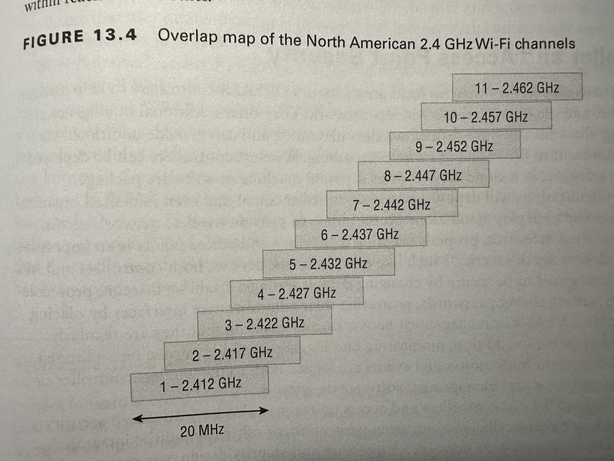

# Wireless and Mobile Security
> Have distinct challenges compared to wired networks.
> They broadcast their signals and are often available from outside the area that an organization contols.

## Building Secure Wireless Networks

### Connection Methods

#### Cellular
* networks provide connectivity by dividing geographic areas into "cells".
* Each cell might have more than one tower.
* 5G needs more attena density, but has more throughput, so requires more antenna planning than 4G.
* Provided by cellular carriers. - So it's a external network from your organization.
* *Operating Scope* : Long range

#### WIFI
* is a set of protocols for wireless LAN.
* Most popular *radio bands*: `2.4 GHz` and `5.0 GHz`
* Uses *multiple channels* for different WIFI networks to coexist in each others vicinity.
* *Key security concern* is that the signals travel outside the organization's walls.
* *Different standards* `802.11b`, `802.11ac`, `802.11x`, `802.11n`, `802.11g`...
  * Some are "aliased" like WIFI 6 is the alias for `802.11ax`
* *Protocols* like `WPA2` and `WPA3` provide security like encryption, authentication and network frames protection.
* *Wifi Devices Modes*
  * `ad hoc` - device-2-device communication, like p2p. No intermediaries. But both devices must be able to reach each other. Sometimes called mesh.
  * `infrastructure` - direct all traffic through base station/access point. Typical for your home router or access point. They follow a star/hub-and-spoke network design.
* `Service Set Identifiers (SSID)` are used to identify networks, these can be broadcasted or kept private.
* *Operating Scope* : Mid range

| Wi-Fi standard | Generation name | Maximum speed | Frequencies |
|----------------|-----------------|---------------|-------------|
| 802.11b | | 11 Mbit/s | 2.4 GHz |
| 802.11a | | 54 Mbit/s | 5 GHz |
| 802.11g | | 54 Mbit/s | 2.4 GHz |
| 802.11n | Wi-Fi 4 | 600 Mbit/s | 2.4 GHz and 5 GHz |
| 802.11ac | Wi-Fi 5 | 6.9 Gbit/s | 5 GHz |
| 802.11ax | Wi-Fi 6 and Wi-Fi 6E | 9.6 Gbit/s | 2.4 GHz, 5 GHz, 6 GHz |
| 802.11be | Wi-Fi 7 | 40+ Gbit/s | 2.4 GHz, 5 GHz, 6 GHz |

#### Bluetooth
* *radio band*: `2.4 GHz`
* *purpose* : Low power, short range and low bandwith.
* *Operationg mode* : Point-2-Point
* *Operating Scope* : close range
* *Pairing* : Process for establishing a connection, requires sometimes a `pin` to complete.
* *Security Modes*
  * 1 - No Security (non-secure)
  * 2 - Service-level enforced security
  * 3 - Link-level enforced securty
  * 4 - Standard pairing with Security Simple Pairing (SSP)
* *encryption* is supported, relies on `PIN` used by both devices, like a shared key.
  * Devices like headsets use `FIXED PINS` decreasing its security.
* *Attacks* against authN and negotiating encryption keys allows for eavesdropping.

### Radio Frequency Identification (RFID)
* Tags are either
  * `active`: Powered themselves and always emits signals to be read by a reader
  * `semie-active`: Powered themselves, but emit signals when the reader asks for it
  * `passive`: entirely powered by the reader.
* *Frequencey Ranges*
  * `low` - short-range, low-power (touch field)
    * Use case : Entry Access & Identification
    * power and frequency can be different around the world, so might not work everywhere the same.
  * `high` - Up to a meter (near field)
    * Communicates faster than `low`
    * Support `read-only`, `write-only` and `rewritable` tags
  * `ultra-high` - highest range and speed to read.
    * Use Cases: inventory, antitheft (shops)
* *Operating Scope* : near to close range (up yo 100m for active tags)
* *Tags are small and inexpensive*
* *Attack Vectors*
  * Destruct/damage tag so they can't be read
  * Reprograming of tags
  * Tags can be cloned, modified or spoofed, or readers can be impersonated.
#### Global Position System (GPS)
* *Operating Scope* : very wide range
* *Only sends signals* - you receive `location` and `time` signals, but you don't connect to have a casual dialog.
* *Attack Vectors*
  * Signal can be jammed
  * Signal can be spoofed
* *Goal* : Geolocation
* GPS often combined with other location centric data (wifi names, bluetooth, ...) to have an accurate location of a device.
#### Near Field Communication (NFC)
* *Operating Scope* : near/touch range (~10 cm)
* *Device-2-device* communication
* *Low bandiwth*
* *Attack Vectors*
  * When in close proximity: Intercept NFC traffic, replay attacks and spoof attacks.
  * NFC decices must not respond to queries unless desired. That's why paying with APple Pay, you need to "trigger your card" first before you can pay.

#### Infrared
* *Device-2-device* communication, but networks are technically possible
* *Attack Vectors*
  * Can be caputed by anything in line of sight.

### Wireless Network Models
* **point-top-point** (decentralized) like device to device, direct connection.
* **point-top-multipoint** (centralized) like an accesspoint/router using the `infrastructure` mode, central hub
* **mesh** - Multiple interconnected paths between many devices
* **broadcast** - sends out on many nodes (like GPS), no return path

### Attacks Against Wireless Networks and Devices

#### EvilTwins and Rogue Access Points

* **EvilTwin** is an Access Point (AP) setup to "appear" as a legitimate trusted network.
  * Specific type of rogue AP that impersonates a legitimate network
  * Emits the same `SSID` as the network it tries to impersonate.
  * The EvilTwin can be placed closer to a dvice or be stronger than the legititime network.
    * (Other techniques exists also)
  * The goal is that target is tricked into connecting to the EvilTwin AP instead of the legitimate AP.
  * The attacker provides internet to the target to not give any impressions something is wrong.
  * Meanwhile, the attacker is on-path and can do lots of typical on-path type of attacks.
      *e.g. False login screens, false websites, ...
* **Rogue Acces Points** are APs added to your network intentionally or unintentionally.
  * The broader category of an **EvilTwin*.
  * Any unauthorized access point (umbrella term)
  * Other examples:
    * Honey Pot AP: "Free_WiFi", so there is no attempt to impersonation for example.
  * *Defenses*
    * Auto detection of new AP in vicinity.
    * Wireless IDS can spot unknown AP and identify if they're connected to your network.

#### Bluetooth Attacks
* **Bluejacking** - Send unsolicited messages to Bluetooth enabled devices.
* **Bluesnarfing** - Unauthorized acces to a Bluetooth device.
  * Aims to gather information like contact lists or other senstive information from a device.
* **Bluetooth Impersonation Attacks (IBA)**
  * Takes advantage of bluetooth specification weakness
* *Defeneses* - not many
  * Often easible guissable PINs (e.g. `0000`) an then establish long teem kwy for connecting.
  * Use non standard pins
  * Patch your hardware

#### RF and Protocol Attacks
> When you want a system to disconnect from a wireless network or conduct an evil twin attack can use either:
> - Disassociation
> - Jamming

* **Disassociation** - Many attacks work better if they can be there when a device connects to a wireless network.
  * Therefore, making a device disconnect/dissaociate momentarily allows the attacker to capture the WIFI connection traffic or to insert an EvilTwin.
  * *How?*
    * Send a `deuauthentication frame` to the AP with a spoofed mac address from the victim. This causes the AP to disconnect the device and require it to reconnect/reauthenticate.
    * WPA2: management frames often not encrypted, so possible
    * WPA3: management frames encrypted, so impossible
* **Jamming** block all traffix in a range/frequency aka wireless inteference.

#### Sideload and Jailbreaks
* **Sideloading** Transfer files to mobile devices, often via USB/MicroSD to install apps from outside the store. This is not always necessarily malicious. Could be to get around geoblocks in app stores.
* **Jailbreaks** do privilege escalation in the OS of the device.

### Designing a Network
* Requires careful **Wireless Access Point (WAP)** placement + configuration.
  * There is limited amount of channels
  * Too many WAPs using same channel in range of each other can degrade performance.
* **Site Surveys** - Move through facility/space to determine
  * Existing networks
  * Location options for WAPs
  * Tools allow to make **Heatmap**
    * where wifi signals are, the strength, the channels they use and devices.
    * APs reach are no perfect circles, cause objects influence their reach
  * Wifi channels overlap each other slightly, the goal is, based on existing networks and their channels, to pick a channel that has the least overlap with used channels.
* Wifi Analyzers are your go to tool fro doing site surveys and build heatmaps.

### Controller and Access Point Security
* **TODO**

### Wi-Fi Security Standards
* **TODO**

### Wireless Authentication
* **Wireless Authentication Protocokls**

## Managing Secure Mobile Devices
* **TODO**

### Mobile Device Deployment Methods
* **TODO**

### Hardening Mobile Devices
* **TODO**
