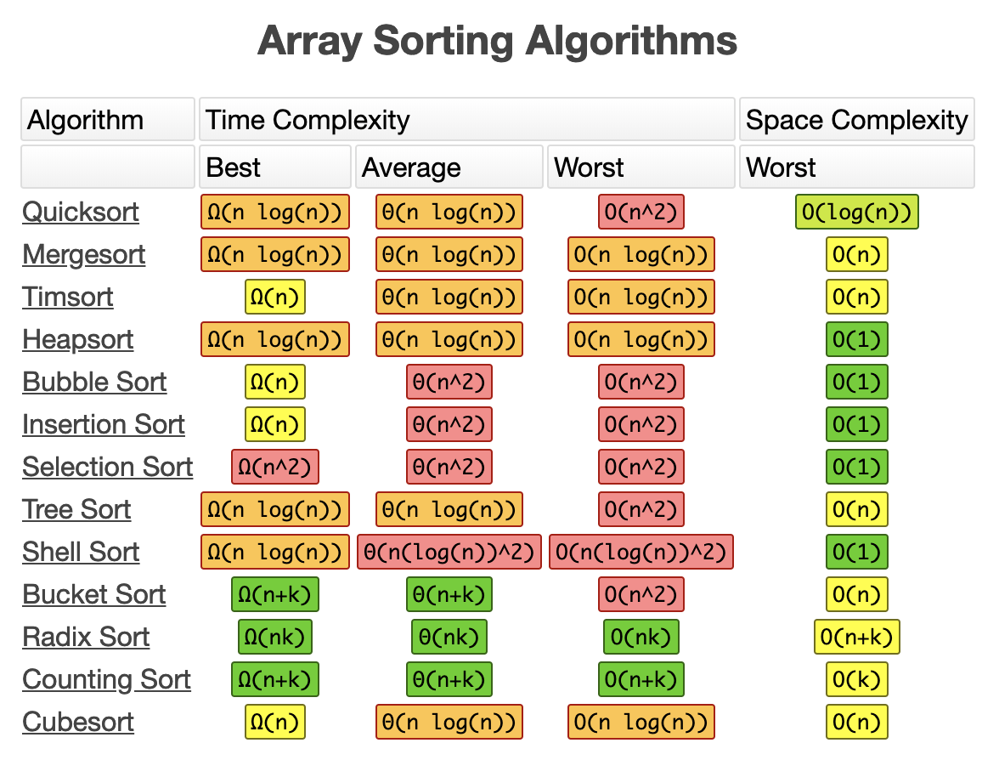

# Data Structures and Algorithms
## Introduction
Data structures and algorithms help you handle problems in a smart and efficient way.

It goes without a saying that they go hand in hand. For solving a problem with a given algorithm efficiently you need to put your data in a appropiate data structure that benefits the algorithm. Using a specific data structure will dictate which algorithms you can use.

This topic is very rich and can go very deep. Understanding the core data structures and algorithms helps you to understand what tools are out there, the more specific your challenge becomes that you try to solve, the more specific a certain data structure and algorithm gets.

The efficiency of your algorithm strongly depends also on the size of your data set that you need to processl. A certain algorithm might perform better on a small set of data, but much worse on a big data set, therefore it is commong that `sort()` functions first probe the size of your data set and based on that might choose another algorithm that is known ot perform better for given data set size.

It's also worth to take in consideration on how your typical data set will be structured or ordered. Statiscally a data set can be faily ordered already, or it can be a given that your data set is almost always sorted in a certain way. This can have an impact on the algorithm you choose.

To be able to decide what is an appropiate algorithm, you must understand the performance (time complexity) expressed in the big O notation. The performance can greatly vary based on the size of the data set and how the typical sample data set that you provide will look like (partialy ordered, always descending, etc...).

As you learn new algorithms, you will find the performance for each of the differen characteristics.

## The Big O notation
[The Big O notation explained](big-o.md)

## Data Structures

Data Structures often differ in their efficiency for each sorting algorithm and their basic operations (like read, insert, remove, update and search).

* [Array](data-structures/array.md)
* [Stack](data-structures/stack.md)
* [Queue](data-structures/queue.md)
* [Singly-Linked List](data-structures/singly-linked-list.md)
* [Doubly-Linked List](data-structures/doubly-linked-list.md)
* [Hash Table](data-structures/hash-table.md)
* [Binary Tree](data-structures/binary-tree.md)

## Algorithms

* [Binary Search](algorithms/binary-search.md)
* [Linear Search](algorithms/linear-search.md)
* [Bubble Sort](algorithms/bibble-sort.md)
* [Selection Sort](algorithms/selection-sort.md)
* [Insertion Sort](algorithms/insertion-sort.md)
* [Quicksort](algorithms/quick-sort.md)
* [Quickselect](algorithms/quick-select.md)
* [Graph Algorithms](algorithms/graph.md)

## Other topics

* [NP Completeness](np-completeness.md)

## General facts and point

* We asume a limit on the size of each word of data. When working with inputs of size `n`, we typically asume that integers are repesented by `c lg n` **bits** for some constant `c >= 1`. We require `c >= 1` so that each word can hold the value of `n`, enabling us to index the indivudual input elements, and we restrict `c` to be constant so the word size does not grow arbitrarly. Because of this property, we can easily index in an array as each item will have the same word size and we kan O(1) access in an array.
* Quadratic function `an² + bn + c`.
* A **randmozed alghoritm takes** "random choices" therefore we can not express the max time, instead we express then the **expected running time**.

### Divide-And-Conquer

* An algorithm design approach/technique.
* They break the problem into several subproblems that are similar to the original problem but smaller in size, solve the subproblems *recursively*,and then combine these solutions to create a solution to the original problem.
* The divide-and-conquer paradigm involves 3 steps at each level of the recurrursion:
  * **Divide** the problem into subproblems that are smaller instances of of the same problem.
  * **Conquer** the subproblems by solving them recursively. If the subprobleme sizes are small enough, howver, just solve the subproblem in a straightforward manner.
  * **Combine** the solutions of the subproblems into the solution for the original problem.
* When an algorithm contains a recursive call to itself, we can often describe its running time by **recurrence equation** or **recurrence**, which describes the overall running time on a problem of size `n` in terms of the running time on smaller inputs. We can then use the mathematical tools to solve the recurrence and provide bounds on the performance of the algorithm.
  * Formula
    * `c` : Some constant
    * `T(n)` : Running time on problem of size `n`
    * `D(n)` : Time to divide the problem in subproblems.
    * `C(n)` : Time to combine the solutions of the subproblems into the solution of the original problem.
    * `a` : # of subproblems each of which is `1/b` the size of the original. It takes time `T(n/b)` to solve one subproblem of size `n/b`, and so it takes time `aT(n/b)` to solve `a` of then.
    * We get recurrance: (correction, `O` must be `Θ` here)
    
    * If the problem is small enough (`n <= c`) the time might be constant `O(1)`.
* Elaborate example of the formula
  * When we have `n > 1`, `n` is an exact power of `2` elements applied with the **merge sort** algorithm:
    * **Divide**: The divide step just computes the middle of the subarray, wich takes constant time. Thus, `D(n) = O(1)`.
    * **Conquer**: We recursively solve two subproblems, each of size `n/2`, which contributes `2T(n/2)` to the running time.
    * **Combine**: Merge procedure on an `n`-element subarray takes `O(n)`, so `C(n) = O(n)`.
  * Formula: (correction, `O` must be `Θ` here) 
  * Where `c` represents the time required to solve problems of size `1` as well as the time per array element of the divide and combine steps.

* It's perfectly reasonable to divide the orginal problem into sub problems untill the subproblems are small enough, and then use a insertion sort on those subproblems as they might perform better on smaller subproblems/arrays.

* **Recursive Case**: When a subproblem is large enough to solve recursively.
* **Base Case**: When a subproblem is smal enough to not recursive.

#### Methods or solving recurrences

For obtaining asymptotic Θ or O bounds on the solution.

* **Substitution**: Guess a bound and then use math to prove our guess is right.
* **Recursion-tree**: Convert the recurruence into a tree whose nodes represent the costs incurred at different levels of the recursion. We use techniques for bounding summations to solve the recurrence.
* **Master**: Provide bounds for recurrences of the form `T(n) = aT(n/b) + f(n)`
