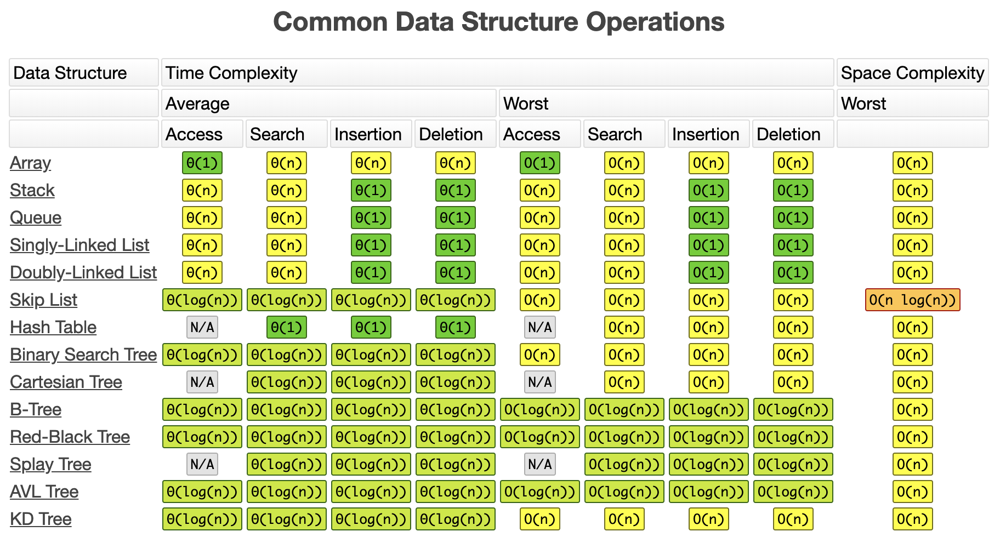

# Singly Linked List

* Part of the node based structures group

* Items in a singly linked list means, each element of the list exists out of two parts. The value and the address location of the next item in the list. If there is no next item in the list, the pointer to the next item will have a nil to indicate the end of the list.

* The memory doesn't have to find one continous block of memory.

* Inserting will be always O(N) as we have to walk through the entire list to find the final item and then update that item's pointer to the next item.

* Reading and Searching is O(N) as we might have to walk through to the entire list to get to the right memory location.

* Deleting will be O(N) in case at the end of the list.

* The list keeps track of the first item

Very appropiate when you need to delete multiple items. As the actualt delete is jus one action, it's stepping through all items that only takes O(N), but for every delete we don't have to shift all elements.

