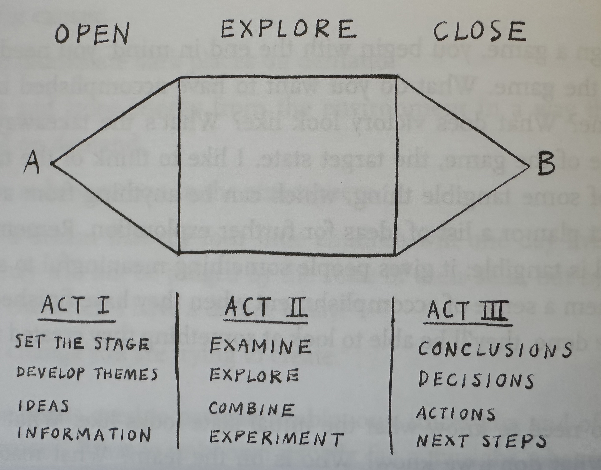
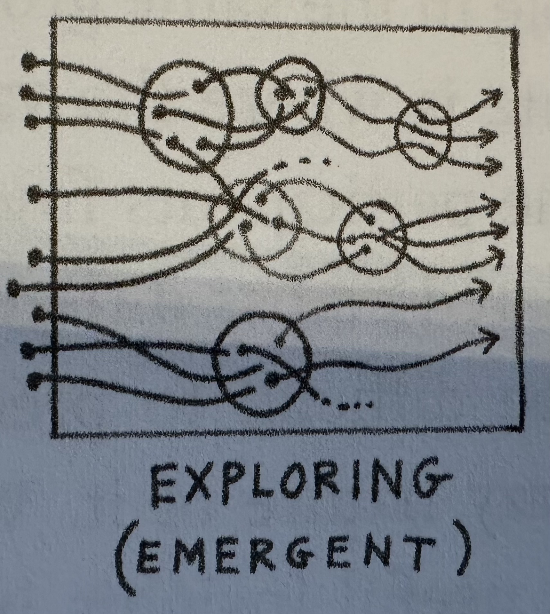
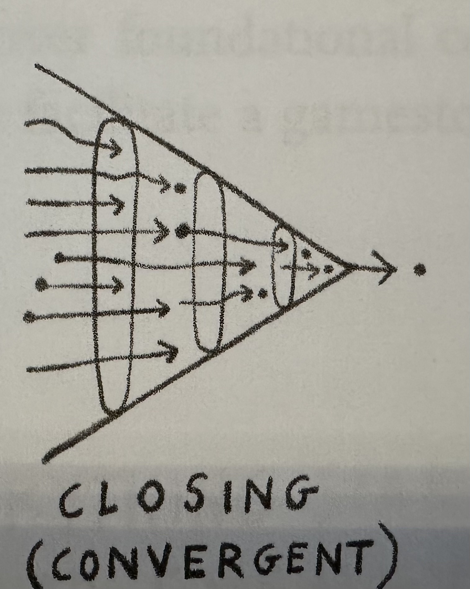

# Game Storming

Gamestorming is a collaborative approach to problem-solving and innovation that uses structured games to help groups think creatively, communicate more effectively, and explore complex challenges together. By combining elements of play, visual thinking, and facilitated activities, gamestorming creates an engaging environment where participants can generate ideas, uncover insights, and align around shared understanding. Rather than relying on abstract discussions, it encourages hands-on participation, making thinking visible and helping teams break down assumptions, discover new perspectives, and move from exploration to actionable outcomes.

## Making Not-Knowing Desirable

> Chapter 1.

Create conditions in which humans venture into new spaces of possibility. Temporarily exchanging certainty for doubt in order to unlock collaboration, problem solving, agility, imagination, innovation and boundless adventure. There are **5 game storming features** that help unlock these.

* **Thinking Moves** - Meta-cognitive processes through which we better understand and engage with the world.
    * When done well: new resources, knowledge acquisition, breakthroughs, and surprising solutions.
    * Examples
        * *Reason With Evidence*
        * *Make Connections*
        * *Uncover Complexity*
        * *Capture The Essence*
        * *Build Explanations*
        * *Describe What's Here*
        * *Wonder*
        * *Consider Different Views*
        * *Identify Patterns*
        * *Generate Possibilities*
        * *Evaluate Evidence*
        * *Make Plans*
        * *Identify Assumptions/Bias*
        * *Prioritize/Rank*
* **Thinking Beyond The Brain** - Refers to the idea that effective thinking is not limited to what happens silently inside an individual’s mind, but is enhanced through physical, visual, and social interaction. In gamestorming activities, participants externalize their thoughts by sketching, moving objects, writing on sticky notes, and interacting with others, which reduces cognitive load and reveals patterns that might otherwise remain hidden. This approach leverages the body, space, and group dynamics as part of the thinking process, allowing ideas to evolve through shared artifacts and collective sense-making rather than isolated mental effort.
* **Visualization** - Gives immediate access to what's inside of other people's space. Sketches make the invisible, visible. Internalized knowledge becomes externalized.
* **Games** - Powerful and purposeful thought experiments.
* **Games Sequences** - We might want to pipe different games to build a bigger journey.

## A Game

> Chapter 2.

* **Game Components**
    * *Game Space* - A alternative world, a model world. Ordinary life is suspended and other rules apply. (just like with DD)
    * *Boundaries* - In space and time. There is a time where the game starts and ends. Usually the game happens in a space, if outside, you step outside the game. (I go to the toilet)
    * *Rules For Interaction* - The rules of engagement, interaction, etc.
    * *Artifacts* - Board, post-its, ball, chess board and pieces, anything you might need/use for the game.
    * *Goal* - When is the game over? End state. Something understood by all players.
    * **Conclusion**: Every game in game storming has these components.
* **Game Flow/Story**
    * *Imagine The World* - Before the game start, imagine one for the players. (aka, create the Game space)
    * *Create The World* - Expand the Game Space with Boundaries, Rules, and Artifacts.
    * *Open The World* - Explain and share the world to all players so they can participate.
    * *Explore The world* - Players explore the world via its rules towards the game goal(s). 
    * *Close The World* - The goals are met, so a ceremonial ending, provide closure.
    * **Conclusion**: Gamestorming is about creating game worlds to explore and examine challenges and complexities, improve collaboration, and to generate novel insights. Games can last from minutes to days.
* **The Game Of Business**
    * You start from a `initial conditions` to a `target space` (goal). Between is the `challenge space`.
    * When there are `clear goals` and linear processes on how to achieve that goal, we have a simple `business process` that can take care of that.
        * Here there is no goal for creativity, we want predictable clear outcomes.
    * When there are `fuzzy goals`  there are no clear steps to achieve that goal. We need creativity.
        * We need a framework (gamestorming)  for exploration, experimentation, and trial and error. The path is not clear, it will/might change.
    * Goals, by their nature, are attempts to predict and control the future. **Specific goals are for production, Fuzzy goals for search.** In search, it's not what you are seeking that matters most, It's what you find.
* **Fuzzy Goals**
    * To define one you need *ESP*
        * *Emotional* - Fuzzy goals must align with people's passion and energy for the project.
        * *Sensory* - The more tangible you can make a goal, the easier it is to share it with others. Sketches and crude physical models help to bring form to ideas that might otherwise be too vague to grasp. You may be able to visualize the goal itself, or you may be able to visualize an effect of the goal, such as a made explicit in some way.
        * *Progressive* - Fuzzy goals are not static; they change over time. This is because, when you begin to move toward a fuzzy goal, you don't know what you don't know. The process of moving toward the goal is also a learning process, sometimes called successive approximation. As the team learns, the goals may change, so it's important to stop every once in a while and look around. Fuzzy goals must be adjusted (and sometimes, completely changed) based on what you learn as you go.
    * Examples
        * A dining experience unlike anything you've had.
        * A home away from home.
        * Land people on the moon and return them safely to Earth.
        * A faster way to move things from here to here.
        * A cure for cancer*
* **Game Shape**
    * 
    * 
        * Opening people's minds, possibilities, explosion of ideas. Not a place for critical thinking or skepticism. **GENERATE IDEAS**.
    * 
        * Create conditions that will allow unexpected, surprising and delightful things to emerge. This is done by exploration and experimentation. You look for patterns and analogies, try to see old things in new ways.
    * 
        * Move towards conclusion, decisions, actions.
        * Now asses ideas with a realistic, critical eye. You converge, filter, narrow down.