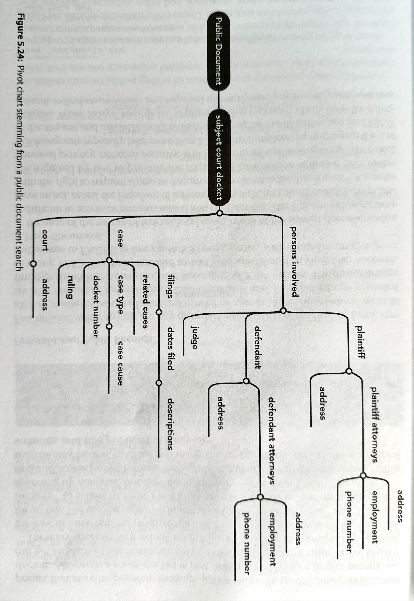
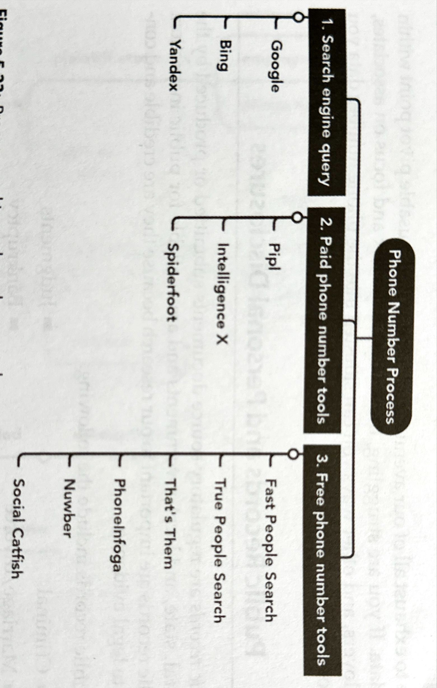
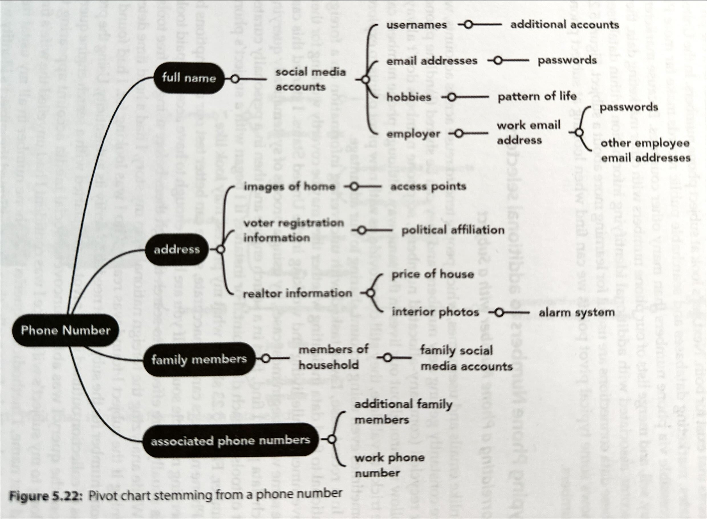
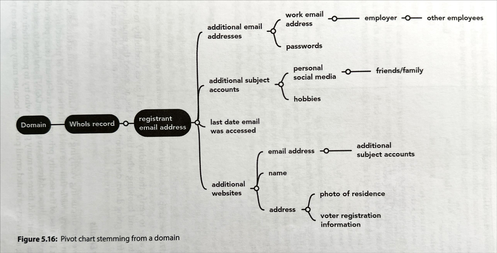
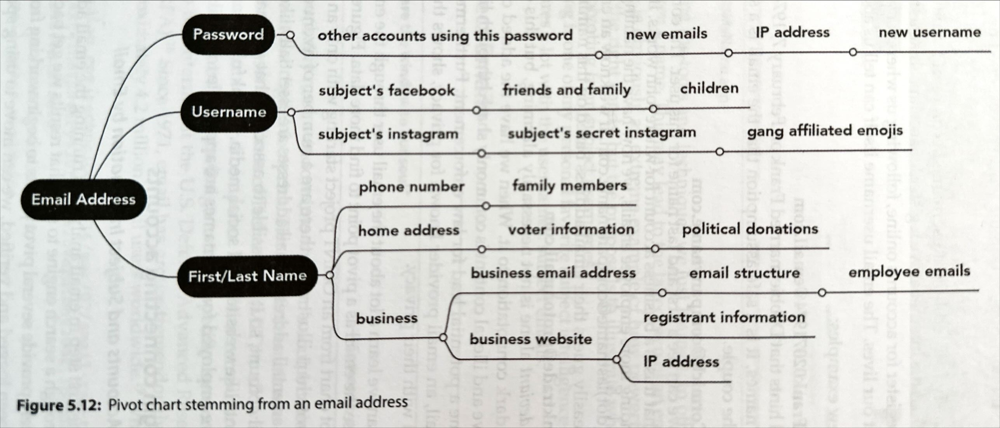
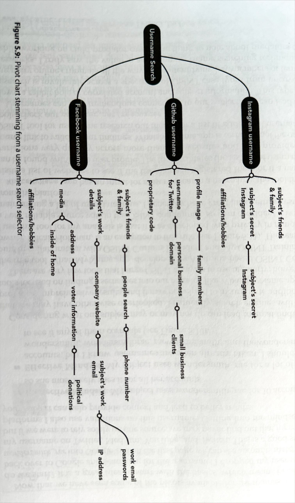
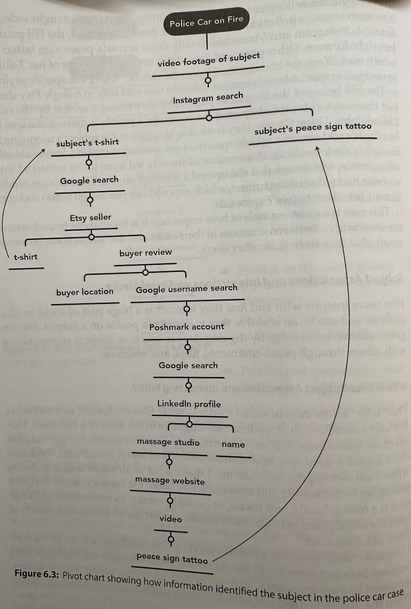
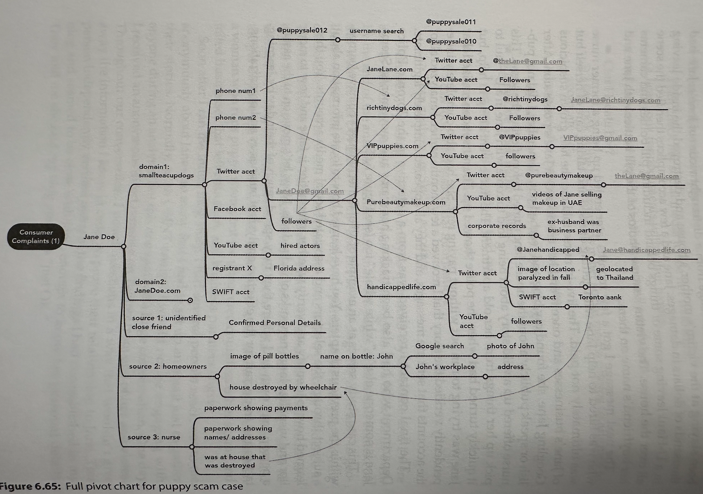
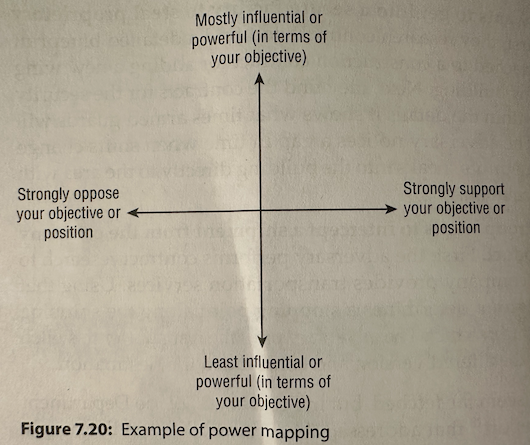

# OSINT: Open Source Intelligence

## Certifications

* https://www.giac.org/certifications/open-source-intelligence-gosi/

## Methodology

### [Intelligence Cycle](https://en.wikipedia.org/wiki/Intelligence_cycle)

1. Planning and Requirements
2. Collection
3. Processing and Evaluation
4. Analysis and Production
5. Dissementation and Consumption
6. Repeat

## Subject Intelligence

> Intelligence about a person and direct metadata (address, name, email, accounts, ...)

### Tools

* [dehashed.com - data breaches and passwords](https://dehashed.com/)

## Social Media Intelligence

> Social Media of a Subject/business

* Note that especially younger generations might have multiple accounts for various audiences (friends, themselves, a business, ....)

* **MIS/DIS/MAL-information**
  * **Misinfoformation**: Misleading or incorrect information that is not knowlingly deceptive.
    * Example: Grandma posts article about vitamines curing cancer.
  * **Misinfoformation**: Misleading or incorrect information that is knowlingly deceptive/deliberate.
    * Usually entirely fabricated.
    * Example: Mascot from one team posts false information about competing mascot, about being arrested for assault.
  * **Malinformation**: Based in reality but is purposfully harmfull. It's is based on reality but shared out of context or intent to cause harm.
    * Example: Political party post fake story of immigrant assaulting a native woman to ignite hated.

### Tools

* [Telegram Stats](https://tgstat.com)
* [Reddit Post Analyzer 1](https://reditr.com/)
* [Reddit Post Analyzer 2](https://www.osintcombine.com/free-osint-tools/reddit-post-analyser)
* [Pro Twitter (Former Tweet Deck)](https://pro.twitter.com/)
* [Centre For Information REeslience](https://www.info-res.org/)
* [Snopes: Debunk site](https://www.snopes.com/)
  * [Snopes Fact Checks](https://www.snopes.com/fact-check/)
* [Fact Check.org](https://www.factcheck.org/)
* [Verification Handbook: Guide to verify digital content](https://verificationhandbook.com/)
* [Spot Bot Like Behaviour on Twitter/x: Bot Sentienel](https://botsentinel.com/)
* Graph Tools For Analysis
  * [Neo4j](https://neo4j.com/)
  * [Gephi](https://gephi.org/)
* Foto Forensics
  * [Tool 1](https://fotoforensics.com/)
  * [Tool 2](https://29a.ch/photo-forensics/#forensic-magnifier)

## Business and Organisational intelligence

* Usual data points
  * Corporate/business structure disclosures
    * Parent
    * Subsidary
    * Holding companies
  * Contract disclosures
    * Government Contracts > Usually public by law > You can check if a given organizatio had government contracts
    * Sounds boring, but very juicy details can be found, especially in appendix
      * Technologies, subcontractors used, blueprints, contacts, building specs,...
  * Financial Records / annual reports
  * Affiliation and relationship disclosures
  * Procurement / supply chain disclosures
  * Innovative / proprietary technology disclosures
  * Business discretions and lawsuits
  * santions / illegal activity
  * Public disclosures
  * Published material disclosures
  * Public companies must submit reports, so that helps with public companies
  * Social media and other public info allows to pivot to subject intelligence
* Recognizing Oranizational Crimes
  * [Guide 1](https://aml-toolbox.medium.com/finding-shell-companies-an-investigators-guide-258c3f244bfd)
  * [guide 2](https://www.fraudconferencenews.com/home/2018/6/17/breaking-the-shell)
* Be informed about sanctions to know if someone is doing shady stuff
  * [UN Sanctions](https://main.un.org/securitycouncil/en/sanctions/information)
  * [ParisMou Sanctions](http://parismou.org/Statistics%26Current-Lists/white-grey-and-black-list)
  * [Financial Action Task Force (FATF) - global money laundering and terrorist financing watchdog](https://www.fatf-gafi.org/)
* Non profit are not allowed various things, non profits can be often used to attract funds for good things but in practice do other things that benefit private persons for example.
* Non profits usually have less oversight, that’s why they’re so tempting for fraud.
* In every country normally non profits have to do some declarations or statements that should be publicly available . Or they might self publish reports to attract trust.
* Organizations Domain / Site / IP
  * Look at robots.txt of any site for potential attempted hidden stuff
  * Search for a domain, you might find what other sites refer to the site, that can uncover stuff.
  * The content of a site can indicate if the site is fraudulent, just a quick shell, images and text can be analyzed or reverse searched to see if it’s stock or fake, fotoforensics etc…
    * If content is legit, it can tell alot about partners, customers, org, employees, structure, contacts, social media, …
  * Website metadata
  * Find hidden but public data by google dorking : `site: tandbergeiendom.no ext:docx | ext:xlsx | ...`
  * Use [FOCA](https://github.com/elevenpaths/FOCA) for screening a site
  * IPs  can show connections or shared infrastructure between seemingly unrelated organizations . Remember, a single hosting can run for various companies sites that are unrelated to, rhey just use the same hosting (e.g wordpress).

### Tools

* [Facebook Ads - See all current or past ads and who paid them](https://www.facebook.com/ads/library/)
* [Open Corporates](https://opencorporates.com/)
* [DNB paid alternative to open corporates, but often. Has more data.](https://www.dnb.com/en-us/)
* [EDGAR =>. All the public SEC data in US](https://www.sec.gov/search-filings)
* [Project On Government Oversight](https://www.pogo.org/)
* [USASpending.gov - US Federal Produrement data](usaspending.gov)
* [Open Tender EU](https://opentender.eu/)
* [LittleSis - Find connections/network between entities and people](https://littlesis.org)
* [Whoxy.com - WHOIS lookup](Whoxy.com)
* [Nslookup.io - IP Lookup](Nslookup.io)
  * The ASN (autonomous system number) is something you can pivot on
* [FOCA](https://github.com/elevenpaths/FOCA) fingerprint site
* [DNSLytics](Https://Dnslytics.com)

## Transport Intelligence

... todo

### Tools

## Transportation intelligence

... todo

* [What is SAR](https://www.earthdata.nasa.gov/learn/earth-observation-data-basics/sar)
* [Difference GPS and GNSS](https://www.symmetryelectronics.com/blog/what-is-the-difference-between-gnss-and-gps/)
* [AIS-VTS](https://gssc.esa.int/navipedia/index.php/AIS-VTS)
* [Jamming and spoofing GNSS](https://www.maritimeglobalsecurity.org/media/1043/2019-jamming-spoofing-of-gnss.pdf)
* [JAmming GPS](https://www.bizavadvisor.com/gps-signal-jamming/)
* [erminology: Parts of ships and equipment aboard ships](https://maritimesa.org/grade-10/terminology-parts-of-ships-and-equipment-aboard-ships/)
* [Gloassary of Port and Shipping Terms](https://www.ppiaf.org/sites/ppiaf.org/files/documents/toolkits/Portoolkit/Toolkit/pdf/modules/09_TOOLKIT_Glossary.pdf)
* [Inustrial Control System](https://csrc.nist.gov/glossary/term/industrial_control_system)
* [THE GUIDELINES ON CYBER SECURITY ONBOARD SHIPS](https://www.ics-shipping.org/wp-content/uploads/2021/02/2021-Cyber-Security-Guidelines.pdf)
* [Military Aircraft Insignia](https://military-history.fandom.com/wiki/Military_aircraft_insignia)
* [Visual Aircraft Recognition](https://irp.fas.org/doddir/army/tc3-01-80.pdf)
* [Drone Survival Guide](http://dronesurvivalguide.org/)
* [Off the Radar: Private Planes Hidden From Public View](https://www.propublica.org/article/off-the-radar-private-planes-hidden-from-public-view-040810)
* [What to Know About Air Cargo Handling](https://www.iata.org/en/publications/newsletters/iata-knowledge-hub/what-to-know-about-air-cargo-handling/)
* [Airports & Operational Technology: 4 Attack Scenarios](https://www.darkreading.com/vulnerabilities-threats/airports-operational-technology-4-attack-scenarios)
* [How to decode your VIN](https://www.edmunds.com/how-to/how-to-quickly-decode-your-vin.html)

### Tools

* [Shipspotting](https://www.shipspotting.com/)
* [Windy](https://www.windy.com/)
* [Landsat](https://landsat.gsfc.nasa.gov/)
* [earthobservatory](https://earthobservatory.nasa.gov/)
* [Sentinel Hub EO Browser](https://www.sentinel-hub.com/explore/eobrowser/)
* [Soar Satelites](https://soar.earth/satellites)
* [Google Earth](https://earth.google.com/web/)
* [Marine Traffic](https://www.marinetraffic.com/)
* [Vesselfinder](https://www.vesselfinder.com/)
* [National Vulnerability Database](https://nvd.nist.gov/)
* [ArcGis](https://www.arcgis.com/index.html)
* [AnyTrip - Live rail map Australia](https://anytrip.com.au/)
* [OpenRailwayMap](https://openrailwaymap.org/)
* [Mobility Portal](https://mobility.portal.geops.io/)
* [Travel Time Map](https://app.traveltime.com/)
* [Airline Call Signs](https://123atc.com/call-signs)
* [Plane Spotters](https://www.planespotters.net/)
* [Flight Radar 24](https://www.flightradar24.com/)
* [adsbexchange - World's largest source of unfiltered flight data](https://adsbexchange.com/)
* [Flight Aware](https://www.flightaware.com/)
* [OpenStreetMap](https://www.openstreetmap.org/#map=5/65.40/17.86)
* [AirPortia](https://www.airportia.com/)
* [Federal Aviation Administration (FAA)](https://www.faa.gov/pilots/ladd)
* [FNS NOTAM Search (FAA)](https://notams.aim.faa.gov/notamSearch/disclaimer.html)
* [Temporary Flight Restrictions List (FAA)](https://tfr.faa.gov/tfr2/list.html)
* [Live Air Traffic](https://www.liveatc.net/)
* [Fire Information For Resource Management System](https://firms.modaps.eosdis.nasa.gov/map/)
* [Airport SCADA Solutions](https://www.vtscada.com/airport-solutions-overview/)
* [Model Recognition](https://carnet.ai/)
* [User submitted license plate database](https://platesmania.com/)
* [License Plate Lookup](https://www.faxvin.com/license-plate-lookup)
* [Licensen Plates Of The World](http://worldlicenseplates.com/)
* [LocaToWeb is a reliable real-time GPS tracker app for Iphone and Android that shares your position to web in real time.](https://locatoweb.com/)
* [Trucking Database](https://truckingdatabase.com/)]

## Critical Infrastructure and Industrial intelligence

... todo

### Tools

## Financial intelligence

... todo

### Tools

## Cryptocurrency intelligence

... todo

### Tools

## Non-Fungible Tokens intelligence

... todo

### Tools

## Tools - General

### Search

* [Google](www.google.com)
* [Bing](www.bing.com)
* [Yandex](www.yandex.ru)
* [Baidu](https://www.baidu.com/)

### Archives

* [WayBackMachine](https://web.archive.org/)
* [Archive.ph](https://archive.ph/)
* [Auto Archiver - Archive social media and other online content](https://github.com/bellingcat/auto-archiver)

### Workflow

* [Browser Extension - Instant Data Scraper](https://chromewebstore.google.com/detail/instant-data-scraper/ofaokhiedipichpaobibbnahnkdoiiahk)
  * [Alternatives](https://blog.apify.com/top-instant-data-scrapers/)

### Others

* [Bellingcat Toolkit](https://bellingcat.gitbook.io/toolkit)
* [GeoSpy](https://geospy.ai/)
* [https://fakepersongenerator.com](https://fakepersongenerator.com)
* [Shodan.io](https://www.shodan.io/)
* [Cyberchef (github)](https://github.com/gchq/CyberChef)
* [Thispersondoesnotexist.com](https://thispersondoesnotexist.com/)
* [Similarweb.com/top-websites](https://www.similarweb.com/top-websites/)
* [Google.com/advanced](https://www.google.com/advanced_search)
* [Strava.com](https://www.strava.com/)
* [raebaker.net/resources](https://www.raebaker.net/resources)
* [PIPL](https://pipl.com/)
* [https://whatsmyname.app/](https://whatsmyname.app/)
* [@nixintel](https://x.com/nixintel?lang=en)
* [Sherlock Github](https://github.com/sherlock-project/sherlock)
* [https://epieos.com/](https://epieos.com/)
* [weekdays.works](https://www.weekday.works/people/ian-segers-segersian)
* [Whoxy.com](https://www.whoxy.com/)
* [Viewdns.info](https://viewdns.info/)
* [Emailrep.io (the lower the reputation, the less likely it’s legitimate)](https://emailrep.io/)
* [Haveibeenpwned.com](https://haveibeenpwned.com/)
* [IntelligenceX (search breaches)](https://intelx.io/tools)
* [Spiderfoot](https://github.com/smicallef/spiderfoot)
* [Lexisnexis.com](https://risk.lexisnexis.com/)
* [Https://legal.thomsonreuters.com/en/products/clear-investigation-software](https://legal.thomsonreuters.com/en/products/clear)
* [Sociallinks.io](https://sociallinks.io/)
* [TheOrg - Find the org charts of companies](https://theorg.com/org/neptune-software)
* [Belliongcat Filename Finder - Show original file names on google maps](https://chromewebstore.google.com/detail/bellingcat-filename-finde/fdhodjpkigpaachejkipcghppfnnfdmp)

### Norway Specific

* [PureHelp](https://www.purehelp.no)
* [Finn](https://finn.no)
* [Skattesjekk.no - Check tax of people](https://www.skattesjekk.no/)
* [anonymskatt - Check tax of people](https://www.anonymskatt.no/)
* [skatteetaten - Check tax of people - not anonymous](https://skatt.skatteetaten.no/web/skattelistesoek/)
* [Brønnøysundregistrene - Norway’s central register authority. Contains multiple registers such as the Register of Business Enterprises, the Register of Company Accounts, and the Register of Bankruptcy.](https://www.brreg.no/)
* [Proff - A commercial website using data from the Brønnøysund Register Centre and other sources to present company overviews.](https://www.proff.no/)
  * Maybe you can find here if someone owns or runs a business
* [Einnsyn - A centralized service for searching through Norwegian government agencies’ public records (post journals)](https://einnsyn.no/)
* [Kvartverket - National authority responsible for mapping, property registration, and geographic data.](https://www.kartverket.no/)
* [seeiendom - public-facing portal that combines property information from the Norwegian Mapping Authority, the Cadastre, and the Land Register](https://seeiendom.kartverket.no/)
  * [Boretslag Info](https://www.kartverket.no/eiendom/bestille-fra-grunnboken/grbutskr-bo)
  * You can see when debts where made and the price something was purchased, refinancing is also visible
  * [Bolig.ai](https://www.bolig.ai/)
  * [https://www.eiendomspriser.no/](https://www.eiendomspriser.no/)
  * [Budstikka - Property Transers](https://www.budstikka.no/vis/eiendomsoverdragelser)
  * [Eiendom norge](https://eiendomnorge.no/)
* [Domstol - Norwegian court rulings can be made partially available to the public, though privacy restrictions apply and many legal documents are anonymized.](https://www.domstol.no/)
* [1881.no -  Online directories for phone numbers, addresses, and sometimes additional public info (e.g., businesses and individuals).](https://www.1881.no/)
* [arkivverket - Repository of historical and archival materials, both for governmental and non-governmental entities.](https://www.arkivverket.no/)
* [NB.no - National repository of publications in various media, some digitized and freely available.](https://www.nb.no/)
* [Vegvesen - Contains Vehicle Information](https://www.vegvesen.no/)
  * You can check all the cars that someone has owned (require SSN)
  * You can check who (only name) ons a car with a given license plate
* [https://www.digitalarkivet.no/](https://www.digitalarkivet.no/)
* [https://www.doffin.no/ - Database for public procurement](https://www.doffin.no/)
* [Public Tenders Database](https://opentender.eu/no)

## Resources

* [Deep Dive: Exploring the Real-world Value of Open Sourc](https://www.amazon.com/Deep-Dive-Exploring-Real-world-Intelligence/dp/1119933242)
* [Open Source Intelligence Techniques: Resources for Searching and Analyzing Online Information (9th edition)](https://www.amazon.com/Open-Source-Intelligence-Techniques-Information/dp/B09PHL6Q4G/)
* [https://www.bellingcat.com](https://www.bellingcat.com)
* [https://benjaminstrick.com/](https://benjaminstrick.com/)
* [Renee Diresta Blog - If you give a mouse a cookie](https://www.reneediresta.com/if-you-give-a-mouse-a-cookie/)
