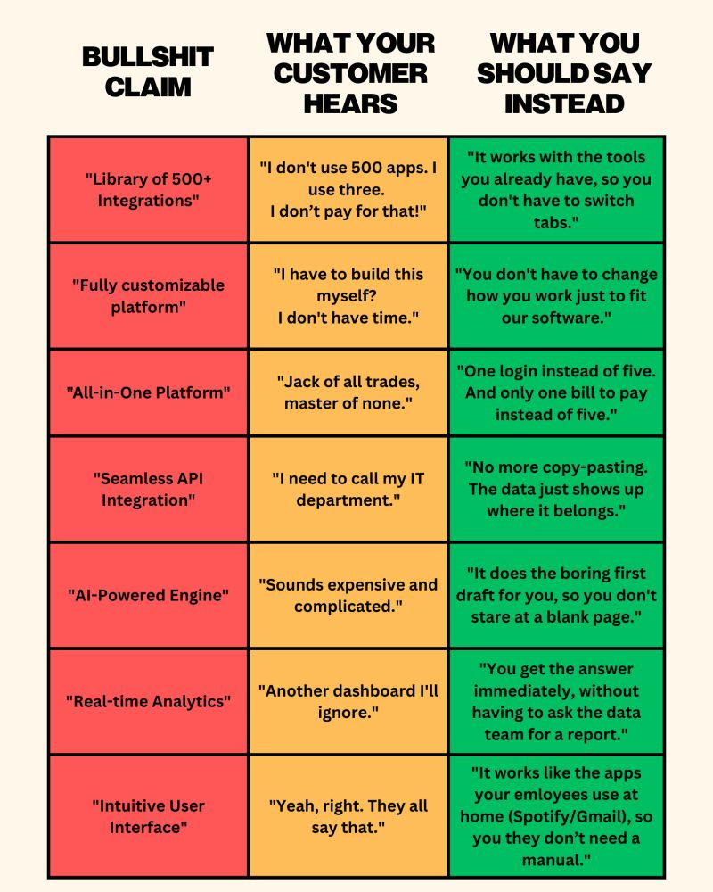

# Product Lifecycle Management (PLM)

End-to-end management of a digital product’s lifecycle, from discovery and development through launch, adoption, and growth.

## Subdomains

These subdomains represent common areas of product work. Their scope and emphasis may vary based on product type (e.g. SaaS), customer type (B2B, B2C), and customer segment.

### 1. Discovery & Strategy
- User research & insights
- Problem definition
- Product vision & principles
- Market & competitive analysis
- Opportunity sizing

### 2. Product Development
- Product management
- Product design (UX/UI)
- Engineering collaboration
- Requirements & prioritization
- Roadmapping & delivery planning

### 3. Go-To-Market & Launch
- Go-to-market (GTM) strategy
- Positioning & messaging
- Launch planning & coordination
- Version releases & rollouts
- Internal enablement (sales, support)

### 4. User Education & Enablement
- User onboarding
- Feature announcements
- In-product education (tooltips, walkthroughs)
- Documentation & tutorials
- Change management

### 5. Adoption & Growth
- Activation & adoption metrics
- Feature usage & engagement
- Experimentation & A/B testing
- Lifecycle communication
- Retention & expansion

### 6. Iteration & Optimization
- Feedback loops (qualitative & quantitative)
- Metrics, KPIs & insights
- Continuous improvement
- Technical debt & refinement
- Deprecation & sunset planning

## Resources
 
* https://strategyn.com/jobs-to-be-done/ — Outcome-driven innovation & JTBD theory
* https://www.strategyzer.com/library/the-value-proposition-canvas
* https://www.hyperact.co.uk/blog/product-development-blueprint
* https://www.wardleymaps.com/
* Positioning a product
    * 