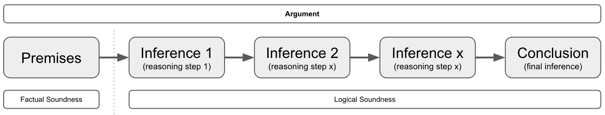

# Thinking

## Chapter 1: An Overview

* Thinking is any mental activity that helps formulate or solve a problem, make a decision, or fulfill a desire to understand. It is searching for answers, and reaching for meaning.
* To be a succesful problem solver, you will need both factual knowledge and proficiency in thinking.
* Good thinking: Good thinking is a matter of habbit, yes some will have a more talent for it, but its a habbit that can be trained and improved. Don't need to be in the NBA to enjoy basketball. IQ seems not connected to this.
  * They have learned strategies for thinking.
  * They have learned strategies to deal with frustration (conusion, mental blockers, ...).
  * They have learned strategies to regain focus/concentration.
  * Comparison:
    * Good Problem Solvers:
      * Read a problem and decide how to begin attacking it.
      * Bring their knowledge to bear on a problem.
      * Go about solving the problem systematically. (e.g. try simplifyng, breaking into smaller problems, ...)
      * Tend to trust their reasoning and have confidence in themselves.
      * Maintain a critical attitude throughout the problem-solving process.
    * Poor Problem Solvers:
      * Cannot settle on a way to begin.
      * Convince themselves they lack sufficient knowledge.
      * Plunge in, from one part of the problem to the other, trying to justify first impressons
      * Tend to distrust their reasoning and lack confidence in themselves.
      * Lack of a critical attitude and take too much for granted.
* Brain At work: Your brain has 2 distinct phases that complement each other during problem solving and decision making.
  * The Production Phase: Most closley related to creativity, it produces solutions, ideas, responses.
    * There are techniques to be learned to be better at this.
  * The Judgement Phase: Most closely related to critical thinking, it examines, judgjes, adds refinements, evaluates.
* Meaningful Discussion:
  * > Many hosts demand that their guests answer complex questions with simple yes or no answers. If the guest responds that way, they are attacked for oversimplifying. If, instead, they try to offer a balanced answer, the host shouts "You're not answering the question".
  * Guidelines:
    * Wehever possible, prepare in advance.
    * Set reasonable expectations. (people will probably not change their conviction on the spot)
    * Leave agotism and personal agendas at the door.
    * Contribute but don't dominate
    * Avoid distracting speech mannerisms
    * Listen actively
    * Judge ideas responsibly (try to not have your general impressions or feelings get in the way to judge something on its merrits)
    * Resist the urge to shout or interrupt
* Preliminary thinking strategies
  * When you must analyze a single statement:
    * Read it again
    * Ask yourself "Does this make sense?"
    * If you have a firm YES/NO, decided what makes to respond that way. That argument is probably what to explain to others.
  * When you get stuck, words fail, dead end road, so difficult challenges:
    * Use a diagram
    * Example: "All dogs are animals. Fido is a dog, therefore Fido is an animal" you could diagram as this:
      * Animal <- All dogs <- Fido
  * When the statement presents as fact something that is not factual, identify the error and explain how it invalidates the statement.
  * When the statement confuses two terms or ideas, identify the confusion and show its effect on the statement as a whole.
  * When the statement presents a conclusion as the only possible conclusion and other conclusions are also possible, present the other conclusions and demonstrate that they, too, are reasonable (perhaps more reasonable).
  * When the statemnt, or some part of it, is open to interpretation, use the if-then approach to analysis.
    * Example: IF X is true THEN conclusion A, IF Y is false THEN conclusion B
    * Also valid if you are unsure about facts
  * When there is a dialog
    * First read it to understand the discussion in its entirety
    * Then read each person's comments individually, note the progression of their thoughts and the degree of logical consistency.
    * Finally read for implications and assimptions (these are ideas that are not stated directly but are nevertheless identifiable by what is stated directly)

# Reasoning Types

Reasoning is a cognitive process that involves drawing conclusions, making judgments, or forming
inferences based on facts or premises. This process has been explored from various perspectives:

* **Symbolic reasoning**: involves the manipulation of symbols that represent ideas or objects and it is often used in mathematics and logic to represent numerical values or logical propositions. 
* **Causal reasoning**: focuses on discerning the relationship between a cause and its effect, aiming to understand how certain events can impact other. 
* **Inductive reasoning**: making broad generalizations from specific observations
* **Deductive reasoning**: applying general principles to specific cases
* **Abductive reasoning**: forming the best hypothesis based on incomplete information

# Reasoning (Book)

## Nature of reasoning
* Reasoning is a skill in using thought and language, and it is profficiency in this skill, not the mere possesion of language, which distinguishes the human species from the others on this planet.
* Reasoning has function to help us find answers to our problems.
* Reasoning has funcfion to express reasons in publicly accessible language.
* Publicly accessible language means that it must be easily accessible or understandble to others.
* The emphasis on communication, on the crucial importance of the **social activity of reasoning**, means that we can **scarecely afford any jargon** at all.
  * Different texts might use different terminology.

* Reading without understand = Basic Reasoning
* Rational = Reasonable
* Practice is more valuable than theory on Reasoning, it's like language, there is no adequate grammar, it changes, you have to use it, just like learning a language.

## Purpose of reasoning

* Reasoning can be used in the service of criticism
* Reasoning can be used in the service of persuasion or communication.
* Reasoning is the means whereby we reach new conclusions, gain new knowledge, uncover new and important facts.

## Creativity & Reasoning

Creativity is a major component in reasoning. The process of trying to think of alternative explanations of a set of facts, is an entirely creative process.

## Argument Analysis

* 3.2
  * Inconcistency Types
    * Logical Inconsistency: Can be detected by anyone who speakers the language without other special knowledge. (aka Contradiction)
    * Factual Inconsistency: A logical inconsistency between what is said (Antwerp is near Oslo) and an unstated fact (Antwerp is in Belgium, but that's a fact or special knowledge that you need to spot the inconsistency).
    * Improbable/Implausible/Quasi-Inconsistent: Something described of having 2 properties which are almost certainly incompatible (that dress is overall green and overall red, but certain materials can be that based on light conditions ).
  * Contradiction == logical inconsistency
  * Consistency is a requirement of communication. Avoid inconsistency/contradiction is crucial.
  * The main point of argument presentation is to show that some kind of inconcistency or implausability is involved in *accepting the premises* of the argument and *rejecting the conclusion*.
  * Arguments are meant to be persuasive; and they succeed in being persuasive if they begin with assertions that the listener or reader is known to accept, and if they continue by showing that acceptance of those asserts (which are called the premises of the argument) requires the acceptance of the conclusion.
  * The power of an argument depends upon two things:
    * It should start off with premises that are known to be true or can be shown to be true.
    * It should proceed to demonstrate or exhibit the way which these premises "force" one to accept the conclusion(s).
      * The force of whishing to avoid contradiction/inconsistency if a weaker kind.
  * You start with a premis (things the other accept) and then steps (aka the inference) that built towards a conclusion. If someone disagrees but agrees with the premsie, they must rebunte one of the steps.
    * You are 18 years old (premise), men below age 25 don't have fully matured brains (step/inference 1) according to sience, so you are not fully mature (Conclusion),
  * Argument types
    * Deductive argument - Logical deduction (e.g. arithmics showing how much something costs, including hidden costs) - Easy attacked with facts or newer facts
    * Inductive argument - Statistical/probable (e.g. its very likely interest rate will increase next month, because ...) - Harder to attack, cause it's implied it's not factual, but likely.
  * Inconsistency is great attack/weapon if poeople have no interest to communicate.
* Reasoning can be used in the service of criticism or in the service of persuasion or communication.
* Logic or reasoning is the means whereby we reach new conclusions, gain new knowledge, uncover new and important facts.
* Reasoning is a constructive and creative activity that leads us to knowledge.
* Creativity is important to reasoning, the process of trying to think of alternative explanations of a set of facts, is an entirely creative process.
* Good thinking, reasoning and creativity go hand in hand
* An argument is logically sound when the reasoning is sound, that the inferences/steps from premise to conclusion are sound, without saying anything about whether the premises are themselves sound (you might not know the facts about the premises)
* An argument is factually sound means that the premises are in fact true.
* An argument can be criticized either by focusing on the truth of the premises, or the goodness of the inference/step. These 2 ways are directly mapped to the factual sound argument and logically sound argument
* The Logic of argument : all the steps/inferences from premise to conclusion
* A conclusion is an inference, actually every inference/step is a kind of mini/inbetween conclusion
* An inference and implication are different. An implication is something that is not directly inferenced by the speaker of the argument, an inference is a clear step that the speaker takes. “The eggs are now rotten, therefore it’s not safe to eat. The inference is that you can’t eat the eggs because they’re rotten, an implication would be, that the spoiled eggs probably now smell like rotten eggs.

## The 7 steps in argument analysis overview
The steps are not highly technical in itself, the difficult thing is to follow them carefully and skillfully.

1. Clarification of meaning (of the argument and of its components)
2. Identification of conclusions (stated and unstated)
3. Portrayal of structure
4. Formulation of (unstated) assumptions (the “missing premises “)
5. Criticism of the premises (given and missing) and the inferences
6. Introduction of other relevant arguments
7. Overall evaluation of this argument in the light of 1 through 6

### Step 1. Clarification of meaning (of the argument and of its components)

* Clarity of: Terms, Phrases, Sentences, Suggestions or Implications and Arguments.

#### Method

A. Read most or all of the argument of passage under consideration before trying any clarification.

B. Replace unknown terms by reference to a dictionary.

C. Rewrite any unclear parts, using clearer language.

D. In particular, identify vague or ambiguous terms that you suspect the argument is 'exploiting'.
  * E.g By shifting from one meaning to another.
  * Translate the clause or sentence containing each occurrence of these terms into other language that conveys the correct meaning  of the term in each context. That will show up any shifts in meaning

E. Write out any important unstated but intended implications or suggestions of the premises, the conclusions, and the argument as a whole.
  * What's it trying to get across that isn't actually spelled out?

F. Ask yourself if you really understand how everything fits together. In other words, have you a "feeling" for the argument or passage as a whole (even if you don't accept it)?
  * Don't let hostility you may have for the position expressed mislead you into misrepresenting the argument - say, by making it more stupid than it already is (you think).
* Look over results of A through E and criticized the passage for unclarity where appropriate. Most of step 1 is laying ground for later analysis. But this part, G is a component of your final criticism.

#### Remember

* The "meaning" of an argument (or word, or other expression) is not what the arguer intended but what he or she said, taken as a native speaker of the language would hear it.
* Still, You want tom kae the best guess at the arguer's intended meaning, and we can take account of context.
  * Ine one context "Dogs Bite" may mean "All dogs bite"; ion another, "most do"' and in another "Dogs, sometimes bite". That is, the meaning of words or phrases isn't to be found in those worlds all by themselves. Look at the context; if the speaker is present, ask for clarification. If not, treat the words as having their usual meaning.

### Step 2. Identification of conclusions (stated and unstated)

#### Method

A. Some of the unstated conclusions turn up in step 1(E) while you're trying to get the meaning straight. Set them out now; write them in below the passage of text, or fit them in (perhaps in the margin) where they come in. Are there any more, perhaps unintended but unavoidable ones? Get them all states clearly and fairly. Which are the most important ones? Is there one main conclusion? (there usually is.).

B. To located the stated conclusions, look for indicate words like `therefore`, `because`, `so` and `thus` and for replacement cues such as the location d the end of a paragraph.
  * These cues are bu no means always reliable; you also have to depend on your sense of the meaning of the passage as a whole.

C. Notice that here may be several conclusions in the argument, each building on the previous ones. And a passage may also contain several entirely separate arguments.

D. Within any one argument, try to decide if that argument has a main conclusion (or conclusions) and if the others can be ranked as to their importance.
  * We can call the second group "secondary" conclusions, some of which may still be quite important, others more or less incidental.

### Step 3. Portrayal of structure

Set out the relationships between conclusions and premises (in the parts of the passage that are arguments). You've already identified the conclusions. Now you just need to ask yourself what assertions are being put forward to support each of these conclusions. **These are the premises**. Typically, there will be other material in the passage that is neither a premise or a conclusion. It may be instructions, rhetoric, repetition, flourish, or other statements. **The following procedure is unnecessary for simple arguments, and it should be applied to very long ones a page or paragraph at a time.**

### Method

A. Number each separate assertion; note that one sentence may contain several assertions.
  * Put square brackets at the beginning and end of each asserts, and number it it in the margin or above the line of type.

B. Do not give a number to repetitions of the same assertion.

C. Do not number irrelevant statements ("asides"). Remember that your judgments or irrelevance or repetitiousness. Remember that your judgement of irrelevance or repetitiousness are crucial to your evaluation of the argument, and you must be ready to defend them.

D. Do give a number to the implicit conclusions you first located in 1E and 2A.

E. Set out the relationships between the relevant assertions in a tree diagram like the one shown here. It is read downward on the page.

If 1 and 2 are claims put forward to support 3 and are not themselves supported by any other assertion, and if 3 is supposed to support 4, but not vice-versa, the diagram looks like the illustration. If 4 might be an unstated conclusion, you might put it in parentheses, as shown.

F. For a "balance of considerations" argument, where we say that 1, 2, and 3 suggest the conclusion 5, "Despite" 4 (which points the other way), use symbolism as shown in this diagram.

G. Sometimes, you can set the structure out on a single line, e.g., ( 1 + 2 + 3 + 4) -> 5 or 1 -> 2 -> ( 3 + 4 ). The arrow then stands for "implies". Sometimes the suggestion is made that, for example, ( 1 + 2 ) imply ( 3 + 4 ) and are implied by them then use a double-ended arrow, thus: ( 1 + 2 ) <-> ( 3 + 4 ).

H. Terminology: IF statement 1 implies statement 2, we can also say 2 "follows from" 1, or "is a consequence" of 1, or that we can infer 2 from 1. It is incorrect to say 1 infers 2: statements imply but can't infer; people can do both (but not at the same time).

I. While doing this, begin to look for places where there are significant, unstated assumptions ("missing premises"). You can locate them by adding circles to the tree diagram with letters in them at the appropriate places, thus:

(A is an assumption that is needed to support the interference from 1 and 2 to 3)
To formulate them exactly, see the next section.

### Step 4. Formulation of (unstated) assumptions (the “missing premises “)

The most difficult part of reconstructing an argument is fair and clear formulation of the "missing premises", the unstated assumptions. You must distinguish between:

A. The *Arguer's assumptions*, what he or she consciously assumed or would accept as an assumption if asked.

B. The *minimal assumptions of the argument* whatever is, logically speaking, necessary to make it possible to get from the premises to the conclusion of the arguer.

C. The *optimal assumptions*, usually stronger claims than B which are logically adequate and independently well-supported.

### Step 5. Criticism of the premises (given and missing) and the inferences

Criticism of expression is already covered in 1(g).

Criticizing an inference from statement 1 to statement 2 means criticizing the claim that 1 supports 2. You do not need to know where 1 is true or not in order to consider whether it supports 2. You just have to ask, if 1 were true, wouldn't 2 then have to be true, or at least very likely be true? 

(Understanding this point is also the key to testing a hypothesis, for when we say, "If Jones did kill Mrs. Robinson, he would have to run a mile in 5 minutes to be in the restaurant by 9:10 PM" we're not saying he did or that he didn't, but we are suggesting that it's reasonable to infer from the claim that he did it to a certain conclusion. By checking on whether he could run this fast, we are testing the hypothesis that Jones was the murderer)

*Criticizing a premise* requires that, if the argument is going to be any good as a way of marshaling support, the forces it calls up had better be strong, i.e., the premises must be reliable. When the premises are technical claims, you aren't expected to comment on them in the course of logical analysis. When they are definitions or analyses subject to logical criticism, or matters of common knowledge, you are expected to asses them.

*Good criticism* of an argument requires that you look at both the reliability of the interference and the reliability if the premises. You might think that there's no point in looking at the interference if the premises are false. But your criticism of the premises may be either in error or fairly easy met by minor modifications; you must guard yourself against this by covering both types of criticism. Good criticism also involves *selective attack*; first attack the main conclusions (via the premises and interferences that bear on them), and spend less time on the others. And attack with your strongest weapons first do not start by making picky points, following the order of the statements in the original. Start in on the key weaknesses: start with your strongest criticism. Strong criticisms are those that could not be met except by extreme modification or complete capitulation.

*Criticism Strategy* involves the key move of "counter exampling". It applies to many types of premise and all types of inference, and it is an exercise in imagination. Here's an outline of the procedure that you can refer back to later. It may hard to follow in this brief summary, but we'll explain it with examples in the next section.
  * A. Counter example a generalization - "All A's are B's"" or "Any A is B" - you think of of indubitable cases of A that are definitely not B. (It is irrelevant to think of B's tha aren't A's, since the claim wasn't that all B's are A's).
  * B. Counter example a definition - "A means the same as B" - treat it as a two-way generalization (i.e. "Any A must be by definition be a B" and "Any B must by definition be an A") and look for counter examples in the reals of possibility as well as actually, since a definitional truth must hold whenever the language can be clearly applied, not only where it has been applied.
  * C. Counter example an inference - Treat it like a one-way generalization. (It will be a definitional generalization in the case of strict deductions, as in most mathematical inferences; a factual generalization in the case of most scientific inferences.) That is, if the statement A is supposed to imply statements B, try to think of cases where A would be true but B would be either definitely false or unlikely.
  * D. Counter example an interpretation or analysis - treat it as an inference from that which which is interpreted to the interpretation itself, and handle it as in c. (It may be intended as an equivalence, that is, a two-way inference)

#### Remember!

If you have extensively reconstructed an argument by filling in so many missing premises and conclusions, you will have done so partly by asking what it would take to make a good argument. Hence you often won't find much to criticize about in the inferences in the reconstructed argument - your criticism will fall instead on the extra bolstering premises you had to add.

### Step 6. Introduction of other relevant arguments

If you stopped after Step 5, you'd have a thorough critique and sometimes that's all that's called for, but you wouldn't know what to think yourself. For to discover that a particular argument has some defects is not to discover that it shouldn't be given some weight, perhaps a good deal. Perhaps, enough to act on. At this point, then, you must step backward and try to get a perspective on the argument. First, ask yourself wether there are arguments on the same issue which point in another direction, perhaps to the opposite conclusion or to a somewhat different conclusion. (In the case of argument from analogy, you may find that the very same analogy can be viewed somewhat differently and taken to support the opposite conclusion.) next, look for the other arguments that support the same conclusion.

### Step 7. Overall evaluation of this argument in the light of 1 through 6

Go back to your criticisms. How devastating are they? Could they be met by modest modifications or the original material? Even when devastating, do they cover all the original lines or argument? Look at the results of Step 6. They not only should help you decide what you think but they also may help you to see what the original argument was after. Have you overcritizied it?
Now, make your final judgement on the argument. Grade it, in several dimensions if you like, but then make yourself give an overall grade. It's a cop-out not to. You must decide where it does have force, and how much for you.

## Resources

* [Art Of Thinking](https://www.amazon.com/Art-Thinking-critical-Creative-Thought/dp/0321953312) by Vincent Ruggiero.
* [Reasoning](https://www.goodreads.com/book/show/1645567.Reasoning) by Michael Scriven.
