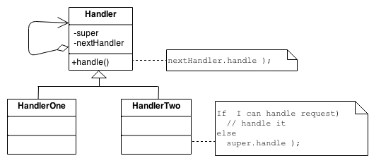

# Design Patterns

Design patterns are battle proven (most of them) solutions to common problems that developers face on daily base. Knowing many help you solve problems in a clean, efficient way. The solutions might be a big complex when you look at the code for the first time and you are not familiar with given pattern. Knowing multiple patterns help you recognize applied patterns, think more abstract about your code and solve your problems in a clean and efficient way.

Opposed of design patterns, there are also antipatterns. Meaning, known patterns that are applied but are known to be a bad practice. Knowning these helps you identify issues in the code and keeps you from implementing a bad solution to your problem.

Our design patterns can be grouped in groups that target a certain set of problems. The main types of patterns are:

- Creational patterns
- Structural patterns
- Behavioral patterns

Patterns can be applicable on small units of code or also on architectural level. This does not always work out for every pattern, but often there might be derived patterns for architectural level from their code unit equivalents.

## Criticism

There has been a lot of criticism about (various) design patterns that they encourage wrong solutions. It goes without a saying that patterns are rather guidelines and a source to challenge your solutions on a more abstract level. Design patterns are not the holy gray but knowing some will help you shape your own opinion and skills to solve problems more efficiently and better abstract thinking. More can be found [here](https://sourcemaking.com/design_patterns).

## General principles

- In many sitations the use of the `new` keyword for creating an object is abstracted away to a single function that "creates" instances. The idea is the code should be unaware of which concrete class should be used. This would result in a single place in the code base to change the concrete class being used in the entire solution. (e.g. I have a `IDataStore` interface, and I have a `MongoDB` implementation and a `MySQL` implementation, if we want to be able to change the implementation easily, then we should preferably only change one line of code instead of all the instantiation statements)
- Patterns can be complementary, so you could use several different patterns on solving the same problem.

## Patterns

### Creational patterns

> In software engineering, creational design patterns are design patterns that deal with object creation mechanisms, trying to create objects in a manner suitable to the situation. The basic form of object creation could result in design problems or added complexity to the design. Creational design patterns solve this problem by somehow controlling this object creation.

#### Abstract Factory

> Group factory functions semantically together that instantiates concrete classes that are closely related to each other.

When we like to avoid using the `new` keyword where possible, the abstract factory, unlike just a regular factory, the abstract factory instantiates the concete classes which are related to each other.

Let's say we have the classes CPU and GPU, which we would like to fetch from our OS. As our application is (presumed in this example) OS agnostic, the concrete class with logic on how to interact with the CPU and GPU would differ based on the underlying OS.

The idea is to have a factory (e.g. HardWareInterfaceFactory) that can create the proper CPU and GPU concrete classes depending on the OS that the application is running.

```C#
// Abstract classes
class CPU {...}
class GPU {...}

// CPU concrete classes
class MacOsCPU : CPU{...};
class WindowsOSCPU : CPU{...}

// GPU concrete classes
class MacOsGPU : GPU{...};
class WindowsOSGPU : GPU {...}

// OS specific abstract factories
class MacOsHardWareInterface : HardWareInterfaceFactory {
    public CPU createCpu()  { return new MacOsCPU() };
    public CPU createGpu()  { return new MacOsCPU() };
}
class WindowsHardWareInterface : HardWareInterfaceFactory {
    public CPU createCpu()  { return new WindowsOSCPU() };
    public CPU createGpu()  { return new WindowsOSGPU() };
}

// Generic abstract factory that brings all factories together
abstract class HardWareInterfaceFactory{
    // This returns the proper instance for given OS
    static HardWareInterfaceFactory getFactoryForOs(os){
        if(os == 'macos'){
            return new MacOsHardWareInterface();
        }else if(os == 'windows'){
            return new WindowsHardWareInterface();
        }else{
            throw new Exception('OS not supported');
        }
    }
    // Here we define the function signature that each HardWareInterface should have.
    abstract CPU createCpu();
    abstract GPU createGpu();
}

// usage
var factory = HardWareInterfaceFactory.getFactoryForOs("windows");
var cpu = factory.createCpu();
... happy instantiation ...
```

#### Builder

When you have a certain process, that always executes the same steps, but each step might need another input depending what you try to achieve, the builder pattern is a good approach. We create an abstract class that will be the "builder" and dictates which steps should be executed. Then you can use concrete builders that know what inputs are required for a given desired output.

This works well when you have a well "defined" business process but takes different inputs depending on what deriative it is from the business process. Like you have the "purchase" busines process. One can happen in the brick and mortar shop and on the online shop. The business process will be the same, but you might get inputs in a different way.

Let's say we have query builder for MongoDB and MySQL.

```C#
// The query is an output that we desire from our builder, ALWAYS
class query { public String queryString {get; set} }

// We define here what steps it requires to build a query.
class AbstractQueryBuilder {
    abstract void setCollectionName(string collectionName);
    abstract void setId(string id);
    abstract string getQuery();
}

// Now we can make a builder for SQL
class SQLQueryBuilder : AbstractQueryBuilder{
    private Query query = new Query();

    public void setCollectionName(string collectionName){
        query.queryString += ' FROM ' + collectionName;
    }
    public void setId(string id){
        query.queryString = 'SELECT' + id + query.queryString;
    }
}

// Now we can make a builder for MongoDb
class MongoDBQueryBuilder : AbstractQueryBuilder{
    private Query query = new Query();

    public void setCollectionName(string collectionName){
        query.queryString += '.collection(' + collectionName + ')';
    }
    public void setId(string id){
        query.queryString = '.findOne({ id: ' + id + '})';
    }
}
// Now we have the director of the process
class DataFetcher {
    private AbstractQueryBuilder queryBuilder;

    public(AbstractQueryBuilder queryBuilder){
        this.queryBuilder = queryBuilder;
    }

    public Data fetch(string id, string collectionName){
        queryBuilder.setId(id);
        queryBuilder.setCollectionName(collectionName);
        // execute query from queryBuilder.query
        return data;
    }
}

// Using it
var dataFetcher = new DataFetcher(new SQLQueryBuilder());
dataFetcher.fetch("100", "users");
```

[Other example](https://sourcemaking.com/design_patterns/builder/java/2)

#### Factory Method

The classic example of where we want to hide the `new` keyword and decide dynamically or only in one place which concrete class we might want to return for further usage.

```c#
interface IDbStore {};
class MongoDb : IDbStore {};
class MySQL : IDbStore {};

static class DBStoreFactory{
    static public IDbStore getDbStore(){
        // Return based on a config or some business logic the MongoDb or SQL instance.
    }
}
```

#### Object pool

> Object pooling can offer a significant performance boost; it is most effective in situations where the cost of initializing a class instance is high, the rate of instantiation of a class is high, and the number of instantiations in use at any one time is low. (aka resource pools).

So if initializing a class is expensive, happens a lot but don't use many instances at the same time, we want to reuse instances.

A good example would be a DB Connection Pool. There are a few connections in the pool, to create a connection, is IO expensive. We might wanna fetch data all over the application, but we might not be using the connections so much all the time, so we create a pool of connections, so we can pick up an unused connection when a data fetch is required.

Usually there will be a max pool size. The pool is responsible to orchestrate the lock/acquiring of a pool object and releasing it for reuse.

#### Singleton

There is only one instance allowed to be used. So you create a function that returns always the same instance, and initializes one of it was not initialized before.

This initialization can be done at startup or lazy wise, only untill the first instance is requested.

```c#
// Lazy
class MyClass {
    private MyClass myInstance;

    private MyClass(){
        // PRIVATE CONSTRUCTOR
    }

    static getInstance(){
        if(myInstance == null){
            this.myInstance = new MyClass();
        }
        return this.myInstance ;
    }
};
```

Important to take in mind when multithreading is happening, in that case you should add the extra safeguarding code to be thread safe.

### Structural patterns

> In Software Engineering, Structural Design Patterns are Design Patterns that ease the design by identifying a simple way to realize relationships between entities.

#### Adapter

The adapter is basically a wrapper so it "connects" nicely between two parts that else mismatch. A typical example is when you use a 3th party library in your solution, but how it works and the view of the world differes from yours and your code. So if you have a GitApiClient module published by Git, you would want it to wrap it so it behaves and interacts how you would want it to interact in your application. So you create a wrapper around it so it has the API that you desire and that is adapted to your code base.

#### Bridge

> Decouple an abstraction from its implementation so that the two can vary independently.

We would use this pattern to solve a hectic hierarchical iheritance issue.

Let's say we have a `Logger`. And we want to have two types of loggers, a `BatchLogger` and a `SimpleLogger`. The `SimpleLogger` writes out a log entry to the `STDOUT` when it's called. The `BatchLogger` accumulates a min amount of log entries before it writes it away to the `STDOUT`.

We would just create a `ILogger` interface and then the `SimpleLogger` and `BatchLogger` implementation.

But now we want to be able to log not only to `STDOUT` but alternatively to a API endpoint instead. Now we would have to create an API and `STDOUT` version of each logger. Resulting in `ApiBatchLogger`,`StdOutBatchLogger`, `ApiSimpleLogger` and `StdOutSimpleLogger`. Notice how this hierarchy becomes a mess and deep. We create more inheritance just because we have code that doesn't move in parallel and rather orthogonally.

How do we solve this? This reminds us a bit of `preffer composition over inheritance` idea. Let's rewrite our code.

We move the `log to ...` logic out of the hierarchy and move it to something separate. Let's call it a `LogGateway` interface. Now we can have the `SimpleLogger` and `BatchLogger` take a `LogGateway` interfaces as reference. Now we end up with `SimpleLogger`, `BatchLogger`, `ApiLogGateway`, and `StdOutLogGateway`. Now we don't need to implement a new logger based on the fact if it's `simple` or `batch` AND for each given gateway we wanne use to write the logs to. Rearranging our inheritance so that we don't end up with deep inheritance hierarchies and we can rather take the benefit of composition.

#### Decorator

> Attach additional responsibilities to an object dynamically.

You wrap the call to a function but then decorate it with extra behaviour.
So you can add "optional" decorators that will execute additional logic on top of the share logic.

This can be done dynamically at runtime.

```Java
// 1. "lowest common denominator"
interface Widget {
    void draw();
}

// 3. "Core" class with "is a" relationship
class TextField implements Widget {
    private int width, height;

    public TextField(int width, int height) {
        this.width = width;
        this.height = height;
    }
    public void draw() {
        System.out.println("TextField: " + width + ", " + height);
    }
}

// 2. Second level base class with "isa" relationship
abstract class Decorator implements Widget {
    // 4. "has a" relationship
    private Widget widget;

    public Decorator(Widget widget) {
        this.widget = widget;
    }

    // 5. Delegation
    public void draw() {
        widget.draw();
    }
}

// 6. Optional embellishment
class BorderDecorator extends Decorator {
    public BorderDecorator(Widget widget) {
        super(widget);
    }
    public void draw() {
        // 7. Delegate to base class and add extra stuff
        super.draw();
        System.out.println("  BorderDecorator");
    }
}

// 6. Optional embellishment
class ScrollDecorator extends Decorator {
    public ScrollDecorator(Widget widget) {
        super(widget);
    }
    public void draw() {
        super.draw(); // 7. Delegate to base class and add extra stuff
        System.out.println("  ScrollDecorator");
    }
}

public class DecoratorDemo {
    public static void main(String[] args) {
        // 8. Client has the responsibility to compose desired configurations
        Widget widget = new BorderDecorator(new BorderDecorator(new ScrollDecorator(new TextField(80, 24))));
        widget.draw();
    }
}
```

Outputs

```Java
TextField: 80, 24
   ScrollDecorator // Aditional logic executed beside the original core one
   BorderDecorator // Aditional logic executed beside the original core one
   BorderDecorator // Aditional logic executed beside the original core one
```

So we dynmically added extra code to be excuted on top of the core functionality.

#### Facade

A facade is just a layer that hides all the sub systems or components being called. A good example of that is when you create a library which has internally differen util classes and services. But then you create on "facace" that will expose the methods that only need to be exposed to the user of this library, while internally the methods are spread into smaller sub components.

This way you encapsulate the internal workings and structure of the library.

#### Flyweight

> The Flyweight uses sharing to support large numbers of objects efficiently. Modern web browsers use this technique to prevent loading same images twice. When browser loads a web page, it traverse through all images on that page. Browser loads all new images from Internet and places them the internal cache. For already loaded images, a flyweight object is created, which has some unique data like position within the page, but everything else is referenced to the cached one.

#### Proxy

Like all proxies, you pust sugorate in between so you can add additional logic and take control, so the real target object is protected from additional complexity. Perfect also to create aspects and such.

### Behavioral patterns

> In software engineering, behavioral design patterns are design patterns that identify common communication patterns between objects and realize these patterns. By doing so, these patterns increase flexibility in carrying out this communication

#### Chain of responsibility

> The pattern chains the receiving objects together, and then passes any request messages from object to object until it reaches an object capable of handling the message. The number and type of handler objects isn't known a priori, they can be configured dynamically. The chaining mechanism uses recursive composition to allow an unlimited number of handlers to be linked.



Chain of Responsibility simplifies object interconnections. Instead of senders and receivers maintaining references to all candidate receivers, each sender keeps a single reference to the head of the chain, and each receiver keeps a single reference to its immediate successor in the chain.


#### Command

> Encapsulate a request as an object, thereby letting you parametrize clients with different requests, queue or log requests, and support undoable operations.

Basically put all the data required to run a command in an object. Pass this on so dynamically a proper command handler can execute the command. 

```C#
interface ICommand {
    void execute();
}

var queue = new List<ICommands>{...};
queue.execute();

```

#### Iterator
Hide the underlying logic and complecity for getting the next value.

#### Mediator

> Design an intermediary to decouple many peers. Define an object that encapsulates how a set of objects interact. Mediator promotes loose coupling by keeping objects from referring to each other explicitly, and it lets you vary their interaction independently.

> Partitioning a system into many objects generally enhances reusability, but proliferating interconnections between those objects tend to reduce it again. The mediator object: encapsulates all interconnections, acts as the hub of communication, is responsible for controlling and coordinating the interactions of its clients, and promotes loose coupling by keeping objects from referring to each other explicitly.

Goal is to remove direct/explicit relations between different objects types.

> The Mediator defines an object that controls how a set of objects interact. Loose coupling between colleague objects is achieved by having colleagues communicate with the Mediator, rather than with each other. The control tower at a controlled airport demonstrates this pattern very well. The pilots of the planes approaching or departing the terminal area communicate with the tower rather than explicitly communicating with one another. The constraints on who can take off or land are enforced by the tower. It is important to note that the tower does not control the whole flight. It exists only to enforce constraints in the terminal area.


#### Memento

> Without violating encapsulation, capture and externalize an object's internal state so that the object can be returned to this state later.

Basically we want to be able to do `undo` or `rollback`. So we keep snapshots/deltas of the changes we make so we can return a specific state later.

It's like the following
```C#
class TheWorld {
    setSnapshot();
    createSnapShot();
}

class TheWorldMoment{
    getState();
    setState();
}

var world = new TheWorld();
// Do changes ...
var snapshot1 = world.createSnapShot();
// Do changes ...
var snapshot2 = world.createSnapShot();
// Restore to state since we took snapshot 1
world.setSnapshot(snapshot1);
```

#### Null Object

The null object pattern is perfect to get rid of all this defensive coding with `if returnValue == null` and such.

Instead of returning a `null` from a (e.g. factory) function, you can return an object that implements certain interface or abstract class, but does nothing. So basically doing a silent "no-operation" or anything similar like that.

> It is sometimes thought that Null Objects are over simple and "stupid" but in truth a Null Object always knows exactly what needs to be done without interacting with any other objects. So in truth it is very "smart."

- The Null Object class is often implemented as a Singleton to save memory as it's stateless anyway.

#### Observer

Idea is that you have a `Observable` with zero, one or more `Observers`. If the state changes in the `Observable`, it will notify all `Observers`. Usually with this pattern the `Observable` keeps a list/references of all `Observers`, so this is create a thight coupling of awareness, consider a pub/sub mechanism if you want to create a more loosely coupled approach where the observers and obserables are unaware of each other.

#### State

Intersting, so instead of changing behaviour purely based on changing state in an object, we will create an abstract class, and each subclass will represent an allowed state. (Use polymoprhism instead of ENUMS/Constants). This is one way !

Everytime you have a finite state machine, evaluate this pattern. The State pattern does not specify where the state transitions will be defined. The choices are two: the "context" object, or each individual State derived class. The advantage of the latter option is ease of adding new State derived classes. The disadvantage is each State derived class has knowledge of (coupling to) its siblings, which introduces dependencies between subclasses.


- State objects are often Singletons.
- Flyweight explains when and how State objects can be shared.


#### Strategy

> Define a family of algorithms, encapsulate each one, and make them interchangeable. Strategy lets the algorithm vary independently from the clients that use it.

This is perfect when you have algorithms that work perfect for a specific size of data set. This is basicaly the core Open/Closed principle of the SOLID. Define one Interface/Abstract class, and have different implementations that have a different strategy. 


#### Template method

 > Define the skeleton of an algorithm in an operation, deferring some steps to client subclasses. Template Method lets subclasses redefine certain steps of an algorithm without changing the algorithm's structure.

 > Base class declares algorithm 'placeholders', and derived classes implement the placeholders.

This use used more than you think. Think of VueJS where you have "hooks". There is a strict process, but you can overwrite or append within a specific atomic step.

This is typicall to have a root class `BusinessProcess`, which has methods `stepA()`, `stepB()`, and `stepC() and then you can subclass it and optionally choose with step you want to override with your own logic.

Another example is : Kind of basic inheritance.

>  "the Hollywood principle" - "don't call us, we'll call you".


