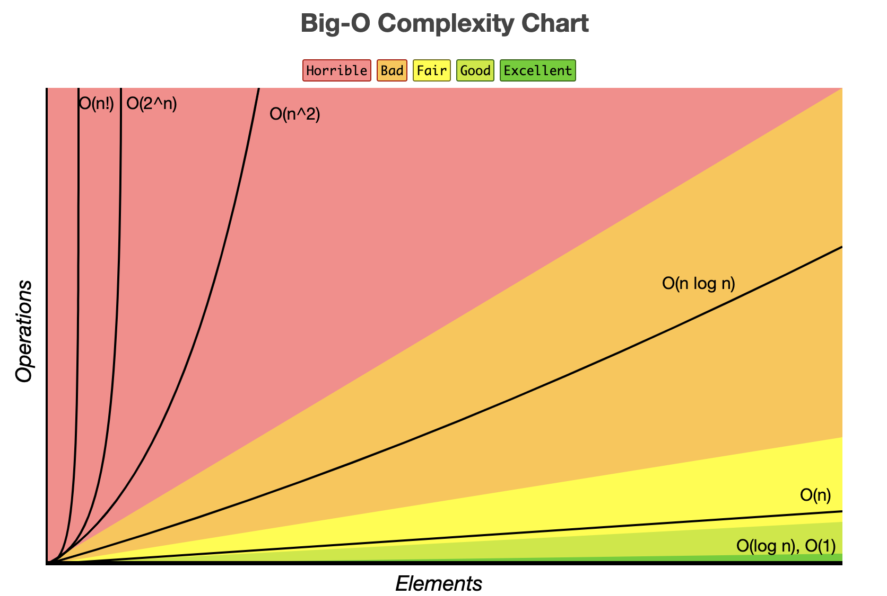

# The Big O Notation

The big O notation is used to express **time complexity**, the time it takes to execute, time being expressed as the amount of steps required relative to the size of the data set it works on. This is usefull to objectivly quantify how good an algorithm is in regarding to the max CPU capacity.

We can use the Big O notation also for the **space complexity**, the amount of memory is required to execute the algorithm relative to the size of your data set. This is particularly usefull when you are constraint to the amount of memory on your machine.

We use this notation to efficiently communicate the efficiency of a given algorithmn.

## Time Complexity
We express the steps taken in relation to the size of the data set, so the amount of elements in your data set to execute given algorithm.

Keep in mind, we express the amount of steps taken to calculate the algorithm, but the execution time is relative still as it strongly depends on the speed of the machine that will execute all the steps.

So an algorithm might take longer on one machine than the other if their CPU speed differs.

## Space Complexity
> For N elements of data, an algorithm consumes a relative number of **additional** data elements in memory.

## Constants
Note that in a Big ) notation we ignore constants. Meaning, if an algorithm takes consistently 3 steps, regardless of the amount if elements. We will say O(1). This is because the constants might be non trivial on a very small data set, we are mostly curious on how an algorithms performs on a large set of data. At this point constants become trivial in comparison to the size of the data set.

Therefore we'll never see O(3), we will always express this as O(1).

## Different scenarios

Often algorithms will perform different depending on the number of elements. That's why often will quantify an algorithm with the Big O notation for different scenarios.

* The Best Case Scenario
* The Average Case Scenario
* The Worst Case Scenario

By default a Big O notation refers to the **worst case scenario** unless specified otherwise.

## Logarithms
> Logarithms are the inverse of exponents

> O(log N) means that the algorithm takes as many steps as it takes to keep halving the data elements we we remain with one.

e.g. `Log2 8 = 3` as ` 8 / 2 / 2 = 1`

## Comparison

### This chart shows the comparison of different Big 0 notations.

### This chart show the efficiency of Data Structure operations
Do note that some values are not correct for linked lists.

### This chart show the efficiency of sorting algorithms
