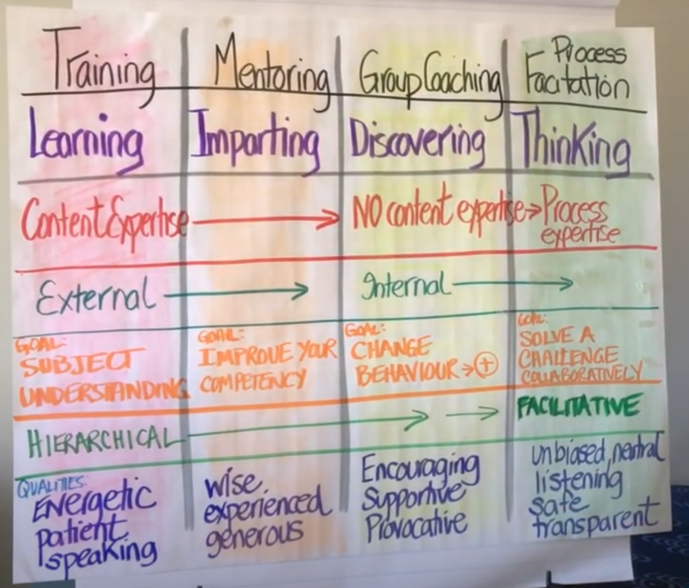

My handbook on facilitation which is a useful skill.

# Facilitating, Teaching, and Lecturing

> TIP: Pick what is most suitable to your goal 

| Type | Who controls what is being learned | Type of Participation | Comments |
| ---  | ---                                | ---                   | ---     |
| Facilitating | The Group                  | Facilitator + entire group | Good for collaborative learning |
| Teaching | Educator primarily             | Mostly from educator, little from group | |
| Lecturing | Educator solely               | Solely from educator | More if a clear message/topic must be transferred |

[Source](https://www.youtube.com/watch?v=tJwfrxAZjKE)

## Why the facilitator is different 

* Evokes creativity and confidence in the group
* Honest & Transparent : I see "this" is happening, in a meta way you observe, less about the content, as facilitator you can be 100% content agnostic.
* Pays Deep Attention at what is happening in the group at any given moment. (You are sheparding a group)
* Artistic and Scientific 
* Ground and calm
* Is a planner, prepare an event, well prepared.
* Adaptive designer: Design a plan, but can be adaptive when necessary based on the needs.
* Neutral and unbiased: You should not care about the result, only that there is a quality result.

# Facilitation Types

* Experiential Facilitation: Facilitate experiences for people to learn by doing. Also known as adventure or outdoor education.
    * Examples: Conflict resolution, Communication, and problem solving.
* Dialogue Facilitation: Building bridges rather than walls.
    * Examples: Put strangers in a circle and talk about given topic(s) (e.g. Politics, Race, Opinions)
* General Facilitation: More like in business, run a meeting. A general batch, but skills from Experiential and Dialogue facilitation can help tremendously. Most of this handbook is about this.

[Source](https://www.youtube.com/watch?v=2cVGI0wo23M)

# Core Skills

* Authenticity: Be yourself while facilitating, don't try to be someone else. If they see you have a "mask" on, you might face resistance. 
* Clarity: Your instructions and guidance must be clear, else people will get lost.
    * F.O.G.S: Framing, Objective, Guidelines and Safety - A framework for clarity.
        * Framing: Situate the context. You got to change the context and make it relevant for everybody.
            * Example: Share a story that leads into the purpose or objective of whatever you're doing.
        * Objective: Clarify/share a clear object for given activity or whole session
            * Example: "Share (personal) stories, without sharing opinions" - now a clear objective was set
        * Guidelines: Rules of engagement. Sometimes adding rules makes your gathering better.
        * Safety: Try to increase both
            * Physical: If people gonna be running around, make it safe to do so.
            * Psychological: People who run meetings often don't mention this type of safety. A highly functional team has a high degree of psychological safety. 
* Listening: It's about what you hear and what you do with that information. Listen to Feats, Aspirations, Core Message, Process.
    * The way that you listen has the power to change what you say. This includes body language. The more "listening" and positive the body language (e.g. lean in) the more they will share.

[Source](https://www.youtube.com/watch?v=2cVGI0wo23M)

# Tips

## Create space/time for people before asking

* "Let's take 15 seconds of pause to help everyone come up with a question and then let them ask". Make explicit moments give moments to digest and build courage.
* Don't ask if people have questions, gently nudge or "command" them to prepare a question. "Take 10 seconds and try to come up with a question".

## Deal with people who dominate conversation

* Flip The Role: Pretext your question with a request for the busy talkers to hold of. People who talk a lot know they talk a lot.
    * Example: "Hey, if you're typically one of the first people to speak, please hold back and wait to be one of the last (or 3th) to speak, is is possible might not get a chance to speak this time,  but I'd love to hear some of the  voices that not always get heard."
    * This is less directed towards individuals (e.g. hey Mark, I didn't hear you yet.)
* Creating Space: Create more space/silence for those who are a bit more hesitant to speak, to get their chance.
    * To avoid awkward silence to create productive silence. Build on top of the "Flip The Role" , by also pretexting, that you want a specific time window before anyone answers, so every can think for a moment.
    * Example: "Hey, if you're typically one of the first people to speak, please hold back and wait to be one of the last (or 3th) to speak, is is possible might not get a chance to speak this time,  but I'd love to hear some of the  voices that not always get heard. I am going to ask this question, and then pause in total silence for 5 seconds to wait for everyone to think of their own response before we share."
    * Even if the 5 seconds pass, let them take the time.
* Change the mechanics: Domination could be because of the people, but because of the structure of the meeting.
    * Split out into groups to have discussions (breakout sessions) and then report back what you heard other people in your group say (not what you said).
* Steering into the curve: Address the elephant in the room, address this privately first. This is more closer to "last resort" if others don't work.
    * Pull person aside: What I'd love you to do, I love all your contributions and I am recognizing your contributions are heavier than others and I'd like to make space for voices. Can you aim to bear through this awkward silence to give space to other people to share. They won't be surprised about it or new about it that they're dominant about it.
    * You can do it publicly but risky: "I can notice we are playing white guy ping-pong, can we step back for a moment and make space for other voices (example from a meeting where it happened the most heavy voices were white, including the facilitator)"

* [YouTube Video: Deal with dominant people in conversation](https://youtu.be/tWKoQv45wzo?si=TaZqqunDKvMeaL1B)

## Do's and Donts

* Do: 
    * Carefully assess needs
    * Stay neutral
    * Have a lot of tools
    * Create open trusting atmosphere and tell why everyone is there.
    * Simple & direct language 
    * Conclude meetings on positive notes.
    * Clear steps
    * Clarity in general
* Donts:
    * Be center of attention
    * Don't check in with participants
    * Don't listen
    * Too passive
    * Lose track of ideas
    * Put people down
    * Don't take breaks
    * Don't have alternative approaches to adjust
    * Let discussions go one and on

## SixSteps® Facilitation and moderation method
by Josef W. Seifert

[YouTube Video: Introduction](https://www.youtube.com/watch?v=bC2kG6hkhQc)

## Facilitation gives a meeting

* Structure
* Safety
* Orientation

## Steps

1. Introduction: 
    * Let the participants settle down, compare participants ideas concerning the purpose of the meeting.
    * Explains the course of the meeting, the goals, and how much time everywhere.
2. Gathering
    * Everyone can propose topics to be discussed.
    * Makes every involved and be part of the results.
    * No topics forgotten
3. Selecting
    * Everyone can vote on the selected topics from the gathering step.
    * Remaining time can be optimal used.
4. Handling
    * Handling the topic(s)
5. Planning
    * Action items which defines a responsible, target date and monitor the results.
    * Distribute evenly if possible.
6. Conclusion
    * Reflect on the meeting, what went well ? What could be improved.

## General

### Goal
* Arrive at a results that are **Created, understood, and accepted** by all participants.
* Better decisions, often faster & More Buy-In

### For Who?
* For everyone who works with groups
    * ED (Effective Decision) = RD (Right Decision) x CD (Commitment to the Decision)
    * Usually we make a (right) decisions but then must built up commitment. With a good facilitation you get commitment as the right solution is built. Therefore, more effective decisions.

### Common Challenges

* Dysfunctional behavior (Whispering, sidetracking, arguments, dominant behavior)
    * A good facilitator can navigate this by doing:  Conscious Prevention, Early Detection, Clean Resolution 
* Get Full Consensus: Understand if the disagreement is Level 1, Level 2, or Level 3 and then use a tool for addressing given level. (not sure if [this is what they refer to](https://themindcollection.com/revisiting-grahams-hierarchy-of-disagreement/))
* Different Types Challenging Participants:
    * The alpha Leader (get in front of the facilitator) - Tends to naturally take over.
        * Driven by: power
        * Handled by: They need to feel important
            * Give an important task, so the task gives them an outlet. Giving them an opportunity to present themselves.
    * The know-it-all - They want to present their own knowledge and want to learn new things, but are looking out for mistakes on the way.
        * Driven By: Knowledge
        * Handled By: Make them into an expert, you say they are the expert in the room and at a particular point of time they will be asked to present their knowledge. Give them a framework when they can't show off, without interrupting your flow.
    * The introverts - Happy to follow, and not make trouble, but observe more than to participate. They avoid to speak up. If you need their input, that's not good.
        * Driven By: Instructions
        * Handled By: Be specific, give examples and clear outlines of that they need to do.
    * The indecisive one - Well hidden, good team member, participate, until a decision must be made. Might as for more input and question if we covered everything?
        * Driven By: Safety 
        * Handled By: Make them feel safe, by outlining what the outcomes the decision at hand will have. Give them the context that the decision is made, and what for. Give them all the information they should know to feel safe to make a decision. Give Them Reassurance!
    * The Negativist - Body language is usually a tell, are grumpy, drain energy and spontaneity.
        * Driven By: Resistance
        * Handled By: Allow them to get rid of their negative opinions, ask for their opinions proactively. Then bounce back to them "What would you do or suggest"? Try to make them an expert.

# Tools & Techniques

## Parking Lot Method
* Technique for difficult participants
* A placeholder for issues or questions that might need to be dealt with, but at a later point in the session/meeting/workshop.
* You can either address all of the items at a specific time, or else in 1:1's (e.g. during lunch) but make CLEAR when you will address these.
* Even if you know these questions will be answered over the workshop, write it down, let them feel heard and appreciated.
* Goal: 
    * Avoid the workshop derailing and explode in discussion. 
    * Let people feel heard.
    * It allows them to let go what's in their head, so they can relax more.
* Examples
    * "This is not something we will deal/address now, but I have a section at the end for rapid fire questions and such, what I will do is add this to the parking lot so we can pick it up at the end."
    * "I Understand where you are coming from, I have a lot of things to say about that, if you don't mind trusting the process, I will get back to that (putting that in the parking lot)".

[YouTube Video: Parking Lot Method](https://youtu.be/DZiYUSau5LM?si=jn-6IsYsZ4qoLARa)

# Resources

* [YouTube Channel: Chad Littlefield](https://www.youtube.com/@chad.littlefield)
* [YouTube Channel: Facilitating XYZ](https://www.youtube.com/@facilitatingxyz5984)
* [YouTube Channel: AJ&Smart](https://www.youtube.com/@AJSmart)
* [YouTube Channel: Adriana Girdler (Project Management))](https://www.youtube.com/@AdrianaGirdler)
* [YouTube Channel: workshop.work (Podcast on Workshop Facilitation)](https://www.youtube.com/@myriamhadnes)
* [YouTube Channel: North Star Facilitators](https://www.youtube.com/@NorthStarFacilitators)
* [Book: Pocket Guide to Facilitating Human Connection - Touches on Experiential Facilitation](https://www.amazon.com/Facilitating-Connections-Littlefield-Self-Improvement-Teambuilding/dp/0996423974)
* [Book: Ask Powerful questions - Touches on Dialogue Facilitation](https://www.amazon.com/Ask-Powerful-Questions-Create-Conversations/dp/1545322996)
* [YouTube Video: How To Think Faster](https://youtu.be/Z2-oteiLuyU?si=8TrAl0O6ErRhnKW2)
* [YouTube Video: Deal with dominant people in conversation](https://youtu.be/tWKoQv45wzo?si=TaZqqunDKvMeaL1B)
* [Training: The Effective Facilitator](https://www.leadstrat.com/courses/effective-facilitator/)
* [YouTube Video: Process Facilitation Explained](https://www.youtube.com/watch?v=3YgIS0N1dII)

# Personal Ideas

* Use the business idea testing experiments to make a list of potential facilitation events.
* How can we use the wisdom of writing clearly, structuring thoughts and the thought process for facilitation events?
    * A small assignment where we ask people to write and think for themselves before joining? Think about how this lady with math, asking students to write first 5 min on how they would go about solving something a math problem that was information incomplete (“how would you try to solve this, if i were to give more information”).