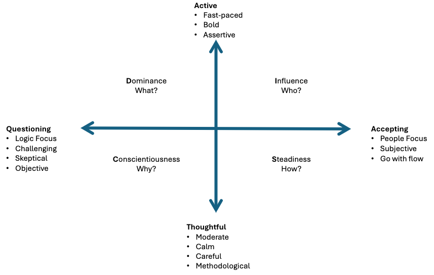

# Facilitation

Facilitation is the process of guiding and managing group activities, discussions, or meetings to ensure effective participation, clear communication, and achievement of objectives. It involves creating an environment that encourages collaboration, creativity, and productivity among participants.

## Training, Mentoring, Group Coaching and Facilitation

They all differ, pick the one applicable to your use case.

| Training | Mentoring | Group Coaching | Process Facilitation |
| ---      | ---       | ---            | ---                  |
| Content Expertise | Content Expertise | No Content Expertise | Process Expertise |
| External | External | Internal | Internal |
| Goal: Subject Understanding | Goal: Improve your competency | Goal: Change Behavior | Goal: Solve a challenge collaboratively |
| Hierarchical | Hierarchical | Hierarchical| Facilitative |
| Energetic, Patient, Speaking | Wise, experienced, generous | Encouraging, Supportive, Provocative | Unbiased, neutral, listening, safe, transparent |

[Source of Table](./assets/comparison_chart_training_mentoring_groupcoaching_facilitation.PNG)

| Type | Who controls what is being learned | Type of Participation | Comments |
| ---  | ---                                | ---                   | ---     |
| Facilitating | The Group                  | Facilitator + entire group | Good for collaborative learning |
| Teaching | Educator primarily             | Mostly from educator, little from group | |
| Lecturing | Educator solely               | Solely from educator | More if a clear message/topic must be transferred |

[Source of Table](https://www.youtube.com/watch?v=tJwfrxAZjKE)

## The Facilitator

### Role

1. I create the container. The participants create the content.
2. My actions enforce their self-organization.
3. It's their meeting. Not Mine.
4. Meetings are real work (Good facilitator required).
5. Success = a fulfilled purpose.

* When being the facilitator, you can't focus on the content and your own opinion.
* Don't tempt to become the project owner/manager.
* As facilitator you can/must push action item commitment.
* Fall back to the excuse "as facilitator it's my role to ...." to allow for pushing certain things that are about the process, not the actual content!

### Characteristics

* Organizer
* Look-Out
* Orchestrator
* Guide
* Conflict Solver
* Active Listener
* Coach

## The Framework

* **Before Event**:
    * Determine Audience, is possible use DISC to prepare.
    * Set Agenda
    * Set objectives
    * Preparation
    * Find Venue & Invites
    * Diets & Foods
    * Deliverables from sponsors
    * Activity Planning
    * Planning
* **During Event**
    * **Open Event**:
        * Start with POWER Statement
        * Agenda (MUST)
        * Way Of Working (OPTIONAL)
            * If you are with a group that often have done this before, this might be implicit.
            * Examples:
                * "ELMO": Enough, let's move on. This means what it says, allow stalled conversation to move, as facilitator that's your role.
                * Raise hand for silence
                * Open for questions
                * Be on time
                * E manners (phone gone, camera on, ...)
                * No smoking breaks or else agree in advance to it.
        * Objectives (MUST)
        * Expectations (OPTIONAL)
        * Do Ice Breaker/Check In activity to get people (mentally) in the room.
    * **Doing The Work**:
        * Follow activities of playbook
        * Adjust activities based on the engagement and proceedings.
    * **Close Event**:
        * Recap the work done
        * Recap/Tackle outstanding Issues
        * Recap Action List
        * Recap Objectives
        * Recap the results
        * Review Results
        * Review used techniques
            * We did X by doing Y
        * Review group communication
            * We did X by communicating... (TODO)
        * Review facilitator responsiveness
        * Participate Expectations
        * Final Words
        * Ask Feedback
        * Short: We close, review the session, how it went, what came out and did we satisfy all relevant items?
* **After Event**:
    * What to document?
    * Who to brief?
    * Share the feedback.
    * Monitor action items.
    * Prepare agenda for next meeting (if applicable).
    * Debrief session if needed.
* **Dysfunctional Behavior**: There are various personas that have pro's and con's. Each persona has methods on how to deal with these.

### POWER Statement

The POWER statement is build out of 5 parts, use this to open your event strong.

* **P**urpose
* **O**utcomes & Deliverables
    * Head - Information, decisions, strategies, shared understanding
    * Heart - Connecting, buy-in, vision, Caring
    * Hand - Next steps, action log, output
* **W**hat's in it for me?
* **E**nergize & Engage
* **R**oles & Responsibilities
    * Of everyone involved (facilitator, participants)

Read this out in one statement at the beginning of an event/facilitation.

#### Example

* **P**urpose: To have more effective communication.
* **O**utcomes & Deliverables: Run more efficient decision processes and meetings between squads and business.
* **W**hat's in it for me?
    * Be less frustrated
    * Become a good communicator
    * Have a better way of working
* **E**nergize & Engage:
    * To decrease the amount of ineffective meetings
    * To have variety in how to do meetings
* **R**oles & Responsibilities
    * To learn, listen and come forward with ideas

## Activities & Types

And event is made up of activities, there are many variations, but they all try to achieve a certain goal. We can categorize these types based on the goal they try to reach.

* **Energizer**: Get blood flowing and get everyone mentally in the room again.
    * Help to return the focus and energy.
    * When too many participants, split in groups, of that shortens the total time of the energizer activity (e.g. playing a game)
    * Be weary of physical energizers, make sure the room is safe and clean.
    * A check-in could ben an energizer also.
* **List**: List facts, known things, statements, limitations.
* **Brainstorm**: Collect and idea new ideas.
* **Group**: Group ideas that are very similar.
* **Prioritize**: Prioritize/group items to decided what gets attention first or not at all.
* **Commit**: Have participants commit to actions.

### Reflection

* **Description**: 
    * Every participant reflects on the session/workshop/event on a shared template.
    * Example questions:
        * How did I as participant contribute to the success of the workshop?
        * My key takeaways?
        * Most memorable statement made by fellow participant?
        * Did we reach our objectives
            * Visual TIP: Create one dimensional scale from "not at all" to "oh yeah" and let people drop a "dot" on the scale. So you get immediately a visual concentration.
* **Why**: 
    * Help participants to consolidate their learnings.
* **When**:
    * Closing of event

### Fist of 5 voting

* **Description**: 
    * Explain Rules
        * People show scale of agreement/disagreement with the amount of fingers
        * 0...2 fingers -> Check in
        * 3...5 fingers -> move forward
        * Be aware of culture specifics here
* **Why**: 
    * To gauge sentiment quickly
* **When**:
    * During event whenever a clarification is needed.

### Prioritize

* **Description**: 
    * Take any set of items (e.g action items, topics, ...)
    * Group them if some are similar (affinity)
    * Now there are 2 methods to choose from:
        * Get Preference from participants
            * Voting (suggested rule: 20% of votes vs the amount of items)
            * Move some dots
        * Use Logic with Eisenhower Matrix
* **Why**: 
    * Need to decide which topics/items to focus on (take only top 3)
    * Need to decide which topics/items to focus first on
* **When**:
    * During event

### Check-In Exercise

* **Description**: 
    * [Typical] Start with asking people to introduce themselves, name, role, fun fact, ...
    * [Alternative] Let people share, for example "Top 3 success Factors" and "Top 3 reasons of failure" with post its on a board.
* **Why**: 
    * Bring people in the room mentally.
    * Break ice.
* **When**:
    * Opening of Event

### Agenda

* **Description**: 
    * Share agenda, time slots, and stay on agenda.
    * Ask if anyone has questions
    * Always end on time, skip content if necessary.
* **Why**: 
    * Expectation Management
    * Respect everyone's time
* **When**:
    * Opening of Event

### Issues - Decisions - Action

* **Description**: 
    * A board / visual aid to track about key issues, decisions and action items raised throughout the event.
* **Why**: 
    * Visibility of all issues, decisions and action items.
* **When**:
    * Introduced at opening of event.
    * Maintain it throughout event.
    * Recap at event closing.

### Weather Check

* **Description**: 
    * Pay attention to body language (distracted, ...)
    * "Is there anything that keeps anyone from being mentally in the room?"
    * "Anything that keeps you from being present?"
    * When energy is low/distracted > Do an energize activity.
* **Why**: 
    * Identify the mood of the room. "Are we stull in collaborative mood?"
* **When**:
    * Whenever, should check often.

### Roman Voting

* **Description**: 
    * Explain the rules
        * Thumb up: I Agree
        * Thumb horizontal: I follow the room
        * Thumb down: I disagree
    * Ask A question
* **Why**: 
    * To determine something quickly
* **When**:
    * When you need a quick decision or feedback throughout the event.

### Commit To Action Items

* **Description**: 
    * Get people commit to identified action items.
    * When no response or volunteers "Hey X, which opf these 2 items you'd like to take?"
    * Gentle force is OK.
    * You are not the project manager
    * As facilitator you can be a bit pushier "As facilitator I must make sure all action items are taken".
* **Why**: 
    * Make sure all action items are owned and assigned.
* **When**:
    * Throughout or end of event

### Template

* **Description**: 
    * Group prepare statements on flip charts for x amount.
    * Groups switch flip charts to review another group's statements for x amount.
        * Let them put "V" if they agree
        * Let them put "X" if they disagree
        * Let then put "?" if they don't understand
    * Let the groups clarify, after clarification they should choose "V" and "X".
    * Keep going till only disagreements are left
    * Now you have a list of disagreements, you have a list to use, or to continue discussion over them. Different deliverables are possible here.
* **Why**: 
    * To list disagreements and filter out any agreements, which don't require the participants time. If they agree with it, no need to waste time to it.
* **When**:
    * During Event

## Communication

* Use positive and proactive language.
* "Yes, and..."
* Be aware of cultural differences.
* Get attention
    * Raise your hand without shouting, till everyone gets quite.
* Avoid hybrid events (part offline, part online)
* Don't know answer to question? State honesty.
    * Either get back to them later.
    * Ask the room of anyone knows.
* Ask random people for input, to keep people on their toes.

## Tools & Equipment

* Pens
* Post-its
* Flip Charts
* Projector
* Miro
* Software
* Playbooks/runbooks

### Playbook

* Playbook/runbook
* Necessary for each event.
* Clear agenda, duration of each section, expectations of facilitation, expectations of the participants, materials needed.

## Visualization Techniques

## General Topics

### Failure Reasons

Reasons a facilitation/event can fail.

* People don't come prepared or don't do homework (only 30% does it).
* People don't engage.
* Wrong people in the room.
* Participants hogging all the time.
* Cultural differences and mistakes.

### People Who Are Late

* Fill them in during break, respect others time.

### DISC

Allows to identify different personalities. If you are able to locate/place your participants, it will be easier to tailor your messaging accordingly.

# Older content to revise

## Why the facilitator is different 

* Evokes creativity and confidence in the group
* Honest & Transparent : I see "this" is happening, in a meta way you observe, less about the content, as facilitator you can be 100% content agnostic.
* Pays Deep Attention at what is happening in the group at any given moment. (You are sheparding a group)
* Artistic and Scientific 
* Ground and calm
* Is a planner, prepare an event, well prepared.
* Adaptive designer: Design a plan, but can be adaptive when necessary based on the needs.
* Neutral and unbiased: You should not care about the result, only that there is a quality result.

## Facilitation Types

* Experiential Facilitation: Facilitate experiences for people to learn by doing. Also known as adventure or outdoor education.
    * Examples: Conflict resolution, Communication, and problem solving.
* Dialogue Facilitation: Building bridges rather than walls.
    * Examples: Put strangers in a circle and talk about given topic(s) (e.g. Politics, Race, Opinions)
* General Facilitation: More like in business, run a meeting. A general batch, but skills from Experiential and Dialogue facilitation can help tremendously. Most of this handbook is about this.

[Source](https://www.youtube.com/watch?v=2cVGI0wo23M)

## Core Skills

* Authenticity: Be yourself while facilitating, don't try to be someone else. If they see you have a "mask" on, you might face resistance. 
* Clarity: Your instructions and guidance must be clear, else people will get lost.
    * F.O.G.S: Framing, Objective, Guidelines and Safety - A framework for clarity.
        * Framing: Situate the context. You got to change the context and make it relevant for everybody.
            * Example: Share a story that leads into the purpose or objective of whatever you're doing.
        * Objective: Clarify/share a clear object for given activity or whole session
            * Example: "Share (personal) stories, without sharing opinions" - now a clear objective was set
        * Guidelines: Rules of engagement. Sometimes adding rules makes your gathering better.
        * Safety: Try to increase both
            * Physical: If people gonna be running around, make it safe to do so.
            * Psychological: People who run meetings often don't mention this type of safety. A highly functional team has a high degree of psychological safety. 
* Listening: It's about what you hear and what you do with that information. Listen to Feats, Aspirations, Core Message, Process.
    * The way that you listen has the power to change what you say. This includes body language. The more "listening" and positive the body language (e.g. lean in) the more they will share.

[Source](https://www.youtube.com/watch?v=2cVGI0wo23M)

## Tips

## Create space/time for people before asking

* "Let's take 15 seconds of pause to help everyone come up with a question and then let them ask". Make explicit moments give moments to digest and build courage.
* Don't ask if people have questions, gently nudge or "command" them to prepare a question. "Take 10 seconds and try to come up with a question".

## Deal with people who dominate conversation

* Flip The Role: Pretext your question with a request for the busy talkers to hold of. People who talk a lot know they talk a lot.
    * Example: "Hey, if you're typically one of the first people to speak, please hold back and wait to be one of the last (or 3th) to speak, is is possible might not get a chance to speak this time,  but I'd love to hear some of the  voices that not always get heard."
    * This is less directed towards individuals (e.g. hey Mark, I didn't hear you yet.)
* Creating Space: Create more space/silence for those who are a bit more hesitant to speak, to get their chance.
    * To avoid awkward silence to create productive silence. Build on top of the "Flip The Role" , by also pretexting, that you want a specific time window before anyone answers, so every can think for a moment.
    * Example: "Hey, if you're typically one of the first people to speak, please hold back and wait to be one of the last (or 3th) to speak, is is possible might not get a chance to speak this time,  but I'd love to hear some of the  voices that not always get heard. I am going to ask this question, and then pause in total silence for 5 seconds to wait for everyone to think of their own response before we share."
    * Even if the 5 seconds pass, let them take the time.
* Change the mechanics: Domination could be because of the people, but because of the structure of the meeting.
    * Split out into groups to have discussions (breakout sessions) and then report back what you heard other people in your group say (not what you said).
* Steering into the curve: Address the elephant in the room, address this privately first. This is more closer to "last resort" if others don't work.
    * Pull person aside: What I'd love you to do, I love all your contributions and I am recognizing your contributions are heavier than others and I'd like to make space for voices. Can you aim to bear through this awkward silence to give space to other people to share. They won't be surprised about it or new about it that they're dominant about it.
    * You can do it publicly but risky: "I can notice we are playing white guy ping-pong, can we step back for a moment and make space for other voices (example from a meeting where it happened the most heavy voices were white, including the facilitator)"

* [YouTube Video: Deal with dominant people in conversation](https://youtu.be/tWKoQv45wzo?si=TaZqqunDKvMeaL1B)

## Do's and Donts

* Do: 
    * Carefully assess needs
    * Stay neutral
    * Have a lot of tools
    * Create open trusting atmosphere and tell why everyone is there.
    * Simple & direct language 
    * Conclude meetings on positive notes.
    * Clear steps
    * Clarity in general
* Donts:
    * Be center of attention
    * Don't check in with participants
    * Don't listen
    * Too passive
    * Lose track of ideas
    * Put people down
    * Don't take breaks
    * Don't have alternative approaches to adjust
    * Let discussions go one and on

## SixSteps® Facilitation and moderation method
by Josef W. Seifert

[YouTube Video: Introduction](https://www.youtube.com/watch?v=bC2kG6hkhQc)

## Facilitation gives a meeting

* Structure
* Safety
* Orientation

## Steps

1. Introduction: 
    * Let the participants settle down, compare participants ideas concerning the purpose of the meeting.
    * Explains the course of the meeting, the goals, and how much time everywhere.
2. Gathering
    * Everyone can propose topics to be discussed.
    * Makes every involved and be part of the results.
    * No topics forgotten
3. Selecting
    * Everyone can vote on the selected topics from the gathering step.
    * Remaining time can be optimal used.
4. Handling
    * Handling the topic(s)
5. Planning
    * Action items which defines a responsible, target date and monitor the results.
    * Distribute evenly if possible.
6. Conclusion
    * Reflect on the meeting, what went well ? What could be improved.

## General

### Goal
* Arrive at a results that are **Created, understood, and accepted** by all participants.
* Better decisions, often faster & More Buy-In

### For Who?
* For everyone who works with groups
    * ED (Effective Decision) = RD (Right Decision) x CD (Commitment to the Decision)
    * Usually we make a (right) decisions but then must built up commitment. With a good facilitation you get commitment as the right solution is built. Therefore, more effective decisions.

### Common Challenges

* Dysfunctional behavior (Whispering, sidetracking, arguments, dominant behavior)
    * A good facilitator can navigate this by doing:  Conscious Prevention, Early Detection, Clean Resolution 
* Get Full Consensus: Understand if the disagreement is Level 1, Level 2, or Level 3 and then use a tool for addressing given level. (not sure if [this is what they refer to](https://themindcollection.com/revisiting-grahams-hierarchy-of-disagreement/))
* Different Types Challenging Participants:
    * The alpha Leader (get in front of the facilitator) - Tends to naturally take over.
        * Driven by: power
        * Handled by: They need to feel important
            * Give an important task, so the task gives them an outlet. Giving them an opportunity to present themselves.
    * The know-it-all - They want to present their own knowledge and want to learn new things, but are looking out for mistakes on the way.
        * Driven By: Knowledge
        * Handled By: Make them into an expert, you say they are the expert in the room and at a particular point of time they will be asked to present their knowledge. Give them a framework when they can't show off, without interrupting your flow.
    * The introverts - Happy to follow, and not make trouble, but observe more than to participate. They avoid to speak up. If you need their input, that's not good.
        * Driven By: Instructions
        * Handled By: Be specific, give examples and clear outlines of that they need to do.
    * The indecisive one - Well hidden, good team member, participate, until a decision must be made. Might as for more input and question if we covered everything?
        * Driven By: Safety 
        * Handled By: Make them feel safe, by outlining what the outcomes the decision at hand will have. Give them the context that the decision is made, and what for. Give them all the information they should know to feel safe to make a decision. Give Them Reassurance!
    * The Negativist - Body language is usually a tell, are grumpy, drain energy and spontaneity.
        * Driven By: Resistance
        * Handled By: Allow them to get rid of their negative opinions, ask for their opinions proactively. Then bounce back to them "What would you do or suggest"? Try to make them an expert.

## Tools & Techniques

## Parking Lot Method
* Technique for difficult participants
* A placeholder for issues or questions that might need to be dealt with, but at a later point in the session/meeting/workshop.
* You can either address all of the items at a specific time, or else in 1:1's (e.g. during lunch) but make CLEAR when you will address these.
* Even if you know these questions will be answered over the workshop, write it down, let them feel heard and appreciated.
* Goal: 
    * Avoid the workshop derailing and explode in discussion. 
    * Let people feel heard.
    * It allows them to let go what's in their head, so they can relax more.
* Examples
    * "This is not something we will deal/address now, but I have a section at the end for rapid fire questions and such, what I will do is add this to the parking lot so we can pick it up at the end."
    * "I Understand where you are coming from, I have a lot of things to say about that, if you don't mind trusting the process, I will get back to that (putting that in the parking lot)".

[YouTube Video: Parking Lot Method](https://youtu.be/DZiYUSau5LM?si=jn-6IsYsZ4qoLARa)

## Resources

* [YouTube Channel: Chad Littlefield](https://www.youtube.com/@chad.littlefield)
* [YouTube Channel: Facilitating XYZ](https://www.youtube.com/@facilitatingxyz5984)
* [YouTube Channel: AJ&Smart](https://www.youtube.com/@AJSmart)
* [YouTube Channel: Adriana Girdler (Project Management))](https://www.youtube.com/@AdrianaGirdler)
* [YouTube Channel: workshop.work (Podcast on Workshop Facilitation)](https://www.youtube.com/@myriamhadnes)
* [YouTube Channel: North Star Facilitators](https://www.youtube.com/@NorthStarFacilitators)
* [Book: Pocket Guide to Facilitating Human Connection - Touches on Experiential Facilitation](https://www.amazon.com/Facilitating-Connections-Littlefield-Self-Improvement-Teambuilding/dp/0996423974)
* [Book: Ask Powerful questions - Touches on Dialogue Facilitation](https://www.amazon.com/Ask-Powerful-Questions-Create-Conversations/dp/1545322996)
* [YouTube Video: How To Think Faster](https://youtu.be/Z2-oteiLuyU?si=8TrAl0O6ErRhnKW2)
* [YouTube Video: Deal with dominant people in conversation](https://youtu.be/tWKoQv45wzo?si=TaZqqunDKvMeaL1B)
* [Training: The Effective Facilitator](https://www.leadstrat.com/courses/effective-facilitator/)
* [YouTube Video: Process Facilitation Explained](https://www.youtube.com/watch?v=3YgIS0N1dII)

## Personal Ideas

* Use the business idea testing experiments to make a list of potential facilitation events.
* How can we use the wisdom of writing clearly, structuring thoughts and the thought process for facilitation events?
    * A small assignment where we ask people to write and think for themselves before joining? Think about how this lady with math, asking students to write first 5 min on how they would go about solving something a math problem that was information incomplete (“how would you try to solve this, if i were to give more information”).
* Quote from [WAC](https://wac.colostate.edu/repository/teaching/intro/include/)
    > [T]alk is important for sharing, clarifying, and distributing knowledge among peers, while asking questions, hypothesizing, explaining, and formulating ideas together are all important mechanisms during peer discussions. Analytical writing is an important tool for transforming rudimentary ideas into knowledge that is more coherent and structured. Furthermore, talk combined with writing appears to enhance the retention of science learning over time. (566)
* Can we use [Blooms Taxonomy](https://tips.uark.edu/using-blooms-taxonomy/) for facilitating ?
