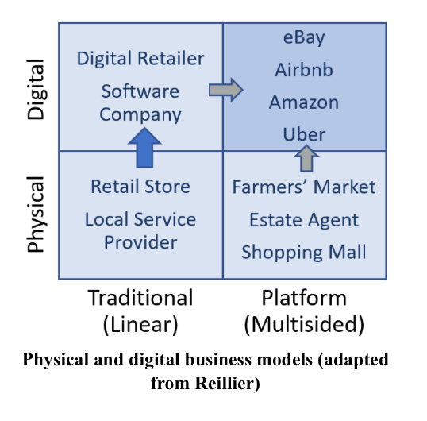
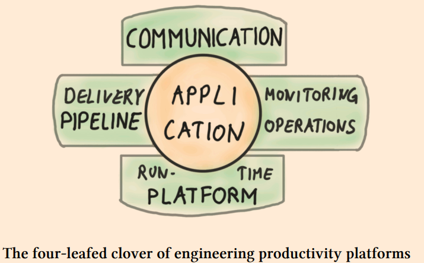
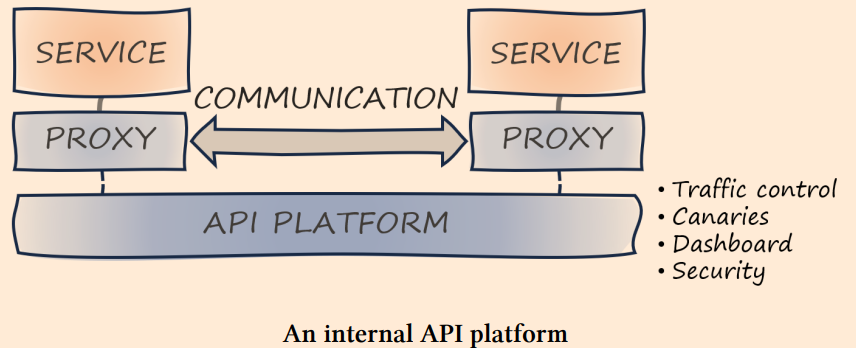
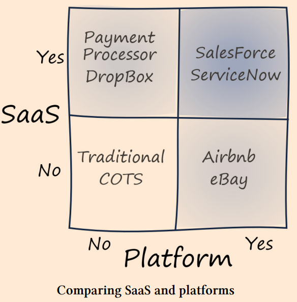

# Platform Strategy

* A critical success factor for platforms is defining which aspectsc an be harmonized and which ones must be kept variable.
* A good platform takes a step in the background of the participant to participant interaction.
* How users acces your platform is at least as important as what's inside.

## Part I : Understanding platforms

When people say platform, they mean different things. That's why it's wise to first look at the history of platforms, catalog different types of platforms, and highlight their benefits.

### Chapter 1: Key properties of platforms

Properties:
* Platforms Elevate: A platforms creates an elevated layer that others can stand on.
* Platforms Enable: Platforms value by allowing participants ot benefit from the presence of others.
  * E.g buyers/sellers, creators/follows,
* Platforms Democratize: Platforms make it easiy for participants to join thanks to lower barriers.
  * E-Commerce platforms allows sellers easier to find markets, pay-what-you-use on cloud
* Platforms Self-Perpetuate: Platforms enabling exchange between participants (virtual/physical goods)
  * Network effect: More sellers attracts more buyers which again attracts more sellers
  * This compounds well with the "Enable" property. Easy entry makes sure nohing stands in the way.
* Platforms Accelerate: Platforms remove any blockers and heavy lifting, so participant can focus much more on value creating tasks and innovation. Things can go faster. Here is where one can focus their time on differentiating tasks.
* Platforms Don't Constrain: They don't limit or put unnecessary constrains on the participants.

#### Examples

* Automotive platforms: Same components and chassis used across models, along to create many different models with little redesign.
* E-commerce platforms: Online marketplaces where sellers and buyers can find each others, removing all the effort to create ways to find and iteract with each other. It connects sellers and buyers directly with each other. An online supermarket not, it's being the in between middleman.
* Media Platforms: Social media, they make it easy to create and share or follow and interact
* Cloud platforms: Bit like dcars, all this heavy lifiting engineering components eaily accessible.
* Business Platforms: Do what cloud platforms did for it. Applications that added capabilities for customization. See CRM, ERP, ...
  * Go SaaS
  * Allow for customization
  * Golden combination

### Chapter 2: The different types of platforms

| Model/Type | Examples | Value Proposition | Interaction | Implementation |
| ---        | ---      | ---               | ---         | ---            |
| Marketplace | Airbnb, Ebay, amazon | Facilitate Transactions | Browser, Mobile, App, API | Propriety |
| Base | Cloud Providers | Rapidly provision IT resources | Console, CLI, API, automation | Proprietary + OSS |
| Developer | Portals, cloud "wrappers" | Increase speed, reuse, governance | Portal, CLI | Composed from OSS |
| Business Capability | Allianz, Syncier, About You | Build an open ecosystem | APIs, Custom Integration | Proprietary, on top of base platforms |

Models can be combined.

* **Marketplace**: Platform allows for farmers market model
  * Participants: Sellers/Buyers
  * Platform Takes care of: Search, ads, reviews, ranking, fraud and maybe payments.
  * Platfrom benefits from: Not maintaing inventory and various ways to generate revenue through fees.
  * Considerations:
    * The positive feedback cycle between buyers/sellers also posses a chicken-egg problem when launching.
    * Flexibility in fees help in inventivicing the balance, if there is a lack of sellers, seller fees wont help.
    * There is a big "Winner takes all" issue
* **Base**:
  * Participants: Developers and IT professionals
  * Aim for feature parity across interaction channels (API, GUI, CLI, ...)
  * Reduce cognitive load for new platform users (reducing friction for new users).
  * How users acces your platform is at least as important as what's inside.
* **Developer**: In-House developer platforms are built by IT Departmens to provide reuse of common IT services, boost productivity and assure compliance with operational guidelines. Usually these are in support of the Software Development Lifecycle.
  * Sometimes these platforms create to much limitation that it defeats the purpose to be able to innovate.
* **Business Capability**: What a base platform is in business, delivering typical entire capabilities for business with the freedom to extendm customize and integrate with other systems via APIs.

## Part II: A Strategy for platforms

Building platforms requires a sizeable investment and a clear strategy. That strategy must turn the objectives into an actionable path defined by meaningful decisions.

### Chapter 3: Formulating a Strategy

#### What is Strategy
Strategy is not complex. But it is hard. It's hard because it forces people and organizations to make specific choices abotu their future - something that doesn't happen in most companies. Meaningful strategies must connect dots between long-term vision and short-ter, tactics, between busines and IT, and between quantifiable success metrics and beliefs. A strategy tells HOW to reach a goal, nut just list the goals.

A sound strategy depends on your organization's unique:
  * Assets: Brand, people, IP, Equipment, Cash, Technology,...
  * Constraints: Resources, Labor Contacts, Regulatory Environment, ...
  * Environment: Competitors, market positioning, price pressure, ...

Which also menas you can't copy someone else's strategy.

#### IT Strategy vs Business Strategy

* Historically IT strategy was basically "to accomedate the business" strategy, a one way street
* Nowadays technology can influence business strategy, we have two way street now
  * Some business strategies are only viable thanks to advances in technology
  * Technology allows now to sell extra services or charge "per consumption"
  * It is technology that enables new business strategy

#### Think in the First Derivative
Or: Think about how things change over time rather than focusing solely on their current state.

A platform strategy should think in the rate of change.

#### Documenting A Strategy

A good strategy consists of:
* Capturing key decisions
  * Covered in all the rest
* **Document them well**
  * Aim For Emphasis Over Completeness: Defining what's most relevant is a critical step towards devising a strategy.
    * See forest if you don't concern yourself with each tree, the real high level.
    * "What is not included" can be very useful chapter.
    * Remember, [clear writing](../../communication/writing.md)
  * Use Conceptual Models:
    * 2x2 matrixes, like SWOT
    * [See more on wikipedia](https://en.wikipedia.org/wiki/Conceptual_model) 
    * [Wardley Maps](https://en.wikipedia.org/wiki/Wardley_map)
  * Show the path and the terrain
    * A point: Where do you want to go? (+where you are?)
    * A Path: How will you get there?
    * A Terrain: What happens when you step of the path?
      * This shows how you see past happy-day scenarios

#### Credible roadmap

Simple linear road maps are unrealistic, foresee decision points, possible paths to be taken and the data needed to make those decisions.

#### From Strategy to Execution

Take a list of all the "benefits" that you aim for and structure in a logical sequence of goals/mechanisms. An example structure that works:

1. **Context**: Explain why you are following a platform strategy. How does it align with the business strategy.
2. **Objectives**: The business benefits that are intended to be delivered by the strategy. Must be the **TOP Objectives**, not all benefits, less is more here.
  * E.g. Cost Reduction, faster innovation, ...
3. **Mechanisms**: Well-known techniques to deliver your objectives. Be very cautious to not just list buzzwords.
  * E.g. Increase code reuse, enable team autonomy
4. **Design Decisions**: Specific trade-offs that are made during implementation
  * E.g. All use the same programming language in return for x, y and Z

| **Level** | **Description** | **Key Activity** | **Example** |
| --- | --- | --- | --- |
| Context | Why you are create a strategy | Link to business | Increase Competition |
| Objective | What you want to achieve | Prioritization | Speed up delivery |
| Mechanism | Common ways to get there | Translate Objectives |
| Design Decision | Trade-offs you are making | Explain Well | Standard APIs |

### Strategy is a Winding Road

A strategy is not a detailed plan but an overall direction.

### Chapter 4: Becoming a Platform Company

* Transformation starts with new ways of thinking, followed by new ways of working, which results (hopefully) new end products that disrupt.
* To transform you must  think and work differently.
* The misunderstanding is that there are only 2 options:
  * Full harmonization, stifling innovation
  * Rapid innovation, entropy and chaos
* These are actually 2 dimensions where we need to find the right balance.
* **(Proper) Harmonization drives innovation**, cause you can focus on higher level issues instead of lower level. (Like Azure, Low-Code and No-Code does).
  * It's important that harmonization does not depend on putting constraints.
  * Harmonize by common APU standards and reuse across diverse languages.
  * There are ways to provide harmony/reuse, without constraints, by having a reuseable part behind an API, that part is extracted out of what developers else had to do in their own language.
* **Removing constraints is the key innovation driver**.

| Characteristic | Perceived Opposite | Enabling Mechanism |
| --- | --- | --- |
| Standards | Innovation | Platforms, Interface Standards |
| Speed | Quality | Automation |
| Cost | Agility | Modularity, Iterations |
| Economies of Scale | Economies of Speed | Cloud Platforms |
| Openness | Monetization | Professional open source |
| Low Risk | Change | Automated Tests, Continuous Delivery |
| Control | Chaos | Transparency, automated governance |
| Short-term gain | Long-term gain | Adaptability, low friction |

* Alignment of the business and technology models are a force multiplier if well aligned. But misaligned, and all is often doomed. A misalignment between business and technology teams dooms the most promising platform initiatives.

### Chapter 5: The Platform Paradox

> **The paradox: How we destroy the conflict of standardization vs innovation? How do we solve this?**

* Platforms break the dichotomy between harmonization and innovation.
* Cloud platforms are a great example of high harmonization, yet boosting innovation and not constraining.
* You put certain constraints, so you can remove others.
  * Example: HTTPS is a standard, which allowed various browsers to be created and interoperate.
* IT Pyramid Fallacy
  * Old school way of doing things, anything applying to entire business is shared and more unique things for specific units and geographies are configured. Its flawed as in:
    * You have to anticipate all users needs, which is impossible and kills innovation.
    * Even if you do it well, the base layer is a massive effort.
  * 
* Platforms Aren't pyramids
  * Platforms don't try to anticipate every use case.
  * If your users haven't built something that surprised you, you probably didn't built a platform.
  * 
* The Double Double Pyramid
  * 
* How Platforms Break Barriers
  * Componentization: Allows for recomposition (e.g. standard-sized bricks sped up construction without reducing creative possibilities)
    * Requires an overarching architecture that defines boundaries and connecting elements. The right boundary matters to make it reusable and recompensable.
  * Separating commodity from differentiators: Bake widely used functions in common layer and components, which is not an easy task.
    * Anything widely used (commoditized) goes into base layer, rest (differentiating, value creating) goes on top. The line is hard to draw due to:
      * Needs vary by user group: Groups see what fits in the platform different
      * The boundary shifts: IT evolves, so do the needs of a platform (first it was IaaS, then PaaS, then FaaS)
      * Cohesion over precision: A precise line between Commodity/Differentiators does not always result in good cohesion, users expect cohesion of a platform.
      * Interaction Matters: How users access the platform is as important as what's inside of it.
      * Done by commodification of services in a way which relinquishes an amount of control ans is open to extension.
  * Building Economies of Speed on Economies of Scale: By taking advantage of the scale, speed should also thrive (see how fast you can deploy a webapp on Azure) due to frictionless usage.
    * Platforms thrive on scale (see cloud)
    * Freeing users from the scale effects and pain points, allows them to have speed in what they want to do.
    * Speed is what encourages experiments and innovation.
    * Easy and Fast is what allows for innovation.
    * Cloud platforms provide scale-optimized technology as a speed-oriented product.
    * See [example where lower lays change slower than higher layers](assets/chapter5_4.jpg), like the 19" server rack standard is from 1922, but K8S is from a few years ago or months ago.
  * Centralizing Decentralization:
    * Centralize expertise
    * Decentralize innovation
    * Done by commodification of services in a way **which relinquishes an amount of control ans is open to extension**.
    * ,

### Chapter 6: Mapping Platforms

(Visual) maps are great to depict strategies and reveal their shortcomings.

* Maps As Visual Models: A good map is easy to understand but are also based in reality.
* Which Map Is Best?
  * Know which question you're trying to answer, before choosing a (visual) model.
  * Maps can be great to answer questions about IT strategies.
* 6 Basic Elements of Maps
  1. Visual representation
  2. Context (what question are we answering)
  3. Orientation Anchor (e.g North Compas)
  4. Components
  5. The Position of the components.
  6. The movement of the components.
* 2x2 Maps
  * Simple models provide highest abstraction and are often most useful
  * Examples contains Context, Orientation, Components, and even movement.
  * 
* [Wardley Mapping](https://learnwardleymapping.com/)
  * At intersection of Technical Capability and Business Value.
  * 2 dimensional
    * Y-axis: Value Chain (how visible or vicinity is it to the user)
      * Dependencies between components flow from TOP (visible to user) to BOTTOM (less visible to user)
      * Relative positioning, so no procession necessary
    * X-axis: Evolution Stage of the component
      * Genesis - Newly Discovered
      * Custom Built - Uncommon, we still learn about
      * Product - Increasingly common and repeatable
      * Commodity - Highly Standardized
  * Components are "Technologies" being plotted.
  * Movements, components move on 2 mechanisms
    1. Commoditization: Horizontal move towards commodity. 
    2. Componentization allows systems to be broken down into identifiable reusable pieces that can move independently towards commoditization.
  * *Goal: Commoditization to standard components leads to an explosion of innovation for higher-order systems*.
  * Example
    * Compute resources: Going from custom built to commodity
    * Default Stack: LAMP stack also created commodity.
  * This map allows for working out your IT/Platform Strategy, where you are and where you are going.

### Chapter 7: A Simple Framework For Writing IT Strategy

Instead of using a rigid template, focus on the following characteristics for writing IT strategy.

* **Alignment**: Must align with a business strategy
  * Must support the business today and in the future.
  * Business Strategy <supports> IT Strategy <supports> Platform Strategy, in both directions!
  * Define metrics which are meaningful to the business (instead of IT vanity metrics)
    * Business doesn't care how many servers are migrated to the cloud.
  * Value is the only real progress
* **Clarity**: Must be easily understood by broad audience
  * Technique: Conceptual models can gop a long way in clarity.
  * Technique: Describe strategy in horizontal layers of detail. Going from high level, executive summary to lower details.
* **Evolution**: Strategies are meant to last, but must evolve based on opportunities, shifting priorities and changing constraints.
  * A purpose of a strategy is to tell how to cope with uncertainty. That's why its a strategy, not a plan.
  * A strategy is supposed to absorb changes and evolve over time.
  * 2 Levels
    * Evolution of the elements described in the strategy.
    * Evolution of the strategy itself.
* **Decisions**: Must make decisions, else its just a list of wishes.
  * Strategy is a series of meaningful decisions, those that require conscious trade-offs.
  * We forgo X in return for Y.

## Part III: Building In-House platforms

Most IT organizations experience platforms when they set out to build one. This part looks beneath the covers of such platform initiatives to highlight important characteristics.

### Chapter 9: In-House IT Platform

* **Benefits:**
  * Reduce Cost: By reuse and economies of scale
  * Increase velocity: Accelerate and speed up new development
  * Assure Compliance: Scaleable compliance
  * Improve Transparency: 
  * Reduce Lock-In: Abstraction Layer
* **IT Platform Classifications**
  * By [McKinsey](https://www.mckinsey.com/capabilities/mckinsey-digital/our-insights/the-platform-play-how-to-operate-like-a-tech-company)
    * Customer Journey Platforms:
      * Reusable elements that define the customer proposition/experience.
      * Coarse-grained functional components (e.g. Click-And-Collect on eCommerce platformm)
    * Business Capability Platforms:
      * Business solutions (e.g. Payment Services, Inventory Management)
      * These capabilities are intended to be modular and can be wired together
      * These capabilities support the customer journey
    * Core IT Platforms:
      * Provide shared technology on which "customer journeys" and/or "Business Capabilities" run on.
      * E.g. Cloud Platform, Data Analytics Platform, ...
  * By [ThoughtWorks](https://www.thoughtworks.com/en-th/insights/blog/platform-tech-strategy-three-layers)
    * Service Platforms: Main offering to be used by the customer.
    * Digital Business Platforms: extend the service platform integrated with partners via APIS.
    * Foundational Technology Platforms: Similar to Core IT.
    * Seems very similar to the McKinsey model.
* **IT Platform Varieties**
  * **Digital Platforms**:
    * Goals
      * Enable new business models
      * Provide better customer/employee experience
      * Assure efficient, reliable and data-driven operations
    * 
      * Interaction Platform: Powers websites, mobile apps, and APIs  to connect customers and to partners.
      * Business Capability Platform: Provides functions to support the business domain (e.g. payment services, e-commerce catalog, ...)
      * Base/Cloud Platform: All elements for operational IT parts.
      * Data Analytics Platform: For doing analytics, ML, create new insights, optimize things, get KPIS
    * Analysis:
      * Run the risk of being seen as a cure for any and all IT ailments
      * Long adaption is risky, must be guided by clear road map with intermediate deliverables and value achieved.
  * **Engineering Productivity Platforms/Internal Developer Platforms**
    * Software delivery tooling determines your organization's rate of change.
    * Economies of speed, provide tools for faster delivery and change.
    * Provide necessary components for:
      * Building
      * Deploying
      * Operating
    * Analysis
      * Done well, the harmonization can provide higher compliance, security, allowing for speed AND quality.
    * 
  * **Data Platforms**:
    * Goal for being more data-driven.
    * Analysis
      * Due to onboarding friction usually, the fail to democratize access to the platform.
      * Adding a new data source is often labour intensive.
      * Just centralized data dumps
  * **Data Meshes**:
    * Attempts to fix the limitations of centralized data systems/platforms by separating the *innovation layer* from the *platform layer*. Again, following economies of speed, built on economies of scale.
    * 4 Pillars
      * Decentralize data domain ownership
      * Data as a product, including ease of use, secure access and trust
      * Abstract the infra complexity into a common self-service data platform  to reduce friction
      * Providing federated governance
    * 
  * **API Platforms**:
    * Can utilize open-source service meshes like Istio/Kong. Allowing to get more metrics and control.
    * Typical capabilities
      * Proxies to monitor and route service calls (e.g. Envoy Proxy)
      * API Gateways (auth, quota, throttling, ...)
      * Self-Service portals for developers
      * Certificate management for secure communication
      * Catalog/Registry for API Discovery
      * Stream or Event handling
      * Monitoring/Dashboards
    * 
  * **Abstraction Layers/Cross-Platform Platforms**:
    * Just an abstraction layer for portability
    * Usually strong focus on vendor-locking is not so important.
    * In general, not really useful.
* **Platforms and Software as a service**:
  * Platforms are often offered as SaaS.
    * Self Service + pricing reduces friction
    * Not all SaaS are platforms
    * SaaS is distribution, operational, and pricing model. Platforms are abstractions tha enable teams to build on top of them.
  * 

### Chapter 10: IT Platform and IT services are Opposites

From a static structural model a "platform" and "Infra/Operations" seem the same, but it does not illustrate the interactions between them.

Like, here the structure looks the same but in the first model, app development "throws their app" over the wall, and Ops people will be paged on issues. So that's not the interaction we're looking for, we're more looking for a DevOps interaction between the app development and the platform. 

That's why, a structural model might seem the same, but the interactions can be very different.

* Placing operational responsibility with the development team, removes organizational boundary.
  * Platform developers are responsible for platform operations. They do dev and ops what they own.
  * App developers are responsible for app operations. They do dev and ops what they own.
  * The platform does provide the core tools to allow the operational parts being done by the app team.

#### Checklist: To verify which one of the 2 types you are working with

| Characteristic    | Platform           | IT Service      | Notes |
| ---               | ---                | ---             | ---   |
| Main Driver       | Speed              | Reuse           | [Platforms should focus on speed first, efficiency second](https://www.linkedin.com/pulse/platform-lesson-1-platforms-should-focus-speed-efficiency-jan-bosch/) |
| Value Proposition | Direct             | Indirect        | |
| Scale Effect      | Thrives            | Bottleneck      | |
| Marginal cost     | Low                | Medium/High     | |
| Friction          | Low                | High            | |
| Self Service      | Yes                | No              | |
| Run as ...        | Product            | Project         | |
| Evolution         | Continuous         | Sporadic        | |
| Orientation       | Customer Centric   | Process Centric | |
| Responsibility    | Shared             | Separated       | |
| Extensibility     | Open or Semi  Open | Closed          | |
| Adoption          | Voluntary          | Mandated        | |

### Chapter 11: Implementation Matters Using Mechanisms

Just a strategy and objectives won't be a recipe for success, the implementation matters. You must describe how to get from X to Y. This can be done with three distinct layers

1. Describe benefits, the desired properties.
2. **Mechanisms**, explains the specific technical implementation.
3. Implementation details, explains what needs to be built.

#### Mechanisms

* Restricted Choice
  * Golden paths are great to reduce complexity and provide governance
    * Might eliminate useful options and slow down development (e.g. not allowing a public cloud)
  * Whatever restriction, make sure the platform is an enabler
* Meaningful Defaults
  * Softer version of restricting choice
* Assumptions/Scope
  * A cloud provider must built for the whole world, an in-house platform for one organization.
  * You can and must make more assumptions than a cloud provider, which translates again in restricting choice and meaningful defaults.
* Aggregation
  * Platform creates uniform access to many elements.
* Abstractions
  * See chapter 21 for more depth
* Automation
  * Automate friction away.
* Functional Addition 
  * Platforms should give extra functions on top of the layer it is built on, filling in gaps.

| Business Objective | Mechanism | Implementation |
| ---                | ---       | ---            |
| Minimize Mistakes  | Meaningful defaults | Templates |
| Increase velocity  | Automation | IaC scripts |
| Improve products   | Fill product gaps | New components |
| Enforce compliance | Restrict choice | Wrappers |
| Reduce lock-in     | Abstraction | Service Layers |

## Chapter 12: Make opinionated platforms, not restrictive ones

## Part IV: Designing platforms

Platforms hide complexity, but building one isn't nearly as simple as it looks from the outside. This part employs metaphors to illustrate platform design decisions.

## Part V: Implementing platforms

This part investigates platform anatomies and propose common platform blueprints.

## Part VI: Growing platforms

Platforms have to be rolled out across the organization. They also require delicate care and feeding over time so that they don't fall victim to excessive entropy or become a bottleneck. This part shows you how to do this successfully.

## Part VII: Organizing for platforms

If you are building platforms, you'll likely need a platform team, which is different from typical application delivery or operation teams. This part describes how to build an manage a platform team.

## Todo

* cover Shared responsibility model (chatper 10 apparently? page 70)

## Resources

* [Platform Strategy](https://leanpub.com/platformstrategy) by Gregor Hohpe
