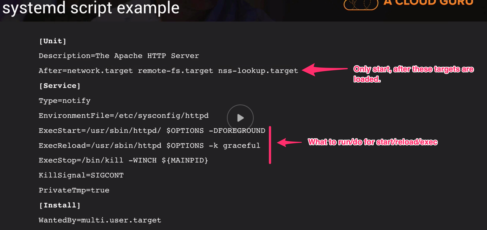

# LPIC-1

## About Linux

* Components of Linux
  * Boot Loader
    * Software manages boot process till the OS starts to load
  * The Kernel
    * Core of OS, manages OS, CPU and peripherals
  * Daemons
    * Processes lurking in the background that start during booth or after login (e.g. time)
  * Shell
  * Graphical Server
    * Subsystem to display graphic
    * AKA x-server
  * Desktop Environment
    * Actual GUI for the user
  * Applications
  
* Why Linux ?
  * Free
  * Stable
  * Secure
  * Open Source
    * Free to run the program for any purpose.
    * Free to study how the program works
    * Free to change how the program works
    * Free to redistribute copies
    
* Distributions
  * What is a distribution ?
    * Collection of software
    * Package management system
    * Helps you install, upgrade and remove software
    * Keeps your server up to date
  * Popular Examples
    * Red Hat
      * CentOS (based on red hat)
      * Fedora
    * Debian
      * Ubuntu
      * Mint
    * SuSE
    * Gentee
    * Arch
    * ...

* VirtualBox Bridged Networking
  * If you do this, instead of NAT, you can SSH into the box instead of using the VirtualBox UI

## System Architecture

* Boot the system
  * UEFI is the new version of BIOS
    * BIOS booting
      * -> BIOS boot from particular disk
      * -> This disk has a MBR (Master Boot Record), which stores the  Boot Loader
      * -> The boot loader knows where the kernel is on disk and boot the OS
    * UEFI
      * UEFI Boot Loader (which lives on your disk) (is not in the MBR)
      * This boot loader calls the kernel, which boots the OS
  * MBR : Information in the first sector of a disk that tells where and how the OS is.
  * GRUB (Grand Unified Bootloader) : Boot loader package that supports multiple OS's on a ps
    * You can modify the settings during bootup and make them persist by directly modifying the config files used by the GRUB
    * For Ubuntu in VirtualBox, tap `esc` during bootup
  * Kernel is lowest level of replacable software to your hardware
  * Once the Kernel has attached the root file system, it will run a program called `init`
  * `init` is always the first process ran by a linux system, therefor, it gets always a PID of `1`
    * There are a few different `init` programs that exist
      * `sysvinit` : Which based on `sysv`, oldest and first
      * `systemd` : Low memory boot process, mainstream, almost used everywhere now
      * `upstart` : Created by Ubuntu, but they switched to `systemd` in the end.
  * `quiet` for kernel param is `supress most boot messages`. So less verbosity for bootup
  
* Determine and configure hardware settings
  * `udev` : Device manager for your kernel
    * Gives low level access to the linux device tree
    * Handles user space events (happens when hardware is removed or added to the system)
      * Eg. Loading firmware
    * Provided by temporary filesystem (`tmpfs`)
      * This is how `udev` provides access, which is mounted to `/dev` on startup
    * `/etc/udev/rules.d` : Folder for custom rules for the device manager `udev`.
      * You can create rules for what should happen/ran when something is plugged in or unplugged
  * `dbus`
    * Inter-process communication mechanism
    * Framework that allows processes to talk to each other
    * Secure
    * Reliable
    * Provides high level OOP interface
  * `sysfs`
    * Virtual filesystem
    * Presents information about various kernel subsystems
      * Hardware devices
      * Drivers
    * Mounted to `/sys`
  * `procfs`
    * Similar to `sysfs`
    * Presents information about various processes
    * Presents information about system information
    * mounted to `/proc`
      * Can be used to interface with the kernel
      * Change parameters on the fly
    * Each running process will have a directory in `/proc/<PID>` + various other stuff
      * eg. `/proc/cmdline` -> Kernel name from bootup
      * eg. `/proc/version` -> Kernel version
      * eg. `/proc/cpuinfo` -> CPU info
  * `lsmod`
    * List all Kernel modules in use and by which modules
  * `modprobe`
    * Add or remove loadable kernel modules to/from the kernel
    * `udev` relies upon `modprob` to load drivers for automatically detected hardware
  * `rmmod`
    * Remove kernel module (prob need root for that)
  * `lspci`
    * Shows all PCI connected devices to the system
    * Show Device IRQ settings
    
* Runlevels and boot targets
  * Run Level : Number between 0 <-> 6 (max 9), determines which scripts/programs are run
    * Levels :
      * `0` - Halt or shut down system
      * `1` - Single user mode
      * `2` - Multi user mode without networking
      * `3` - Normal boot (multi user mode + networking)
      * `4` - Unused/customizable
      * `5` - Run level 3 + GUI display manager (if installed, so the graph env)
      * `6` - Reboot
    * Based on the run level, more or less scripts will be ran which are located in different places (e.g. `Systemd` or `sysv`)
      * `inittab` (came with `sysv`)
      * Ubuntu : `/etc/rc0.d` ... `/etc/rc6.d` folders with scripts that are ran based on correlating run level. `rcS.d` us ran for any run level. 
        * This is still there for compatibility reasons
      * `systemd` run levels : 
        * Also has scripts
        * System scripts `/etc/systemd/system`
        * Package Scripts `/usr/lib/systemd/system`
        * `/etc/systemd/system` takes precedence over `/usr/lib/systemd/systen`
        * Uses **targets** (similar-ish to the other run level style)
          * Run Level - Systemd Target
          * `0` - runlevel0.target, poweroff.target        
          * `1` - runlevel1.target, rescue.target        
          * `2,4` - runlevel2.target, runlevel4.target, multi-user.target        
          * `3` - runlevel3.target, multi-user.target
          * `5` - runlevel5.target, graphical.target
          * `6` - runlevel6.target, reboot.target
          * `emergency` - emergency.target
  * with `init`/`telinit` you can tell what level to run
                  

* `systemctl`
  * How you drive/control `systemd`
  * How you start, stop, restart applications (just like `kubectl`)
  * E.g.
    * Status sound card : `sudo systemctl status sound.target`
    * stop sound card : `sudo systemctl stop sound.target`
    * Status sound card : `sudo systemctl status sound.target`
    * start sound card : `sudo systemctl start sound.target`
    * Status sound card : `sudo systemctl status sound.target`
        
* Commands
  * `ps` : List active processes
  * `ps aux | head` : Shows the top processes where you will seee `/sbin/init`
  * `dmesg` : Kernel messages logged from the last bootup
  * `head` : take first `n` lines
  * `tail` : take last `n` lines
  * `less` : page through a long result 
  * `man` : manual 
  * `sudo wall` : Send a message to anyone logged in/has open shell (like announce a reboot)
  * `which` : Where is an app running from?
  
## Linux Installation and Package Management

* Design hard disk layout
  * `/` : root
  * `/usr` : user binaries installed
  * `/home` : 
  * `/boot` : All related to booting
  * `/var` : Variable data (e.g. system logs ...)
  * `/tmp` : Everyone on the system can write to

* Partitions
  * Divide storage in multiple pieces
  * Allows dual booting
  * Separation of files
  * Data organization
  * System protection
  * e.g. Separate partition for each user to separate and safeguard
  * When you create a partition you need to **mount** them to directories.
  * Every path in linux can be **mounted to**
    * We can mount to :
      * `/home`
      * `/var`
      * `/tmp`
      * `/home/nick/blah/`
    * Remember like with Docker. You can have a folder `/home/ian/dbdata` with data in it.
      * When you mount a partition to `/home/ian/dbdata`, the data in there will be hidden and overtaken with this mounted partition (like a volume with docker)
      * Once you unmoun the partition from that folder, the original data is again visible and accessible.

* Swap
  * Swap is a partition, used in case the RAM is full, Swap is used
  * Unused pages fo the RAM will be saved in the SWAP partition

* LVM
  * Logical Volume Manager
  * (like Disk Manager windows, on steroids)
  * Allows to split disks into pools (Pools are also known as PE, Physical Extends)
  * Create partitions from pools
  * Can grow or shrink partitions
  

  
* Install a boot manager
  * Boot Loader
    * Boots a linux system
    * Runs before the OS
    * Can be configured from the operating system
    * common boot loaders :
      * LILO
      * GRUB Legacy
      * GRUB2
   * Configuring the `/boot/grub/grub.cfg` results in editing your boot loader logic
   * Although the above is the auto generated result of `/etc/grub.d` and `/etc/default/grub` using `grub-mkconfig`
  * `grub-probe`
  * `grub-install` : To install grub to the MBR of the specified disk (in case that didn't happen yet)
  
  * Revise
    * update `sudo vi /etc/default/grub` file
    * run `sudo update-grub`
    * restart to see changes in action

* Manage Shared Libraries
  * Libraries : So typical libs/packages that bash scripts or actual code can use
  * Key properties
    * Shared
    * Reusable
  * Linking
    * When your application wants to use these libraries, they should be linked to them
      * Static Linking : Library is included in the application (each app has its own copy)
      * Dynamic Linking : Different applications using the exact same copy of the library
        * Update libraries in a single place
        * `/etc/ld.so.conf` lists the locations of the shared libraries on your system.
        * `include` statements means it was split into other linked files
    * `ldd` :  ldd prints the shared objects (shared libraries) required by each program or shared object specified on the command line.
      * e.g. `ldd /bin/ls`
      
      
* Use debian package manager
  * `dpkg` : Debian Package Manager
    * install/upgrade/remove software
    * low level tool
    * (Does not automatically installes dependencies)
  * `apt`
    * Advanced packaging tool
    * high level tool
    * install/upgrade/remove software
    * handles upgrading of entire system
    * Handle all package dependencies automatically
    * Uses online repositories
  * `/etc/apt/sources.list` is the list for mirrors of `apt` and specifics on which repos per mirror to use
    * `main` : Officially supported software
    * `restricted` : supported software (not free under completely free license)
    * `xenial` : current version 
    * `universe` : community maintained software
    * `multiverse` : Not free software
  * `apt-get update` : update local package lists
  * `apt-get install <name>` : Install software
  * `apt-get remove <name>` : Uninstall software
    * ! does not remove remaining config files, use `dpkg --purge <name>` for cleanup
  * `apt-cache depends <name>` : Show what a app depends on
  * `apt-cache search <name>` : Search for packages with a particular name
  * `apt-get upgrade` : Upgrade all current installed packages (respecting semver)
  * `apt-get dist-upgrade` : upgrade everything and remove anything unused
    
* `wget` Download a file to current location

* Use RPM and YUM package manager
  * RPM
    * RedHat Package Manager
    * rpm command
    * Low level tools
    * install/upgrade/remove software 
  * YUM
    * Yellowdog update/modifier
    * replaced YUP (yellowdog updater)
    * Utilites online repositories
    * manages dependencies

* Quiz

  * How do you temporarily add a directory to your shared library path? - `LD_LIBRARY_PATH`

## GNU and Unix Commands

## Devices, filesystems and filesystem hierarchy

## Shells, scripting and data management

## User Interface and Desktop

## Manage user and group accounts and related system files

## Essential System Services

## Networking fundamentals

## Security