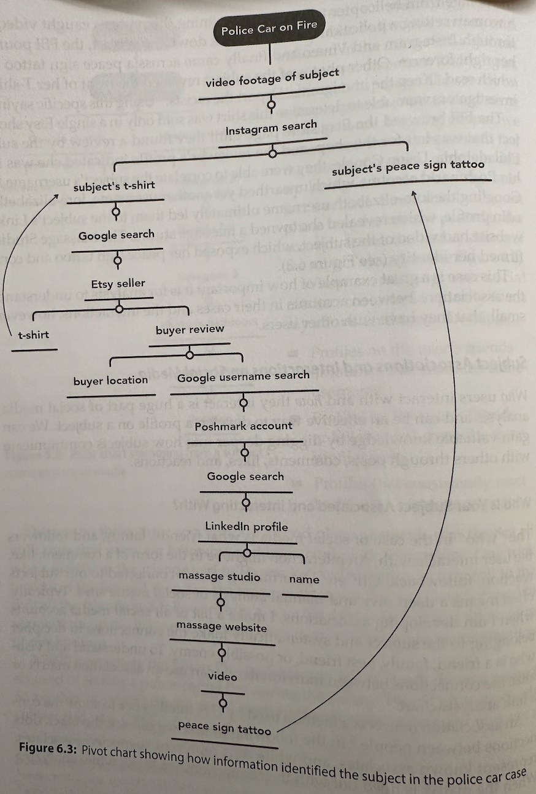

## Methodology

### [Intelligence Cycle](https://en.wikipedia.org/wiki/Intelligence_cycle)

1. Planning and Requirements
2. Collection
3. Processing and Evaluation
4. Analysis and Production
5. Dissementation and Consumption
6. Repeat

## Subject Intelligence

> Intelligence about a person and direct metadata (address, name, email, accounts, ...)


## Social Media Intelligence

> Social Media of a Subject/business

* Note that especially younger generations might have multiple accounts for various audiences (friends, themselves, a business, ....)

* [Telegram Stats](https://tgstat.com)
* [Reddit Post Analyzer 1](https://reditr.com/)
* [Reddit Post Analyzer 2](https://www.osintcombine.com/free-osint-tools/reddit-post-analyser)
* [Pro Twitter (Former Tweet Deck)](https://pro.twitter.com/)
* [Centre For Information REeslience](https://www.info-res.org/)
* [Snopes: Debunk site](https://www.snopes.com/)
  * [Snopes Fact Checks](https://www.snopes.com/fact-check/)
* [Verification Handbook: Guide to verify digital content](https://verificationhandbook.com/)
* [Spot Bot Like Behaviour on Twitter/x: Bot Sentienel](https://botsentinel.com/)
* Graph Tools For Analysis
  * [Neo4j](https://neo4j.com/)
  * [Gephi](https://gephi.org/)
* Foto Forensics
  * [Tool 1](https://fotoforensics.com/)
  * [Tool 2](https://29a.ch/photo-forensics/#forensic-magnifier)
* **MIS/DIS/MAL-information**
  * **Misinfoformation**: Misleading or incorrect information that is not knowlingly deceptive.
    * Example: Grandma posts article about vitamines curing cancer.
  * **Misinfoformation**: Misleading or incorrect information that is knowlingly deceptive/deliberate.
    * Usually entirely fabricated.
    * Example: Mascot from one team posts false information about competing mascot, about being arrested for assault.
  * **Malinformation**: Based in reality but is purposfully harmfull. It's is based on reality but shared out of context or intent to cause harm.
    * Example: Political party post fake story of immigrant assaulting a native woman to ignite hated.


```md




```

TODO: Add links (like redit post analyzer etc from the chapter)

## Business and Organisational intelligence

Usual data points

* Corporate/business structure disclosures
  * Parent
  * Subsidary
  * Holding companies
* Contract disclosures
* Financial Records / annual reports
* Affiliation and relationship disclosures
* Procurement / supply chain disclosures
* Innovative / proprietary technology disclosures
* Business discretions and lawsuits
* santions / illegal activity
* Public disclosures
* Published material disclosures


## Tools

### Search

* [Google](www.google.com)

* [Bing](www.bing.com)
* [Yandex](www.yandex.ru)
* [Baidu](https://www.baidu.com/)

### Archives

* [WayBackMachine](https://web.archive.org/)

### Subject Intelligence

* [https://dehashed.com/](https://dehashed.com/)

### Workflow

* [Browser Extension - Instant Data Scraper](https://chromewebstore.google.com/detail/instant-data-scraper/ofaokhiedipichpaobibbnahnkdoiiahk)
  * [Alternatives](https://blog.apify.com/top-instant-data-scrapers/)

### Others

* [https://fakepersongenerator.com](https://fakepersongenerator.com)
* [Shodan.io](https://www.shodan.io/)
* [Cyberchef (github)](https://github.com/gchq/CyberChef)
* [Thispersondoesnotexist.com](https://thispersondoesnotexist.com/)
* [Similarweb.com/top-websites](https://www.similarweb.com/top-websites/)
* [Google.com/advanced](https://www.google.com/advanced_search)
* [Strava.com](https://www.strava.com/)
* [raebaker.net/resources](https://www.raebaker.net/resources)
* [PIPL](https://pipl.com/)
* [https://whatsmyname.app/](https://whatsmyname.app/)
* [@nixintel](https://x.com/nixintel?lang=en)
* [Sherlock Github](https://github.com/sherlock-project/sherlock)
* [https://epieos.com/](https://epieos.com/)
* [weekdays.works](https://www.weekday.works/people/ian-segers-segersian)
* [Whoxy.com](https://www.whoxy.com/)
* [Viewdns.info](https://viewdns.info/)
* [Emailrep.io (the lower the reputation, the less likely it’s legitimate)](https://emailrep.io/)
* [Haveibeenpwned.com](https://haveibeenpwned.com/)
* [IntelligenceX (search breaches)](https://intelx.io/tools)
* [Spiderfoot](https://github.com/smicallef/spiderfoot)
* [Lexisnexis.com](https://risk.lexisnexis.com/)
* [Https://legal.thomsonreuters.com/en/products/clear-investigation-software](https://legal.thomsonreuters.com/en/products/clear)
* [Sociallinks.io](https://sociallinks.io/)
* [TheOrg - Find the org charts of companies](https://theorg.com/org/neptune-software)

### Norway

* [PureHelp](https://www.purehelp.no)
* [Finn](https://finn.no)
* [Skattesjekk.no - Check tax of people](https://www.skattesjekk.no/)
* [Brønnøysundregistrene - Norway’s central register authority. Contains multiple registers such as the Register of Business Enterprises, the Register of Company Accounts, and the Register of Bankruptcy.](https://www.brreg.no/)
* [Proff - A commercial website using data from the Brønnøysund Register Centre and other sources to present company overviews.](https://www.proff.no/)
  * Maybe you can find here if someone owns or runs a business
* [Einnsyn - A centralized service for searching through Norwegian government agencies’ public records (post journals)](https://einnsyn.no/)
* [Kvartverket - National authority responsible for mapping, property registration, and geographic data.](https://www.kartverket.no/)
* [seeiendom - public-facing portal that combines property information from the Norwegian Mapping Authority, the Cadastre, and the Land Register](https://seeiendom.kartverket.no/)
  * [Boretslag Info](https://www.kartverket.no/eiendom/bestille-fra-grunnboken/grbutskr-bo)
  * You can see when debts where made and the price something was purchased, refinancing is also visible
  * [Bolig.ai](https://www.bolig.ai/)
  * [https://www.eiendomspriser.no/](https://www.eiendomspriser.no/)
  * [Budstikka - Property Transers](https://www.budstikka.no/vis/eiendomsoverdragelser)
* [Domstol - Norwegian court rulings can be made partially available to the public, though privacy restrictions apply and many legal documents are anonymized.](https://www.domstol.no/)
* [1881.no -  Online directories for phone numbers, addresses, and sometimes additional public info (e.g., businesses and individuals).](https://www.1881.no/)
* [arkivverket - Repository of historical and archival materials, both for governmental and non-governmental entities.](https://www.arkivverket.no/)
* [NB.no - National repository of publications in various media, some digitized and freely available.](https://www.nb.no/)
* [Vegvesen - Contains Vehicle Information](https://www.vegvesen.no/)
  * You can check all the cars that someone has owned (require SSN)
  * You can check who (only name) ons a car with a given license plate
* [https://www.digitalarkivet.no/](https://www.digitalarkivet.no/)

## Resources

* [Deep Dive: Exploring the Real-world Value of Open Sourc](https://www.amazon.com/Deep-Dive-Exploring-Real-world-Intelligence/dp/1119933242)
* [Open Source Intelligence Techniques: Resources for Searching and Analyzing Online Information (9th edition)](https://www.amazon.com/Open-Source-Intelligence-Techniques-Information/dp/B09PHL6Q4G/)
* [https://www.bellingcat.com](https://www.bellingcat.com)
* [https://benjaminstrick.com/](https://benjaminstrick.com/)
