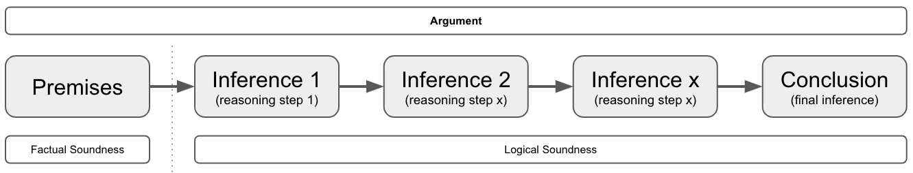

# Thinking

## Chapter 1: An Overview

* Thinking is any mental activity that helps formulate or solve a problem, make a decision, or fulfill a desire to understand. It is searching for answers, and reaching for meaning.
* To be a succesful problem solver, you will need both factual knowledge and proficiency in thinking.
* Good thinking: Good thinking is a matter of habbit, yes some will have a more talent for it, but its a habbit that can be trained and improved. Don't need to be in the NBA to enjoy basketball. IQ seems not connected to this.
  * They have learned strategies for thinking.
  * They have learned strategies to deal with frustration (conusion, mental blockers, ...).
  * They have learned strategies to regain focus/concentration.
  * Comparison:
    * Good Problem Solvers:
      * Read a problem and decide how to begin attacking it.
      * Bring their knowledge to bear on a problem.
      * Go about solving the problem systematically. (e.g. try simplifyng, breaking into smaller problems, ...)
      * Tend to trust their reasoning and have confidence in themselves.
      * Maintain a critical attitude throughout the problem-solving process.
    * Poor Problem Solvers:
      * Cannot settle on a way to begin.
      * Convince themselves they lack sufficient knowledge.
      * Plunge in, from one part of the problem to the other, trying to justify first impressons
      * Tend to distrust their reasoning and lack confidence in themselves.
      * Lack of a critical attitude and take too much for granted.
* Brain At work: Your brain has 2 distinct phases that complement each other during problem solving and decision making.
  * The Production Phase: Most closley related to creativity, it produces solutions, ideas, responses.
    * There are techniques to be learned to be better at this.
  * The Judgement Phase: Most closely related to critical thinking, it examines, judgjes, adds refinements, evaluates.
* Meaningful Discussion:
  * > Many hosts demand that their guests answer complex questions with simple yes or no answers. If the guest responds that way, they are attacked for oversimplifying. If, instead, they try to offer a balanced answer, the host shouts "You're not answering the question".
  * Guidelines:
    * Wehever possible, prepare in advance.
    * Set reasonable expectations. (people will probably not change their conviction on the spot)
    * Leave agotism and personal agendas at the door.
    * Contribute but don't dominate
    * Avoid distracting speech mannerisms
    * Listen actively
    * Judge ideas responsibly (try to not have your general impressions or feelings get in the way to judge something on its merrits)
    * Resist the urge to shout or interrupt
* Preliminary thinking strategies
  * When you must analyze a single statement:
    * Read it again
    * Ask yourself "Does this make sense?"
    * If you have a firm YES/NO, decided what makes to respond that way. That argument is probably what to explain to others.
  * When you get stuck, words fail, dead end road, so difficult challenges:
    * Use a diagram
    * Example: "All dogs are animals. Fido is a dog, therefore Fido is an animal" you could diagram as this:
      * Animal <- All dogs <- Fido
  * When the statement presents as fact something that is not factual, identify the error and explain how it invalidates the statement.
  * When the statement confuses two terms or ideas, identify the confusion and show its effect on the statement as a whole.
  * When the statement presents a conclusion as the only possible conclusion and other conclusions are also possible, present the other conclusions and demonstrate that they, too, are reasonable (perhaps more reasonable).
  * When the statemnt, or some part of it, is open to interpretation, use the if-then approach to analysis.
    * Example: IF X is true THEN conclusion A, IF Y is false THEN conclusion B
    * Also valid if you are unsure about facts
  * When there is a dialog
    * First read it to understand the discussion in its entirety
    * Then read each person's comments individually, note the progression of their thoughts and the degree of logical consistency.
    * Finally read for implications and assimptions (these are ideas that are not stated directly but are nevertheless identifiable by what is stated directly)

# Reasoning

## Nature of reasoning
* Reasoning is a skill in using thought and language, and it is profficiency in this skill, not the mere possesion of language, which distinguishes the human species from the others on this planet.
* Reasoning has function to help us find answers to our problems.
* Reasoning has funcfion to express reasons in publicly accessible language.
* Publicly accessible language means that it must be easily accessible or understandble to others.
* The emphasis on communication, on the crucial importance of the **social activity of reasoning**, means that we can **scarecely afford any jargon** at all.
  * Different texts might use different terminology.

* Reading without understand = Basic Reasoning
* Rational = Reasonable
* Practice is more valuable than theory on Reasoning, it's like language, there is no adequate grammar, it changes, you have to use it, just like learning a language.

## Purpose of reasoning

* Reasoning can be used in the service of criticism
* Reasoning can be used in the service of persuasion or communication.
* Reasoning is the means whereby we reach new conclusions, gain new knowledge, uncover new and important facts.

## Creativity & Reasoning

Creativity is a major component in reasoning. The process of trying to think of alternative explanations of a set of facts, is an entirely creative process.

## Argument Analysis

* 3.2
  * Inconcistency Types
    * Logical Inconsistency: Can be detected by anyone who speakers the language without other special knowledge. (aka Contradiction)
    * Factual Inconsistency: A logical inconsistency between what is said (Antwerp is near Oslo) and an unstated fact (Antwerp is in Belgium, but that's a fact or special knowledge that you need to spot the inconsistency).
    * Improbable/Implausible/Quasi-Inconsistent: Something described of having 2 properties which are almost certainly incompatible (that dress is overall green and overall red, but certain materials can be that based on light conditions ).
  * Contradiction == logical inconsistency
  * Consistency is a requirement of communication. Avoid inconsistency/contradiction is crucial.
  * The main point of argument presentation is to show that some kind of inconcistency or implausability is involved in *accepting the premises* of the argument and *rejecting the conclusion*.
  * Arguments are meant to be persuasive; and they succeed in being persuasive if they begin with assertions that the listener or reader is known to accept, and if they continue by showing that acceptance of those asserts (which are called the premises of the argument) requires the acceptance of the conclusion.
  * The power of an argument depends upon two things:
    * It should start off with premises that are known to be true or can be shown to be true.
    * It should proceed to demonstrate or exhibit the way which these premises "force" one to accept the conclusion(s).
      * The force of whishing to avoid contradiction/inconsistency if a weaker kind.
  * You start with a premis (things the other accept) and then steps (aka the inference) that built towards a conclusion. If someone disagrees but agrees with the premsie, they must rebunte one of the steps.
    * You are 18 years old (premise), men below age 25 don't have fully matured brains (step/inference 1) according to sience, so you are not fully mature (Conclusion),
  * Argument types
    * Deductive argument - Logical deduction (e.g. arithmics showing how much something costs, including hidden costs) - Easy attacked with facts or newer facts
    * Inductive argument - Statistical/probable (e.g. its very likely interest rate will increase next month, because ...) - Harder to attack, cause it's implied it's not factual, but likely.
  * Inconsistency is great attack/weapon if poeople have no interest to communicate.
* Reasoning can be used in the service of criticism or in the service of persuasion or communication.
* Logic or reasoning is the means whereby we reach new conclusions, gain new knowledge, uncover new and important facts.
* Reasoning is a constructive and creative activity that leads us to knowledge.
* Creativity is important to reasoning, the process of trying to think of alternative explanations of a set of facts, is an entirely creative process.
* Good thinking, reasoning and creativity go hand in hand
* An argument is logically sound when the reasoning is sound, that the inferences/steps from premise to conclusion are sound, without saying anything about whether the premises are themselves sound (you might not know the facts about the premises)
* An argument is factually sound means that the premises are in fact true.
* An argument can be criticized either by focusing on the truth of the premises, or the goodness of the inference/step. These 2 ways are directly mapped to the factual sound argument and logically sound argument
* The Logic of argument : all the steps/inferences from premise to conclusion
* A conclusion is an inference, actually every inference/step is a kind of mini/inbetween conclusion
* An inference and implication are different. An implication is something that is not directly inferenced by the speaker of the argument, an inference is a clear step that the speaker takes. “The eggs are now rotten, therefore it’s not safe to eat. The inference is that you can’t eat the eggs because they’re rotten, an implication would be, that the spoiled eggs probably now smell like rotten eggs.

## The 7 steps in argument analysis overview
The steps are not highly technical in itself, the difficult thing is to follow them carefully and skillfully.

1. Clarification of meaning (of the argument and of its components)
2. Identification of conclusions (stated and unstated)
3. Portrayal of structure
4. Formulation of (unstated) assumptions (the “missing premises “)
5. Criticism of the premises (given and missing) and the inferences
6. Introduction of other relevant arguments
7. Overall evaluation of this argument in the light of 1 through 6

### Step 1. Clarification of meaning (of the argument and of its components)

### Step 2. Identification of conclusions (stated and unstated)

### Step 3. Portrayal of structure

### Step 4. Formulation of (unstated) assumptions (the “missing premises “)

### Step 5. Criticism of the premises (given and missing) and the inferences

### Step 6. Introduction of other relevant arguments

### Step 7. Overall evaluation of this argument in the light of 1 through 6

## Resources

* [Art Of Thinking](https://www.amazon.com/Art-Thinking-critical-Creative-Thought/dp/0321953312) by Vincent Ruggiero.
* [Reasoning](https://www.goodreads.com/book/show/1645567.Reasoning) by Michael Scriven.
